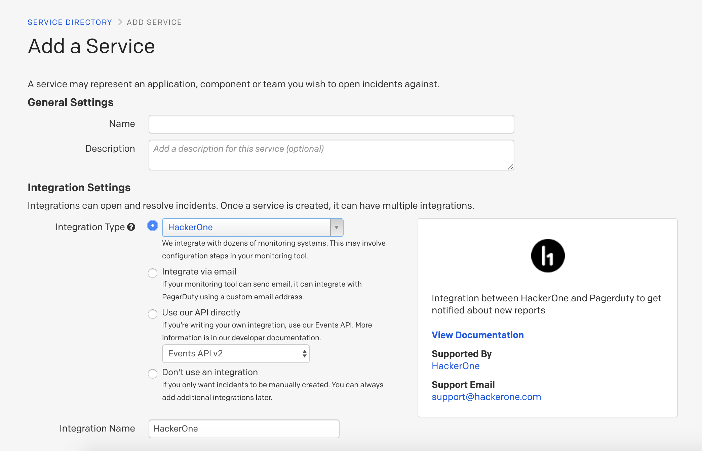
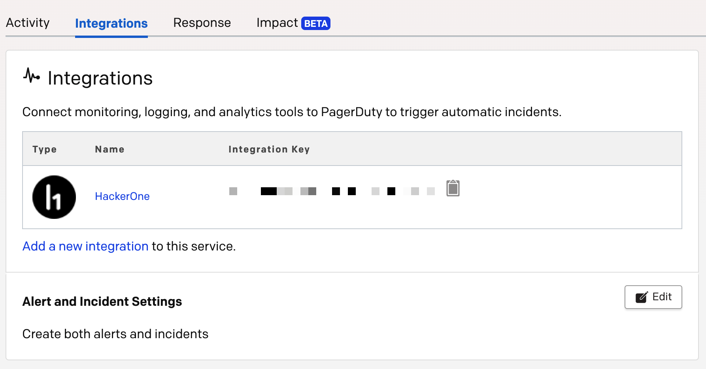
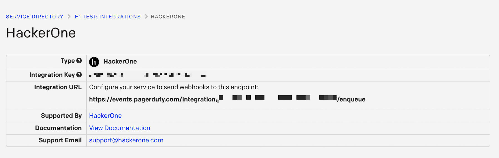
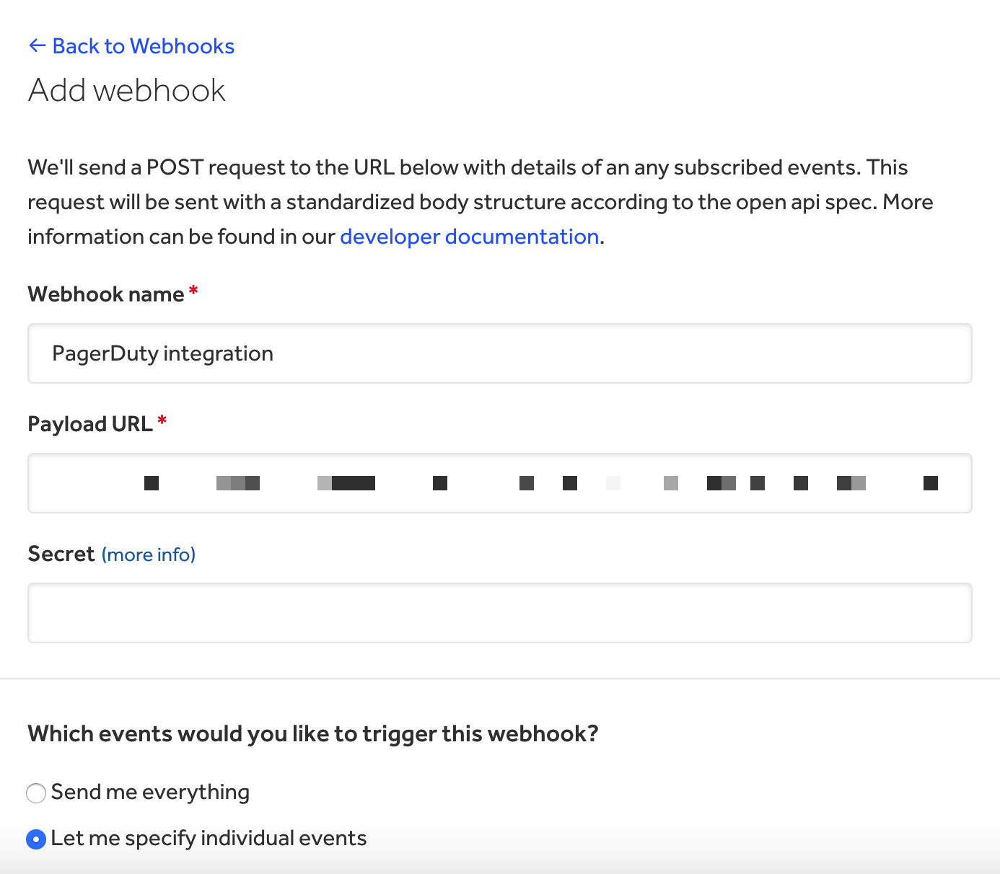

The PagerDuty integration enables incidents to be created each time a new (high or critical severity) report is submitted or triaged onto HackerOne. This integration is flexible and can be used to create a PagerDuty incident for any of the [events](https://api.hackerone.com/webhooks/#events) listed.

> **Note:** The PagerDuty integration is only available for Enterprise programs.

### Setup

To set up the integration between PagerDuty and each time a high or critical report is created on HackerOne:

1. Navigate to **Configuration > Services** on PagerDuty.
2. Click on **New Service** or add an integration to an existing service on PagerDuty by clicking **+Add New Services** on your services page.
3. Select **HackerOne** for the *Integration Type*.

4. Click **Add Service**.
5. Go to the **Integrations** tab on the **Services** page.
6. Click on **HackerOne**.

7. Copy the **Integration URL** and store that for later.

8. Log in to your account on hackerone.com.
9. Navigate to your webhooks settings on **Program Settings > Program > Webhooks**.
10. Click **New Webhook**.
11. Paste the URL that was copied from the Pagerduty integration page in step 7.

12. Select **Report created** and **Report triaged** as the events you want to trigger the webhook on.
13. *(Optional)* Select any other events you want to trigger the webhook on.
14. Click **Add webhook** to save the webhook.

Each new and triaged report that has a high or critical severity will now create an incident on PagerDuty and page the appropriate teams based on your PagerDuty policies. You can tailor the configuration of your integration for different use cases by adjusting the events in step 13.
