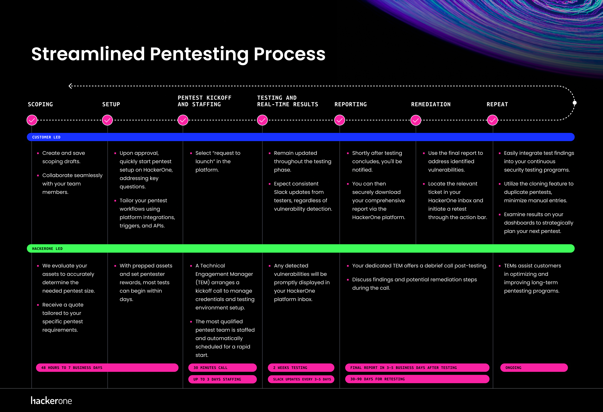

## Structure

By adhering to a structured testing approach, HackerOne aims to deliver consistent, high-quality pentest results
tailored to the unique security requirements of our customers. The five key components of our pentest approach are
explained below:

<table>
<tbody>
<tr>
<td nowrap><b>Team Composition</b></td>
<td><ul><li>Every pentest is led by one Lead Pentester.</li><li>Up to four additional pentesters may be included in the team, depending on the scope and requirements.</li></ul></td>
</tr>
<tr>
<td nowrap><b>Pentest Tiers</b></td>
<td><ul><li>Pentests are categorized into two <a href="/hackers/background-checks.html">distinct tiers</a>: the Essential and the Premium.</li><li>Each tier carries its unique responsibilities, ensuring a tailored approach to different security needs.</li></ul></td>
</tr>
<tr>
<td nowrap><b>Duration and Effort</b></td>
<td><ul><li>All pentests, irrespective of their size or tier, are designed to run over a span of two calendar weeks (14 days) unless specified otherwise.</li><li>Every pentester involved is expected to commit a total of forty hours of effort during this period.</li></ul></td>
</tr>
<tr>
<td nowrap><b>Retesting Phase</b></td>
<td><ul><li>Following the main testing phase, a retesting window opens.</li><li>Pentesters assigned will be responsible for conducting retests during this period.</li><li>The duration of the retesting window is contingent upon the assessment tier chosen.</li></ul></td>
</tr>
<tr>
<td nowrap><b>Peer Review</b></td>
<td><ul><li>Collaboration is paramount to ensure consistency across each engagement.</li><li>At the end of each engagement, pentesters are required to review and provide feedback on their teammates' contributions, ensuring continuous improvement and cohesion within the team.</li></ul></td>
</tr>
</tbody>
</table>

## Pentest Engagement Process

### 1. Pre-Testing Phase

<table>
<thead>
    <th></th>
    <th>Scoping</th>
    <th>Setup</th>
</thead>
<tbody>
    <tr style="background-color: #BDD1F6;">
        <td nowrap>Customer Tasks</td>
        <td><ul><li>Create and save scoping drafts</li><li>Collaborate seamlessly with team members.</li></ul></ul></td>
        <td><ul><li>Upon approval, quickly start pentest setup on HackerOne, addressing key questions</li><li>Tailor your pentest workflows using platform integrations, triggers, and APIs.</li></ul></td>
    </tr>
    <tr style="background-color: #D1E5C9">
        <td>HackerOne Tasks</td>
        <td><ul><li>We evaluate your assets to accurately determine the needed pentest size.</li><li>We provide a customized quote tailored to your specific pentest requirements.</li></ul></td>
        <td><ul><li>With prepped assets and set pentester rewards, most tests can begin within days.</li></ul></td>
    </tr>
    <tr style="font-weight: bold; background-color: #F2F2F2; text-align:center;">
        <td>Duration</td>
        <td colspan="2"><b>48 Hours to 7 Business Days</b></td>
    </tr>
</tbody>
</table>

### 2. Testing Phase

<table>
<thead>
    <th></th>
    <th colspan=2>Pentest Kickoff and Staffing</th>
    <th>Testing and Real-time Results</th>
</thead>
<tbody>
    <tr style="background-color: #BDD1F6;">
        <td nowrap>Customer Tasks</td>
        <td colspan=2><ul><li>Select “request to launch” in the platform.</li></ul></td>
        <td><ul><li>Remain updated throughout the testing phase.</li><li>Expect consistent Slack updates from testers, regardless of vulnerability detection.</li></ul></td>
    </tr>
    <tr style="background-color: #D1E5C9">
        <td>HackerOne Tasks</td>
        <td><ul><li>A Technical Engagement Manager (TEM) arranges a kickoff call to manage credentials and testing environment setup.</li><li>The most qualified pentest team is staffed and automatically scheduled.</li></ul></td>
        <td>After this kick-off call, HackerOne needs as little as three working days to source the pentest team, after which testing can begin.</td>
        <td><ul><li>Any detected vulnerabilities will be promptly displayed in your HackerOne platform inbox.</li></ul></td>
    </tr>
    <tr style="font-weight: bold; background-color: #F2F2F2; text-align:center;">
        <td>Duration</td>
        <td>30 Minutes</td>
        <td>Up to 3 Days</td>
        <td>2 Weeks Testing  Slack updates every 3-5 days</td>
    </tr>
</tbody>
</table>

### 3. Post-testing Phase

<table>
<thead>
    <th></th>
    <th>Reporting</th>
    <th>Remediation and Retesting</th>
    <th>Repeat</th>
</thead>
    <tbody>
    <tr style="background-color: #BDD1F6;">
        <td nowrap>Customer Tasks</td>
        <td><ul><li>Shortly after testing concludes, you'll be notified.</li><li>You can then securely download your comprehensive report via the HackerOne platform.</li></ul></td>
        <td><ul><li>Use the final report to address identified vulnerabilities.</li><li>Locate the relevant ticket in your Hackerone inbox and initiate a retest through the action bar.</li></ul></td>
        <td><ul><li>Effortlessly transition pentest findings to your continuous security testing programs.</li><li>Use the cloning feature to simplify and duplicate pentests, reducing manual entries.</li><li>Analyze the pentest findings in your dashboards to determine where best to run your next pentest.</li></ul></td>
    </tr>
    <tr style="background-color: #D1E5C9">
        <td>HackerOne Tasks</td>
        <td colspan=2><ul><li>Your dedicated TEM offers a debrief call post-testing.</li><li>Discuss findings and potential remediation steps during the call.</li></ul></td>
        <td><ul><li>TEMs assist customers in optimizing and improving long-term pentesting programs.</li></ul></td>
    </tr>
    <tr style="font-weight: bold; background-color: #F2F2F2; text-align:center;">
        <td>Duration</td>
        <td>Final report in 3-5 Business Days After Testing</td>
        <td>30-90 Days for Retesting</td>
        <td>Ongoing</td>
    </tr>
</tbody>
</table>

## Scoping

The scoping of a pentest serves two functions: to identify the target of the test and to calculate the size of the test.
The output of scoping is:

- **The technical scope of the test:** The assets and user roles to be tested
- **The size of test:** How many people/hours and what type of skills are needed to complete the test to a high quality
  standard
- **A commercial quotation:** How much this will cost

The target of the test is the set of digital assets that will be assessed in the 2 week testing period by the pentesting
team. The type of asset determines the checks that must be completed, the pentester skill requirements and the tier (
essentials or premium). For example, when an Android mobile application is added to a HackerOne Pentest scope, the
Android security checklist is added, pentesters are selected with skills and tools needed to audit Android applications,
and the test will be defined as a premium test to reflect the increased complexity of testing (over a simple web
application).

The size of the test is the number of hours needed to achieve coverage of the test targets. The size is calculated from
the type of asset and qualities such as the number of functions that an application performs and the number of user
roles.

## Size

There are five different units of measurement we use to define various pentest sizes that HackerOne offers. These sizes
are calculated based on the testing hours needed per pentest, depending on the scope.

All pentesters, including Leads, are expected to spend forty (40) hours of effort across all pentest sizes. Pentests are
named based on the number of hours the assessment requires for the whole team and referred to as the following:

<table>
<thead>
<tr>
    <th>Pentest Size</th>
    <th>Description</th>
    <th># of Lead Pentester</th>
    <th># of Supporting Pentester(s)</th>
</tr>
</thead>
<tbody>
    <tr>
        <td><b>P40</b></td>
        <td>Lead pentester performs all of the work by themselves.</td>
        <td>1</td>
        <td>-</td>
    </tr>
    <tr>
        <td><b>P80</b></td>
        <td>Lead pentester and a supporting pentester share the work.</td>
        <td>1</td>
        <td>1</td>
    </tr>
    <tr>
        <td><b>P120</b></td>
        <td>Lead pentester and 2 supporting pentesters share the work.</td>
        <td>1</td>
        <td>2</td>
    </tr>
    <tr>
        <td><b>P160</b></td>
        <td>Lead pentester and 3 supporting pentesters share the work.</td>
        <td>1</td>
        <td>3</td>
    </tr>
    <tr>
        <td><b>P200</b></td>
        <td>Lead pentester and 4 supporting pentestesr share the work.</td>
        <td>1</td>
        <td>4</td>
    </tr>
    <tr>
        <td><b>>P200</b></td>
        <td colspan="3">Contact your dedicated pentest team for custom sizing tailored to larger environments and multiple tests.</td>
    </tr>
</tbody>
</table>

> ℹ️ Of course, most organizations will be developing and maintaining multiple systems, and therefore, will need
> multiple tests. This is addressed with a consumption contract. A set number of hours are purchased, and these hours are
> deducted from the total during the contract period.

## Pentester Roles and Responsibilities

<table>
<thead>
<tr>
    <th>Pentest Lead</th>
    <th>Pentester</th>
</tr>
</thead>
<tbody>
    <tr>
        <td>
            <ul><li>Main point of contact with the Customer and HackerOne staff</li><li>Responds to all customer inquiries and questions within 1 business day</li><li>Provides updates frequently (minimum of 4 updates required)</li><li>Validates, performs QA and de-duplicates all submissions from the pentesters before they are submitted</li><li>Ensures all submissions are clear and optimized for the customer understanding</li><li>Leads the team, makes decision about scope and testing focus, coordinates and delegates work where needed</li><li>Performs testing and retesting</li><li>Writes vulnerability reports and the summary report</li><li>Completes checklists and/or assigns these to testers making sure these are completed.</li></ul>
        </td>
        <td>
            <ul><li>Performs testing and retesting</li><li>Updates the Lead about testing (minimum of 4 updates required)</li><li>Shares and validates vulnerabilities with the Lead and the team before submission</li><li>Writes Vulnerability reports</li><li>Provides all the information required by the Lead (e.g. to answer customer questions)</li><li>Completes checklists according to what the Lead assigns.</li></ul>
        </td>
    </tr>
    <tr>
        <td colspan="2" style="text-align: center;">
            <strong>40 hours of individual pentest work</strong>
        </td>
    </tr>
</tbody>
</table>

## Tiers

Regardless of the size and scope, all pentests are categorized on the platform into two distinct tiers: Essential and
Premium. There are several fundamental differences between these two tiers, which are detailed below.

