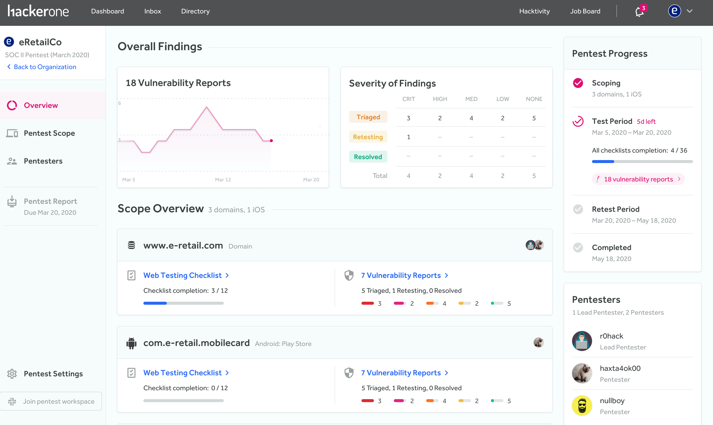

In a penetration test (pentest), authorized hackers simulate a cyberattack on a specific application to test how secure the application is. HackerOne pentests are performed by select hackers from the HackerOne community with skills and experience that best match your applications in scope.

> **Note:** To take part in HackerOne pentests, contact your Account Manager.  

### How It Works

Here are the steps outlining the process of pentests:
1. Fill out the scoping questionnaire provided by your Account Manager. (*~30 minutes*)
2. You'll work with one of HackerOne's Solutions Architects to confirm the scope of the engagement, ensure login credentials/assets are ready for testing, and set up your pentest. HackerOne will look at all pentest applicants and form the best pentester team for your pentest based on the skills required for the specified scope. (*~1 week*)
3. During the testing period you'll be able to view and begin remediating any found vulnerabilities immediately in the platform or via any issue tracking integrations that are set up. (*2 weeks*)
4. After testing has been completed, the lead pentester will draft and provide a summary report of the team's findings. (*~1 week*)
5. Once the vulnerabilities have been remediated, the pentest team will retest the vulnerabilities to make sure they’re fixed. (*60 days from the conclusion of testing*)

To learn how pentests work from the hacker side, see the [Pentest Overview page for pentesters](/hackers/pentest-overview.html).

### Managing Pentests
After you log in to HackerOne and navigate to your pentest program, you’ll be met with the *Pentest Dashboard* page where you can view all information related to your pentest.

The Pentest Dashboard enables you to view the:
* Number of vulnerability reports by severity and status.
* Members that comprise your pentest team. Your team includes the pentesters as well as your HackerOne customer success manager. As most communication between you and the team happens through Slack, there’s a link that’ll lead you to join the Slack workspace for your pentest.
* Assets that make up your pentest scope.  Each asset is linked to its own testing checklist. You can also see the number of vulnerability reports associated with each asset as well as the state and severity.
* Progression status of your pentest. There are 4 progress phases to your pentest. They are:

Pentest Phase | Details
------------- | --------
Scoping | Assets are added to the scope of your pentest and you can set the dates of your testing period.
Test Period | Pentesters actively work on your pentest.
Retest Period | The pentest team retests any vulnerabilities that have been remediated from the pentest.
Completed | Your pentest is finished and the report is available to download.

When the final copy of your pentest report is ready, you can also directly download your report.

On the left-hand side of the page, you can access these pages to go deeper into your pentest:

Page | Details
---- | -------
Pentest Scope | You can view the details behind the progress of your checklists associated with your assets and see what each checklist entails.
Vulnerabilities | You can view all the vulnerabilities that have been found and the associated vulnerability report, as well as the status and severity of the report.   If you have an integration set up to a tracking tool like Jira, you can choose to link your reports to the tool to get visibility into the remediation status.
Pentest Team | You can view the members part of your pentest team.

### Pentest Ratings
At the end of the pentest, you'll have 30 days to rate and provide feedback about your experience with HackerOne pentests. You'll also be able to rate each of the pentesters you worked with and provide constructive feedback to help them improve in their skills. The pentesters will also have the ability to provide feedback regarding your pentest program. The pentesters you rate will only be able to see the feedback that pertains specifically to them. 

### Pentest Pricing
Our pentest pricing comes in 2 tiers - Essential and Premium.

