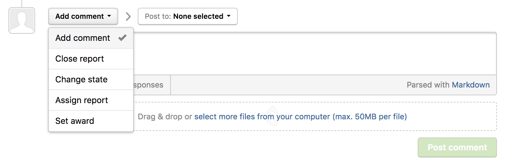
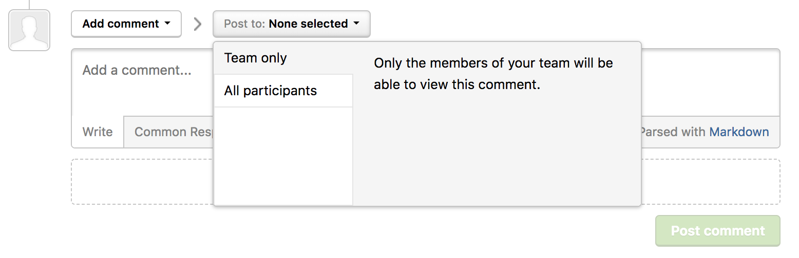
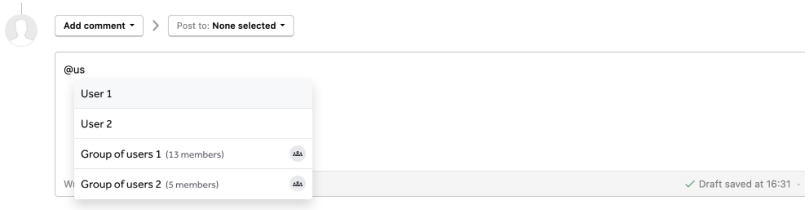
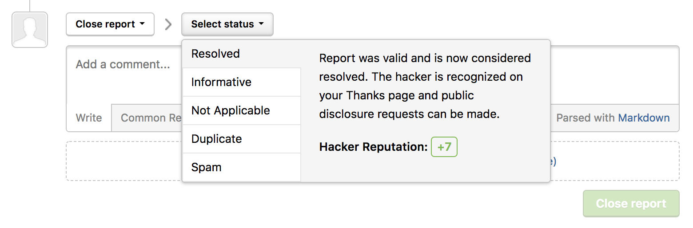
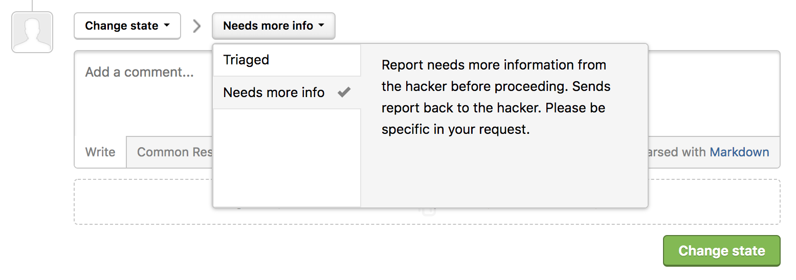
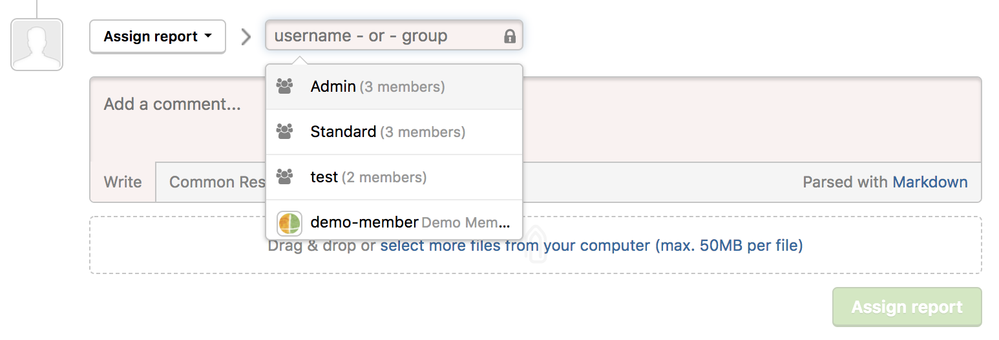
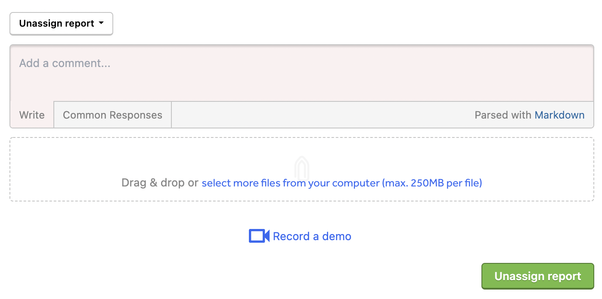
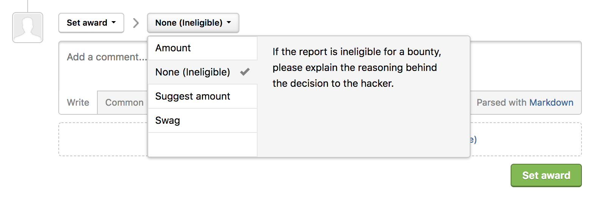

There are several actions you can take on a report in your inbox. You can:
* Add a comment
* Close a report
* Change the state
* Assign a report
* Unassign a report
* Set an award

### Add a Comment
You can dialogue with hackers, team members, and groups or make notes about the report by adding comments.

To add a comment:
1) Go to the bottom of the report above the comment box.
2) Make sure the action picker is set to **Add comment**.
3) Select who you would like to make the comment visible to. You can select from these options:

Option | Details
------ | -------
Team only | Only the members of your program will be able to view the comment.
All participants | All participants of the report will be able to view the comment.

><i>Note: When you're adding a comment to your internal team only, the comment box will turn red.</i>

#### Mention Users or Groups
In the comment box, type in **@** followed by the first few letters of the person or group that you want to mention in the comment. You can also see the number of members in that group and a group icon. 

### Close a Report
You can close a report to mark that it's either:
* Resolved
* Informative
* Not Applicable
* Duplicate
* Spam

To close a report:
1) Go to the bottom of the report above the comment box.
2) Select **Close report** in the action picker.
3) Select the status of the report in the **Select status** action picker.
4) Click **Close report**.

### Change the State
You can change the state of a report to be marked as either *triaged* or *new*. This'll help you keep track of what state your report is in.

To change the state of a report:
1) Go to the bottom of the report above the comment box.
2) Change the action picker from **Add comment** to **Change state** from the drop-down.  
3) Select the state of the report. You can choose from:

Option | Details
------ | -------
Triaged | The report has passed the initial validation and is pending resolution. You can briefly describe the next steps in the comments section such as further investigation, escalation, engineer preparing a fix. *(Optional) When you select triage, you can enter the reference ID to your integration in the **Reference ID** field.*
New | The report is pending triage and validation.

4) Click **Change state**.

### Assign a Report
You can assign reports to individual members or groups in your program to evaluate and take action on a report.

To assign a report:
1) Go to the bottom of the report above the comment box.
2) Change the action picker from **Add comment** to **Assign report** from the drop-down.  
3) Enter the username of the assignee or the group.
4) Click **Assign report**.

### Unassign a Report
Once a report has been assigned, you can elect to unassign a report.

To unassign a report:
1) Go to the assigned report in your inbox.
2) Change the action picker to **Unassign report** from the drop-down.
3) Click **Unassign report**.

No one will be assigned to the report. You can reassign the report by following the steps in the <b>Assign a Report</b> section.

### Set an Award
You can mark that you've rewarded a hacker with swag or a monetary amount through setting awards.

To set an award to a hacker for the report:
1) Go to the bottom of the report above the comment box.
2) Change the action picker from **Add comment** to **Set award** from the drop-down.  
3) Select the type of award you want to reward the hacker with. You can choose from these options:

Option | Details
------ | ------
Amount | Mark that you've rewarded the hacker with a specific dollar amount for the vulnerability.
None (ineligible) | The report is ineligible for a bounty. It's best to explain the reasons to hackers in the comments section, why the report is ineligible.
Suggest amount | Suggest a bounty amount to award the hacker. Only internal members of your program will be able to view your bounty suggestion.
Swag | Mark that you've rewarded the hacker with swag.

4) Click **Set award**.

