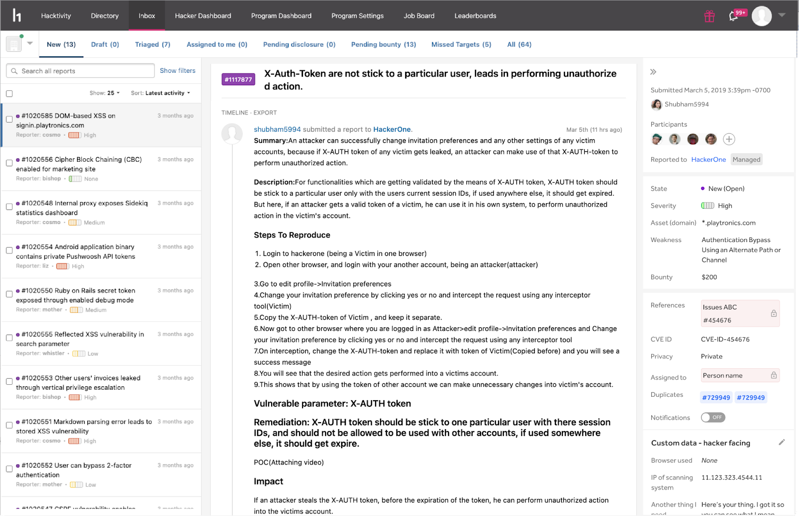
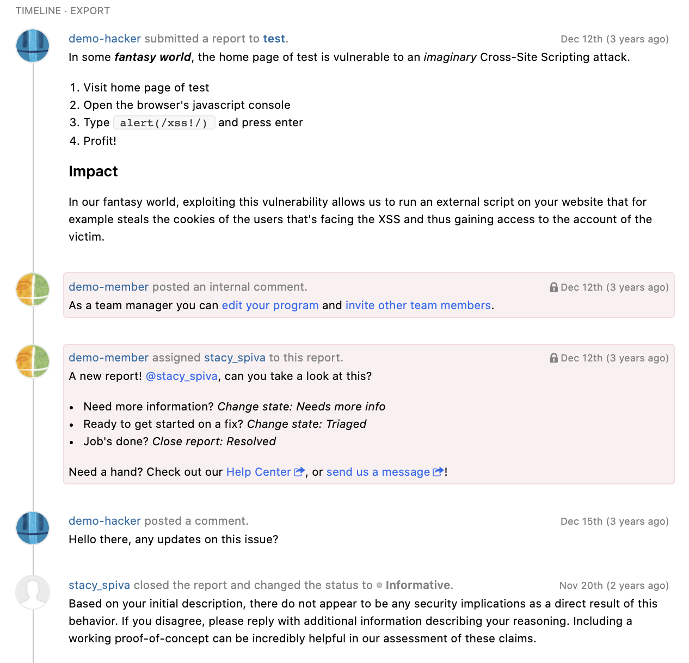

Reports in your inbox consist of different components to give you a holistic view of the vulnerability.

### Hacker Info
The hacker that submitted the report is shown in the sidebar metadata. On hover, you can see the hacking statistics by reputation, signal, and impact.

### Report ID and Title
At the top of the report is the report ID number and title. You can change the report title to your internal naming conventions. The color behind the report number represents the state the report is in. These are the different colors and the report states they represent:

Color | Report State
----- | ---------
Purple | New
Light Blue | Needs more info
Dark Blue | Pending Program Review *(currently in beta)*
Yellow | [Retesting](retesting.html)
Green | Resolved
Orange | Triaged
Brown | Duplicate
Grey | Informative
Red | Not Applicable

### Report Metadata
You’ll be able to view these metadata fields in the right sidebar:

Metadata Field | Details
-------------- | --------
Asset | The specific asset the vulnerability was found on.
Assigned to | *(An internal field that is only seen by the program’s security team)* The person on your security team that's assigned to triage or manage the report.
Bounty | (*Only shows for resolved reports that were given a bounty*) How much bounty the report was awarded.
Cloned From | Shows which report this was cloned from
Cloned reports | There is an ability to clone a report on our platform, this metadata item links all the reports that were cloned from the current one.
Credential Account Details | Related to Credential Management (https://docs.hackerone.com/organizations/credential-management.html)
Custom Fields | Private fields for your company, not seen by hackers see article about custom fields
CVE ID | The [CVE ID](cve-requests.html) the vulnerability is linked to.
Disclosed | The date the report was disclosed. Only shows for reports that were disclosed.
Duplicates | Shows which reports this is duplicate of
Link Sharing | Ability to generate a secure link to share this report with a third party
Notifications | Indicates whether you have notifications enabled or disabled for actions on your program.
Participants | All of the hackers involved in finding the vulnerability as well as program members involved with triaging the report.
Pentest | *(Shows only if you're participating in pentests)* The pentest the report is linked to.
References | *(An internal field that is only seen by the program’s security team)* The ticket number associated with the report in your issue tracking tool that you've set up an integration for.
Reported at | The date and time the report was submitted.
Reported to | The name of the program the report was submitted to.
Reporter | The hacker who submitted the report
Resolution Target | Programs have certain SLA, so this is date/time by which program should resolve the report, so it doesn't miss SLA
Severity | The severity level of the vulnerability.
State | The state the report is in.
Visibility | Indicates the status of disclosure of the vulnerability. You can also choose to redact private information from the report.
Weakness | The type of weakness of the vulnerability.

### Summary
Either your security team or the hacker(s) involved with the report can choose to provide an optional summary of the report. Including a summary helps future viewers of the report to understand the context without having to scroll through the entire report. Click **ADD SUMMARY** to add a summary to the report.

### Timeline
The report timeline shows all of the activity that occurs in the report between you and the hackers involved. It will show when:
* You or the hacker adds a comment
* The state of the report changes
* The report has been assigned or unassigned
* A bounty is set
* A bounty has been given
* A hacker requests mediation
* You or the hacker requests public disclosure  
* The report severity has changed
* The latest internal activity occurred

The report timeline will also show who is in charge of the next pending action within the report.

Internal comments and actions made within your program security team will be surrounded with a red box and a lock icon to denote that the comment will only be seen by internal members and not by hackers.

If you have [hackbot](hackbot.html) enabled, you’ll also be able to view your suggestions from hackbot, which will also be internal.

