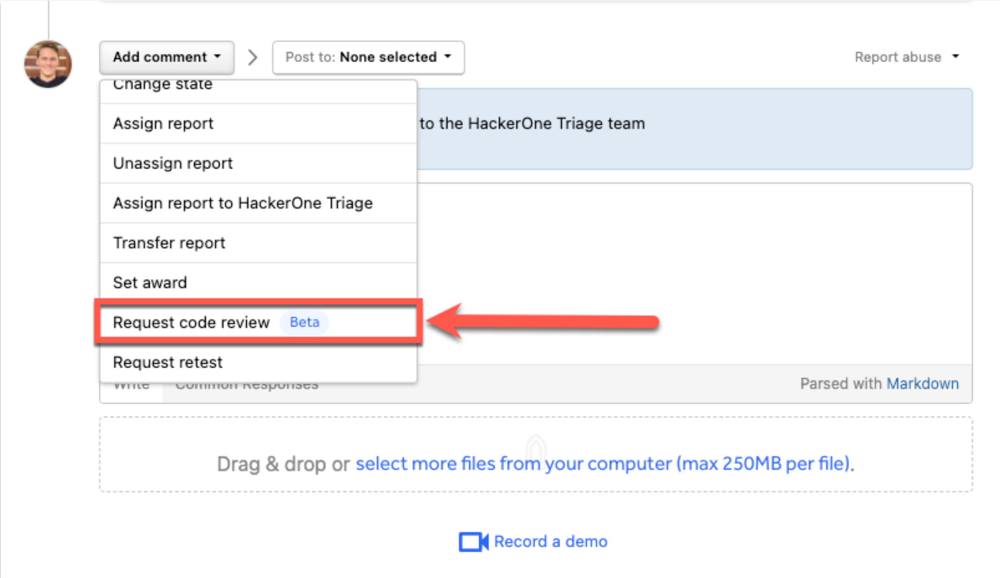
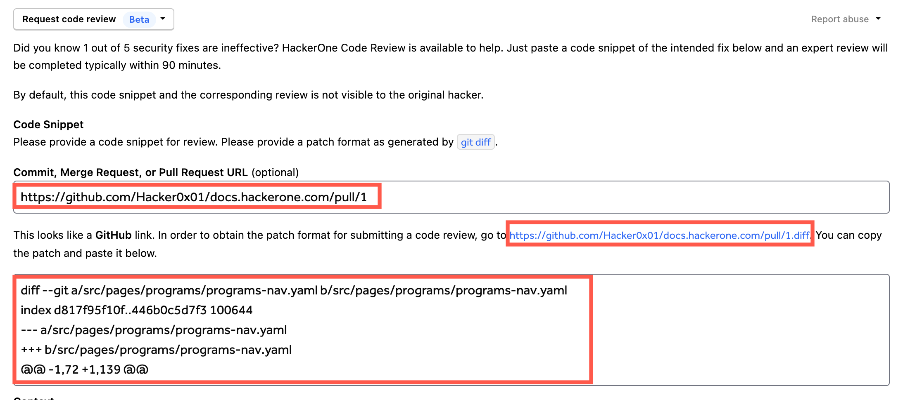
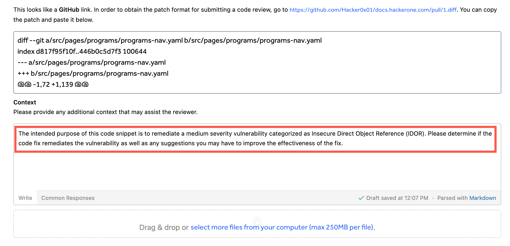
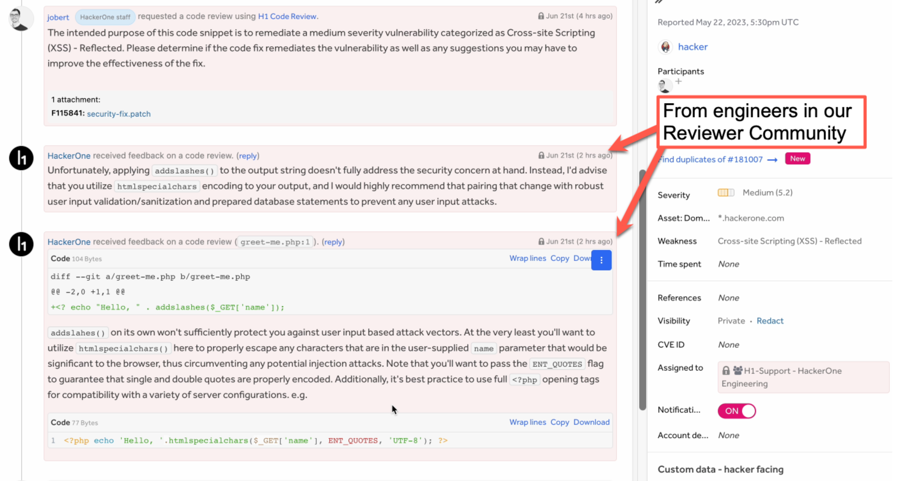

In addition to confirming a vulnerability has been fixed by requesting a [Retest](/retesting.html), you can also request a code review to verify any source code updates adequately address the reported vulnerability. These are conducted by the HackerOne Code Review Community: a group of rigorously-vetted, specialized software engineers and security experts HackerOne created as part of the [acquisition of PullRequest.com](https://www.hackerone.com/press-release/hackerone-acquires-pullrequest-power-developer-first-security-testing-solutions). You can learn more about this specialized cohort of the HackerOne Community [here](https://www.pullrequest.com/reviewers/).

The **Request code review** feature allows you to send a limited code snippet patch to be reviewed as generated by `git diff`.

> **Note:** This feature is currently in open beta.

### How it Works  
To request a patch code review:
1. Choose the report in your inbox that you want to assign a our reviewer community to review.
2. Change the action picker to **Request code review**.

4. You'll be prompted to enter a code snippet. You can add this by running `git diff` between data sources that support Git diff functions (e.g., commits, branches, files). Alternatively, if the proposed update is already in a GitHub pull request or GitLab merge request, you can enter the URL to get an easily accessible link to its associated diff source.

5. A **Context** field will pre-populate with a few sentences describing the code snippet and context of the change. Feel free to edit this to provide additional information.

6. Click **Post** to send the snippet to be reviewed.

> **Note:** It usually takes about 90 minutes for engineers in our community to complete a review and submit feedback.

Review results from engineers from our community will be posted as [Internal](/report-components.html#timeline) comments to the report.

### Payments
There are **no fees** associated with this feature. If you're interested in more in-depth secure code review, [let us know](https://www.hackerone.com/contact)!

### FAQs
Question | Answer
-------- | -------
Can the person reviewing the code snippet see the contents of the report? | No. Further, identities of the reporter(s) and members of your program team are also NOT disclosed to the engineer reviewing the code.
How does HackerOne vet the reviewers? | All members of the code review community are background-checked, interviewed for technical proficiency & professionalism, sign confidentiality & personal inventions assignment agreements, and are based the U.S., U.K., or Canada.
How much of the source code is exposed to reviewers? | Only what is contained within the diff snippet. These contain whatever lines of code have been changed and, where applicable, a few lines of code above and below the changed lines to provide additional context for the impacted lines of code.
If a reviewer finds a problem with the proposed fix, can I submit another diff snippet with updated code? | Yes. We encourage it!
Can I respond to the reviewer or ask questions? | Yes. Simply respond with an [Internal](/report-components.html#timeline) comment.
What programming languages, frameworks, libraries and platforms do you support? | All types of code are supported. This includes Infrastructure as Code (IaS) and Configuration as Code (CaC). It does help our community if you expand the Context to include version(s) of a programming language or framework if relevant to determine correctness. Our systems detect the type of code submitted by the file types included as part of the diff snippet and assign to experts in our community accordingly.
