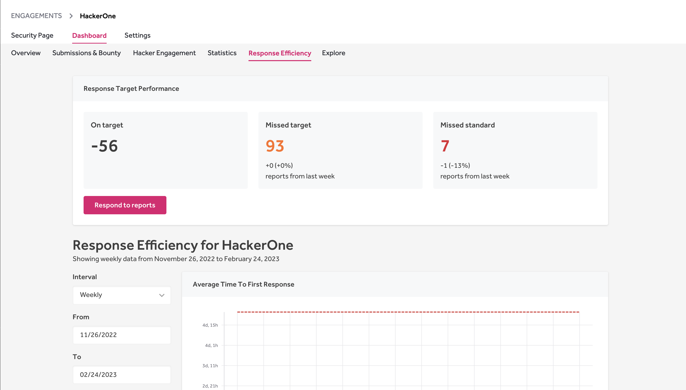

### Response Efficiency
The Response Efficiency page gives insight into how efficiently you respond to your reports. It helps you keep track of how many reports have missed your [response target](response-targets.html) or standard.

You can view the metrics of the average time to:
* First response
* Triage
* Bounty
* Resolution
