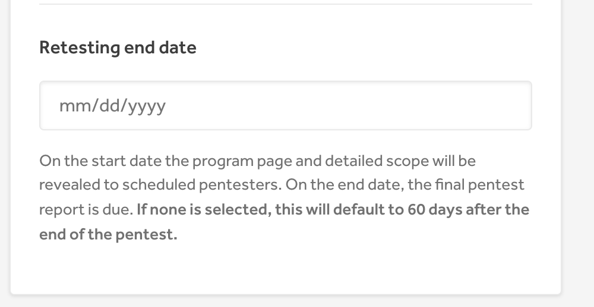

### Pentest Retests

Requesting a retest typically happens after a report has been submitted, triaged, and remediated. You can request a retest at any point during the testing period. You have an additional 60 days after the test period ends to request a retest.

  **Note:** If you want to request a retest after the 60 day window expires, you can effectively “extend” the retest window for $50 per retest to pentesters (Hacker/BBP Retesting).

### Request a Retest

After a report has been triaged, you can use the action picker to elect to have pentesters retest vulnerabilities to verify the fixes.

### Hacker Response
The original reporter that submitted the vulnerability will be invited to take part in the retest. They will see the request in their Hacker Dashboard.
  **Note:** There is no specific notification letting reporters know they have been assigned and need to complete a retest, but there is a generic state change notification for team members and all pentesters that the report has moved to the retesting state.

- The pentester will submit their findings in the Retest Findings form at the bottom of the report.
- Hackers can also decline to participate in the retest which will un-assign the original reporter. The retest will be opened up to other hackers to claim.
  - If a reviewer has declined to participate, they cannot claim that retest again.
  - There is no notification to the other pentesters that there is a retest open which they can now claim.

All users can see a summary of the retest time window and reports to be retested in the Pentest Phases section.

- The “hours remaining” for the original reporter to complete the retest will count down from 24 hours, but the retest never actually expires for the original reporter.
  - In the Hacker Dashboard > Retesting UI it appears that the retest has expired (“0 hours remaining”) but that is not actually the case.
  - The original reporter can click on the card and complete the Retest Findings flow in the report.

- This means the retest request is never unassigned from the original reporter and never opens up to the other pentest team members to claim and complete and it appears to be expired for the original reporter

### Accepting/Rejecting the Retest

After the hacker submits their findings, you’ll be prompted to either Approve and Resolve or Reject the retest, using the prompt shown below:

### End Retest Period
The Submit Report buttons are removed in **HackerDashboard > My Pentests** and the Pentest Overview when the retesting period ends.
An SA manually closing the program does not override this logic of time.
