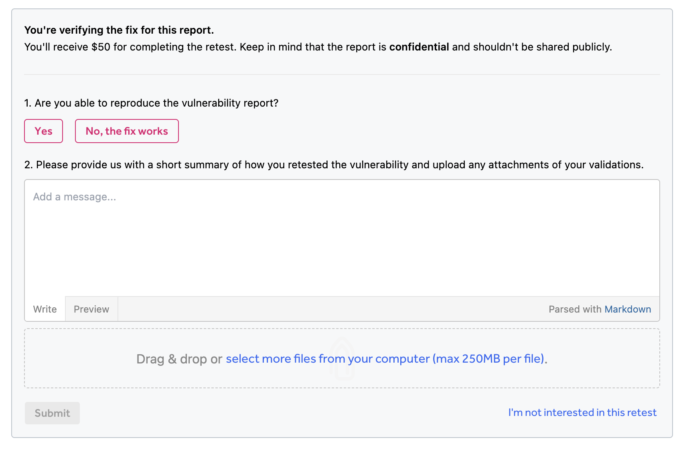
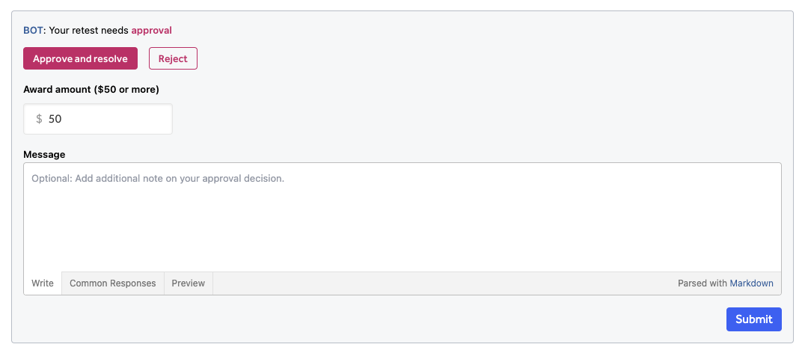

As programs receive vulnerability reports and work on deploying fixes, they need proof that their vulnerabilities have actually been fixed. Retesting is a good way to secure the protection of your asset’s data by asking hackers to verify whether a fix has been made. With retesting, you can elect to have hackers retest your vulnerabilities to verify the fixes.

> **Note:** For response programs (VDPs) using HackerOne's triage services, the triage team will retest the vulnerabilities to verify the fixes instead of hackers when a retest is requested. 

### How it Works  
To have hackers retest a vulnerability:
1. Choose the report in your inbox that you want to assign a hacker to retest.
2. Change the action picker to **Request retest**.

3. Click **Confirm retest**.

The original hacker who submitted the vulnerability will be invited to take part in the retest.

The hacker will submit their findings in the **Retest findings** form at the bottom of the report. The form consists of these fields:
* Are you able to reproduce the vulnerability report?
* Please provide us with a short summary of how you retested the vulnerability and upload any attachments of your validations.

After the hacker submits their findings, you’ll be prompted to either **Approve and resolve** or **Reject** the retest. When approving the retest, you can award the hacker with $50 or more.

If you choose the following actions for the retest:

Action | Scenario | Details
------ | -------- | --------
**Approve and resolve** | The hacker says the vulnerability is fixed. | The report will close and will be marked as *Resolved*. The hacker will also be awarded a bounty.
**Reject** | The hacker says the vulnerability is fixed. | You’ll need to provide a summary to the hacker explaining why you’ve rejected the retest. You can choose to request another retest for the report, by going back to step 1.   The status of the report will be changed to its previous state..
**Approve** | The hacker says the vulnerability is not fixed. | The report will move back to *Triaged* and will stay open for the team to implement a fix. The hacker will be awarded a bounty.
**Reject** | The hacker says the vulnerability is not fixed. | You’ll need to provide a summary to the hacker explaining why you’ve rejected the retest. You can choose to request another retest for the report, by going back to step 1.   The status of the report will be changed to its previous state.

If the original hacker rejects the retest, the report will pass back to you in its previous state. You are also able to cancel a retest if the original hacker does not respond in time. 

> **Note:** Retesting is not available for anonymous reports.

### Payments
Hackers will be awarded a bounty for each successful retest. Awards for retests will be paid from your bounty pool. If you're using the consumption tier to pay for your bounties, payments for retests will count toward the tier.   
