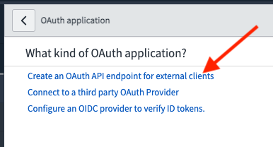

HackerOne offers a bi-directional ServiceNow integration that enables you to synchronize your HackerOne reports to ServiceNow and vice versa, from ServiceNow to HackerOne. This integration enables your development and security teams to stay aligned as it also contributes to a better workflow of remediating security vulnerabilities by minimizing the manual back and forth between ServiceNow and HackerOne.

You can use this integration with different ServiceNow tables. The guide below uses the `incident` table that's used in the ServiceNow's [Incident Management](https://docs.servicenow.com/bundle/quebec-it-service-management/page/product/incident-management/concept/c_IncidentManagement.html) product. IF you're using the ServiceNow's [Security Incident Response](https://docs.servicenow.com/bundle/quebec-security-management/page/product/security-incident-response/reference/sir-landing-page.html) product, you can use the following table name: `sn_si_incident`. Alternatively, we support custom tables as well for full flexibility. 

> This integration is only available to Enterprise programs.

### Set up
To set up the bi-directional integration between HackerOne and your ServiceNow instance, you’ll need to follow these 5 steps:
1. [Configure OAuth for your ServiceNow instance](#configure-oauth)
2. [Configure incoming requests in your ServiceNow instance](#configure-incoming-requests)
3. [Configure the integration on HackerOne](#configure-on-hackerone)
4. [Configure outgoing requests in your ServiceNow instance](#configure-outgoing-requests)
5. [Configure a “close report” request from ServiceNow to HackerOne](#configure-close-report-event)

### Configure Oauth

1. Navigate to **System OAuth > Application Registry** in your ServiceNow settings.


2. Click **new** to create a new Application Registry.


3. Click **Create an OAuth API endpoint for external clients**



4. Enter these values for these fields:

Field | Value
----- | -----
Name | HackerOne
Client ID | This is auto generated. Copy this value, you'll need this later when setting up the Oauth connection.
Client Secret | Enter a secret key. Later in the process when setting up the OAuth connection you'll need this key again.
Redirect URL | https://hackerone.integration-authentication.com/oauth2/token


5. Click **Submit**. 

### Configure Incoming Requests
Configuring incoming requests requires you to post to a custom REST API endpoint in ServiceNow. This will enable you to add comments from HackerOne to your ServiceNow instance.

To configure adding comments from HackerOne to ServiceNow:
1. Navigate to **Scripted REST APIs** in your ServiceNow settings.


2. Click **New** to create a new Scripted REST API.


3. Enter these values for these fields:

Field | Value
----- | -----
Name | HackerOne
API ID | hackerone


4. Click **Submit**.
5. Open the HackerOne Scripted REST API you just created.   
6. Click **New** to add a new resource to the Scripted REST API.


7. Enter these values for these fields:

Field | Value
----- | -----
Name | New Comment
Relative Path | /new_comment
HTTP Method | POST


8. Enter this code in the Script field:

```
(
 function process(/*RESTAPIRequest*/ request, /*RESTAPIResponse*/ response) {
   // Retrieve the incident with the passed in sys_id
   var sys_id = request.body.data.sys_id;
   // Create a new record for the table you want to use (in our example `incident`)
   var incident = new GlideRecord('incident');
   incident.get(sys_id);
   // Add comment to incident item
   incident['work_notes'].setJournalEntry(request.body.data.message);
   // Update the incident item
   incident.update();
   // Retrieve the last added comment on this incident
   var comment = new GlideRecord('sys_journal_field');
   comment.addQuery('element_id', sys_id);
   comment.addQuery('name', 'incident');
   comment.addQuery('element', 'work_notes');
   comment.addQuery('value', request.body.data.message);
   comment.orderByDesc('sys_created_on');
   comment.setLimit(1);
   comment.query();
   if (comment.next()) {
     //Store last comment in variable
     var last_comment = comment;
   }
   response.setBody(
     {
       'sys_id': incident.sys_id,
       'comment_sys_id': last_comment.sys_id,
       'comment_value': last_comment.value,
       'request_sys_id': request.body.data.sys_id,
       'request_message': request.body.data.message
     }
   );
 }
)(request, response);
```
Make sure you enter the correct table name, as in this case, it's *incident*.

9. Click **Submit**.

10. Copy the full URL to your endpoint and save it to be used for later. <ul><li>The full URL to the `/hackerone/new_comment` endpoint is required to set up the HackerOne integration. The namespace can be found from within the HackerOne Scripted REST API you just created, in the Resources tab underneath the Resource path column. Combine this with your instance URL found in the address bar to get the full URL.<li>As shown in the images below, this would be: https://dev100796.service-now.com/api/514345/hackerone/new_comment.


### Configure on HackerOne

To set up the integration on HackerOne:
1. Navigate to **Program Settings > Program > Integrations**.
2. Click **Connect with ServiceNow**.


3. Click **Edit** to start the setup process.


4. Authenticate your ServiceNow instance by entering information to these fields:

Field | Details
----- | -------
ServiceNow Instance URL | Enter the full URL to your ServiceNow instance, for example it could be: https://my-instance.service-now.com/
Client ID & Client secret | Enter the `Client ID` and `Client secret` from step 4 in [Configure OAuth](#configure-oauth)

5. Provide the name of the escalation table. By default, the integration uses the ServiceNow `incident` table. If you want to use a different or a custom table, please enter the table in the field below. If you prefer to use Security Incidents instead, you can use the following table name: `sn_si_incident`. 


6. Click **Next**.

7. Configure data mapping from HackerOne reports to ServiceNow incidents. This uses the API of both systems to retrieve fields that are allowed to be used for these objects. For example, you could map the HackerOne report title to the ServiceNow incident short description.


> **Note**: alternatively you can manually set the mapping to a single field or combination of fields from the [integration variables](/organizations/integration-variables.html). For example: `{{triage_summary}} \\ Link: {{report_link}} \\ Date: {{submission_date}} \\ Reporter: {{reporter_name}} \\ Weakness: {{weakness}}` Would create a combination of the triage summare, a link to the report the submission date, the reporter name and the weakness of their report and map that to a single field.

8. Click **Next**.

9. Enter your ServiceNow New Comment endpoint that was configured earlier in the **ServiceNow “Add Comment” endpoint** field. This should be a combination of the URL to your instance and the Resource Path found in the Scripted REST API object in ServiceNow.


10. Click **Next**.
11. Copy the public listener URL in the configuration wizard.
12. Click **Enable** to enable the integration.


### Configure Outgoing Requests
After configuring incoming requests, you’ll need to configure outgoing requests in ServiceNow which will enable you to post comments from ServiceNow to HackerOne. You’ll need to use Outbound REST Messages and Business Rules in the configuration process.

To configure posting comments from ServiceNow to HackerOne:
1. Navigate to: **System Web Services > Outbound > REST Message**.


2. Click **New** to create a new Outbound REST Message.
3. Enter these values for these fields:  

Field | Value
----- | -----
Name | HackerOne
Endpoint | The Public ServiceNow URL. This is found in the configuration wizard on the HackerOne platform.
Authentication Type | No authentication  


4. Click **Submit**.
5. Reopen the HackerOne outbound REST message you just created.
6. Click **New** to add a new HTTP Method.


7. Enter these values for these fields:

Field | Value
----- | -----
Name | New Comment
HTTP Method | POST
Authentication Type | Inherit from parent

8. Enter this in the **Content** field in the HTTP Request tab:

```
{"event_name":"new_comment","message":"${message}","sys_id":"${sys_id}","element_id":"${element_id}"}
```

9. Add these two HTTP Headers on the same HTTP Request tab:

Name | Value
----- | -----
Accept | application/json
Content-Type | application/json

10. Click **Submit**.

11. Navigate to **System Definition > Business Rules**.


12. Click **New** to create a new business rule.
13. Enter these values for these fields:

Field | Value
----- | ------
Name | Add Comment
Table | Journal Entry [sys\_journal\_field]
Advanced | Make sure the box is checked

14. Enter these values for these fields on the **When to run** tab. In this example, we use the `incident` table, if you use a different escalation table use that name here instead of `incident`.

Field | Value
----- | ------
When | async
Insert | Make sure the box is checked
Filter Conditions | Value is not empty: AND : Name : is : incident

15. Enter this script in the **Advanced** tab:

```
(function executeRule(current, previous /*null when async*/) {
   try {
     var r = new sn_ws.RESTMessageV2('HackerOne', 'New Comment');
     var encoded_message = GlideStringUtil.base64Encode(current.value.toString());
     r.setStringParameterNoEscape('message', encoded_message);
     r.setStringParameterNoEscape('sys_id', current.sys_id);
     r.setStringParameterNoEscape('element_id', current.element_id);
     r.execute();
   }
   catch(ex) {
     var message = ex.message;
   }
 }
)(current, previous);
```

15. Click **Submit**.

Make sure that the arguments for RESTMessageV2 matches the name you gave to the Outbound REST Message.

### Configure Close Report Event
The close report event from ServiceNow to HackerOne is set up in a similar fashion to configuring the outgoing requests. You only need to change the content in the Outbound REST Message and the trigger action in the Business Rule.

To set up the close report event:
1. 1. Navigate to: **System Web Services > Outbound > REST Message**.


2. Search for *HackerOne*.
3. Click **New** to add a new method.


4. Enter these values to these fields:

Field | Value
----- | -----
Name | Close Report
Endpoint | The Public ServiceNow URL visible in configuration wizard on the HackerOne platform
HTTP Method | POST
Authentication Type | Inherit from parent

5. Enter this in the **Content** field in the HTTP Request tab:
```
{"event_name":"close_report","element_id":"${sys_id}","hackerone_report_state": "${hackerone_report_state}"}
```

6. Add these two HTTP Headers on the same HTTP Request tab:

Name | Value
----- | -----
Accept | application/json
Content-Type | application/json

7. Click **Submit**.
8. Navigate to  **System Definition > Business Rules**.
9. Click **New** to create a new business rule.
10. Enter these values for these fields on the **When to run** tab. In this example, we use the `incident` table, if you use a different escalation table use that name here instead of `incident`.:

Field | Value
----- | -----
Name | Close Report
Table | Incident [incident]
Advanced | Make sure the box is checked
When | Async
Update | Make sure the box is checked
Filter Conditions | State: changes to : Closed

11. Enter this script on the **Advanced** tab:

```
(function executeRule(current, previous /*null when async*/) {
   try {
     var r = new sn_ws.RESTMessageV2('HackerOne', 'Close Report');
     r.setStringParameterNoEscape('sys_id', current.sys_id);
     // Set the HackerOne report state.
     // Possible state changes can be found here https://api.hackerone.com/customer-resources/#reports-change-state
     r.setStringParameterNoEscape('hackerone_report_state', 'resolved');
     var response = r.execute();
   }
   catch(ex) {
     var message = ex.message;
   }
 }
)(current, previous);
```

12. Click **Submit**.

Make sure the arguments for RESTMessageV2 match the name you gave the Outbound REST Message and HTTP Method.
