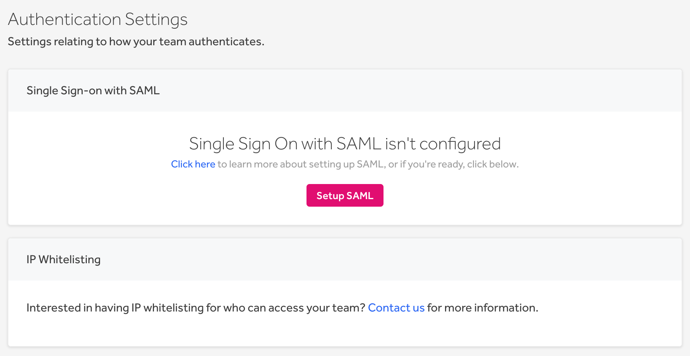
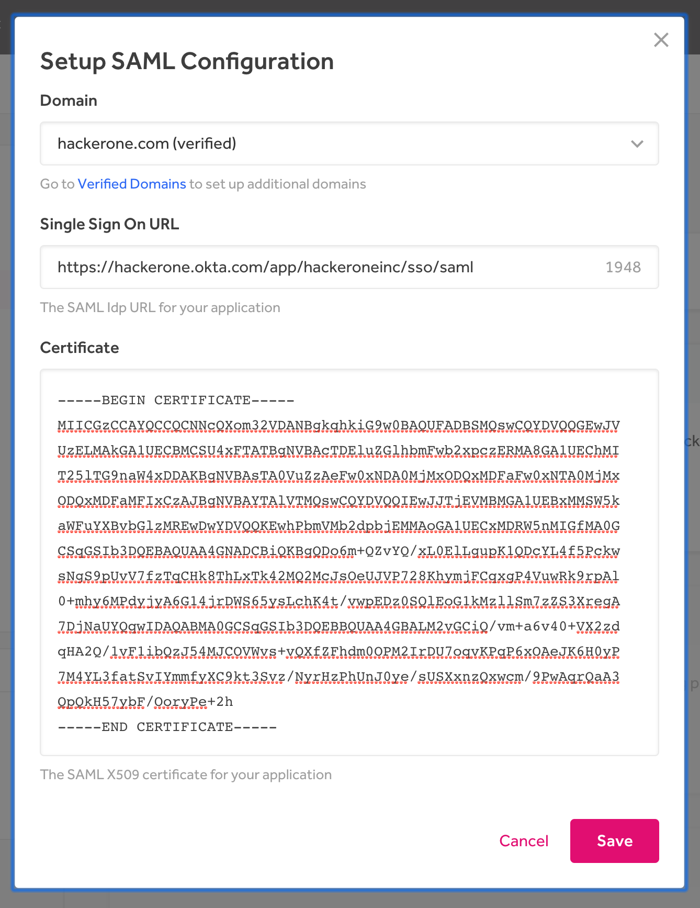
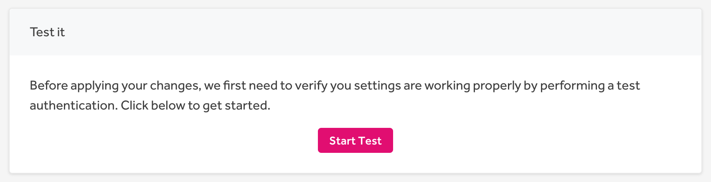
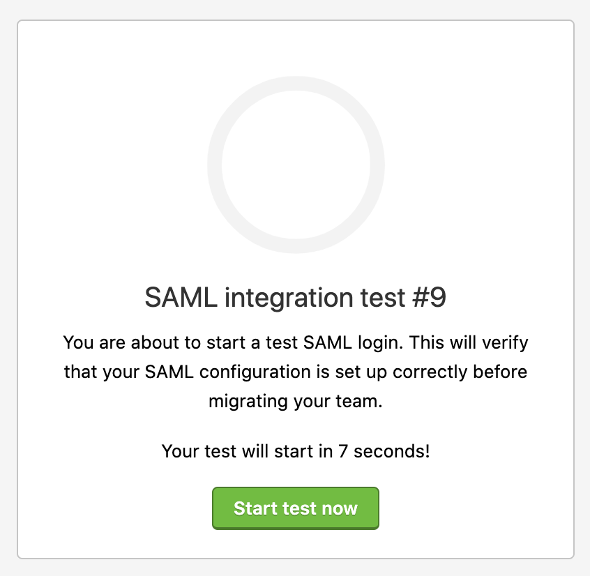
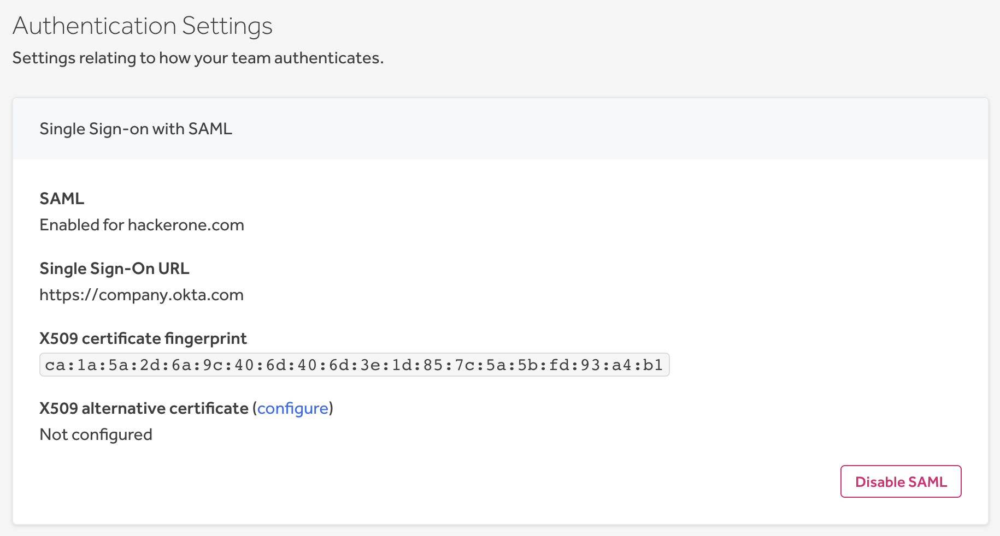
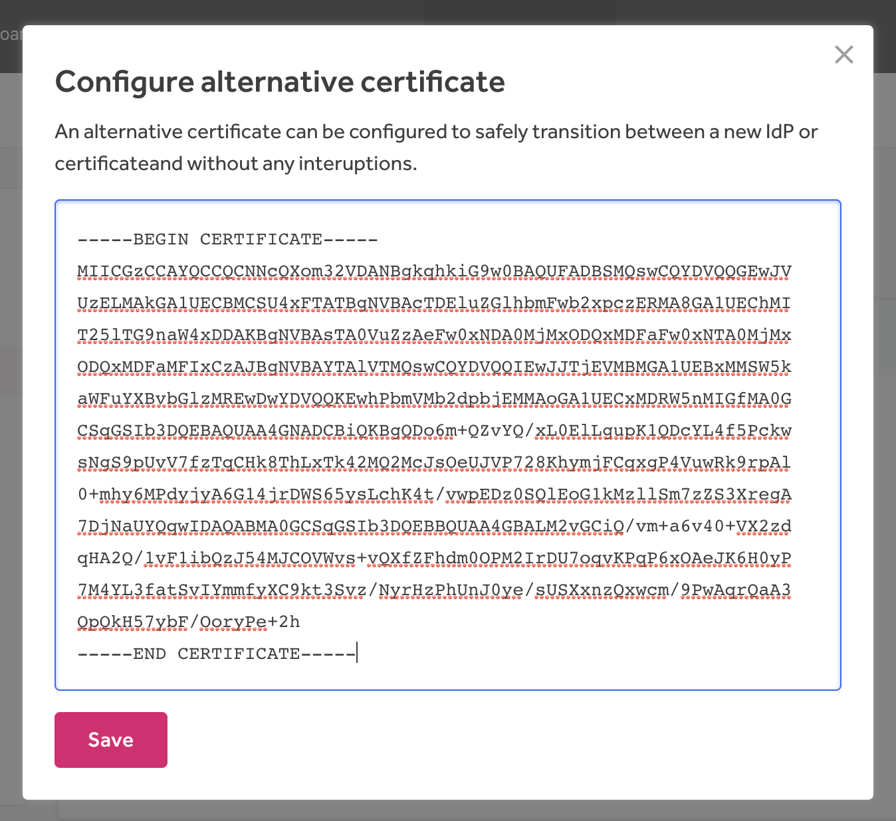
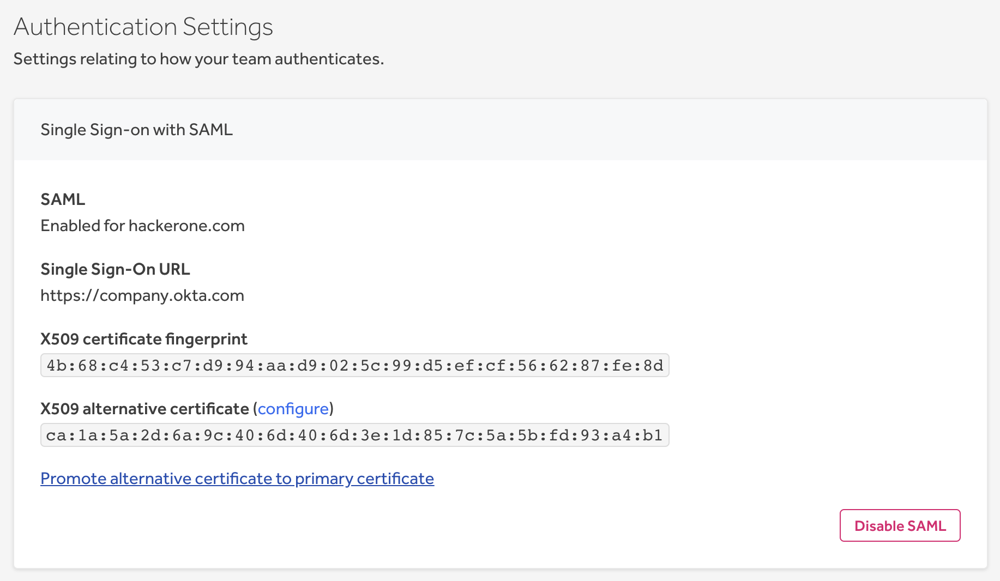

HackerOne supports Single Sign-On (SSO) through Security Assertion Markup Language 2.0 (SAML 2.0) for these providers:
* [Google](/organizations/google-sso-saml-setup.html)
* [Okta](/organizations/okta-sso-saml-setup.html)
* [OneLogin](/organizations/onelogin-sso-saml-setup.html)
* [Bitium](https://support.bitium.com/administration/saml-hackerone/)
* Centrify
* MS ADFS
* [Azure Active Directory](https://azuremarketplace.microsoft.com/en-us/marketplace/apps/aad.hackerone)
* Ping Identity
* [Duo](https://duo.com/docs/hackerone)
* [JumpCloud](https://support.jumpcloud.com/support/s/article/single-sign-on-sso-with-hackerone2)

[Contact HackerOne](https://support.hackerone.com) if you have another SAML provider.

### Set Up

To configure Single Sign-On via SAML:
1. Go to **Program Settings > General > Authentication**.

><i>Note: You must have User Management permissions to setup SAML.</i>

2. Click **Setup SAML** in the *Single Sign-on with SAML* section.

3. Click **Enter Configuration** on the *SAML Configuration* page.

4. Enter information for these fields:

Field | Details
------ | ------
Domain | The  domain for users that will be required to use SAML authentication. The domain must be verified before entering. If you don't have a verified domain, see [Domain Verification](domain-verification.html) to set up a verified domain.  *Note: Please use your own domain, not the HackerOne domain.*
Single Sign On URL | The URL from your SAML provider to initiate a single sign-on attempt, sometimes called the login URL.
X509 Certificate | The certificate from your SAML provider to verify the single sign-on response.

5. Click **Save**.
6. Click **Start Test** in the *Test it* section of the SAML Configuration page.

7. Click **Run test** in the *SAML Settings Test* modal that pops up.
8. Click **Start test now**.

9. Enter your login credentials to the test window. After your login attempt, the test will either succeed or fail and provide warning messages about your test login. If your test fails, run another test by going back to step 6 above.
10. Click **Verify Settings**.  

11. Click **Verify** in the *Verify SAML Settings* modal. Once you verify your settings, you won't be able to change your settings or run tests on the domain anymore.

12. Click **Enable SAML** once you're ready to migrate all user accounts to SAML authentication.
13. Click **Enable** in the *Enable SAML* modal that pops up.

Once you've successfully enabled SAML, all users that are part of the domain will be required to authenticate using SAML. The passwords associated with those accounts will be removed. Users will receive instructions on their first log in informing them of the change.

### Additional Information
Here are some screenshots that provide additional details on Service Provider and Attribute mapping:

### Configure an Alternative Certificate
If you need to switch your identity provider or if your current SAML certificate is expiring, you can configure an alternative SAML certificate to avoid having to disable your SSO integration during the update.

> **Note:** Only the admin of the program has the ability to configure the alternative certificate.

To configure an alternative certificate:

1. Go to **Program Settings > General > Authentication**.
2. Click **configure** next to **X509 alternative certificate**.

3. Enter the alternative certificate in the **Configure alternative certificate** window.

4. Click **Save**.

After the alternative certificate has been configured, users will be able to authenticate through the new SAML certificate.

When the primary certificate isn't used anymore, you can promote the alternative certificate to the primary by clicking **Promote alternative certificate to primary certificate**. This will enable your primary certificate to be replaced with the alternative.

### Changing Identity Providers

If you need to change your identity provider at any time, to provide a more seamless self-service configuration, you can follow these steps:

 1. Copy this information from your prior identity provider configuration:

 Field | Details
------ | ------
Domain | The  domain for users that was required to use SAML authentication.
Single Sign On URL | The URL from your SAML provider to initiate a single sign-on attempt, sometimes called the login URL.
X509 Certificate | The certificate from your SAML provider to verify the single sign-on response.

 2. Preconfigure your new identity provider on your provider's site with information from HackerOne. Depending on your provider, you may need HackerOne's metadata endpoint and ACS URL. You can find that along with other helpful information [here](sso-faqs.html).
     * If you're using [Google](google-sso-saml-setup.html), [Okta](okta-sso-saml-setup.html), or [OneLogin](onelogin-sso-saml-setup.html), you can use the resources on our docs site for configuring those identity providers (more links are at the top of this page).

3. Go to **Program Settings > General > Authentication** in HackerOne.

> **Note:** Steps 4 - 7 will make your SAML authentications temporarily unavailable. Be sure to communicate this to your program members as needed.

 4. Disable your current configuration by clicking **Yes, disable SAML**.

 5. Uncheck the check box for **Send password reset emails to affected users**.

 6. Re-configure your SAML configuration with the new identity provider information by following steps 1-12 [here](single-sign-on-sso-via-saml.html#set-up).

 7. Make sure the checkbox for **Notify existing users that SAML is enabled** is unchecked when the **Enable SAML** window pops up.

 8. Click **Enable**.

 If at anytime testing doesn't work or you encounter issues, revert to the recorded information for the prior identity provider.
