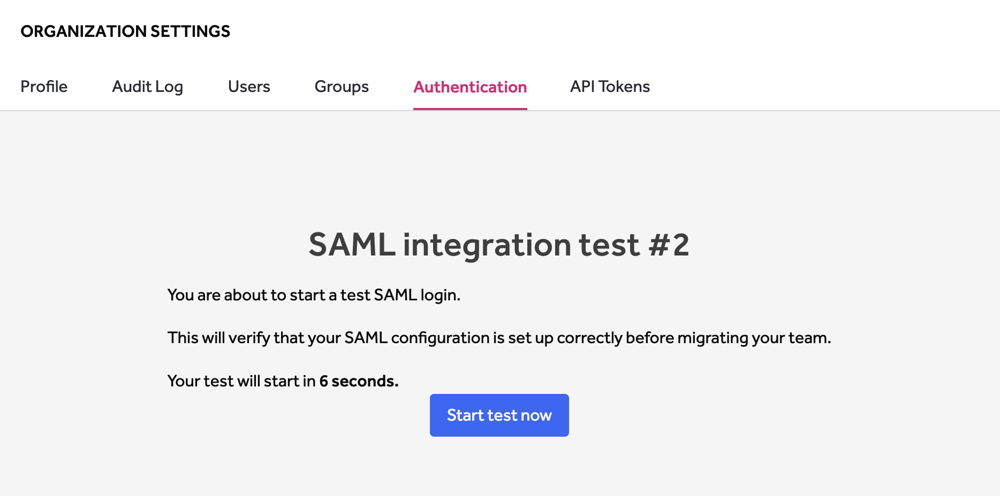
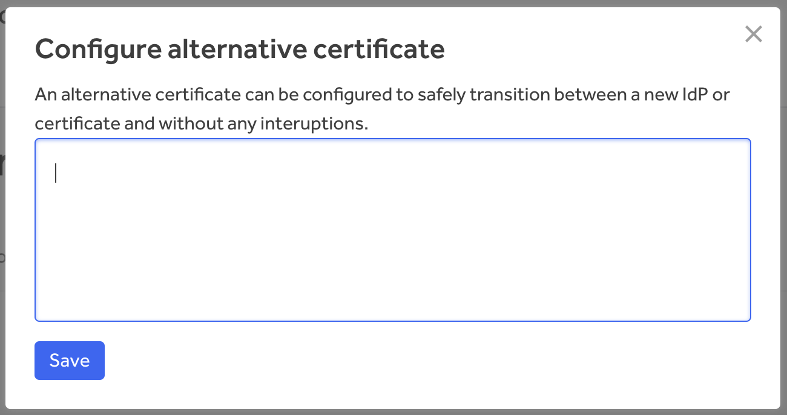

HackerOne supports Single Sign-On (SSO) through Security Assertion Markup Language 2.0 (SAML 2.0) for these providers:
* [Google](/organizations/google-sso-saml-setup.html)
* [Okta](/organizations/okta-sso-saml-setup.html)
* [OneLogin](/organizations/onelogin-sso-saml-setup.html)
* [Bitium](https://support.bitium.com/administration/saml-hackerone/)
* Centrify
* MS ADFS
* [Microsoft Entra ID](https://learn.microsoft.com/en-us/azure/active-directory/saas-apps/hackerone-tutorial) (formerly Azure AD)
* Ping Identity
* [Duo](https://duo.com/docs/hackerone)
* [JumpCloud](https://support.jumpcloud.com/support/s/article/single-sign-on-sso-with-hackerone2)

[Contact HackerOne](https://support.hackerone.com) if you have another SAML provider.

### Set Up

To configure Single Sign-On via SAML:
1. Go to **Organization Settings > Authentication > SAML (SSO)**.

><i>Note: You must be an organization administrator to setup SAML.</i>

2. Click **Add SAML Provider**.

3. Enter information for these fields:

Field | Details
------ | ------
Name | The name of the SAML provider
Domain | The  domain for users that will be required to use SAML authentication. The domain must be verified before entering. If you don't have a verified domain, see [Domain Verification](domain-verification.html) to set up a verified domain.  *Note: Please use your own domain, not the HackerOne domain.*
Single Sign On URL | The URL from your SAML provider to initiate a single sign-on attempt, sometimes called the login URL.
X509 Certificate | The certificate from your SAML provider to verify the single sign-on response.
Require new users to use SAML | Chheck this box if new users with emails matching the verified domain are required to sign up with SAML.

4. Click **Save**.
5. Click **Start Test** in the *Test settings* section of the SAML Configuration page.

6. Click **Start test now**.

7. Enter your login credentials to the test window. After your login attempt, the test will either succeed or fail and provide warning messages about your test login. If your test fails, run another test by going back to step 5 above.
8. Click **Verify settings**. Once you verify your settings, you won't be able to change your settings or run tests on the domain anymore.

9. Click **Enable SAML** once you're ready to migrate user accounts to SAML authentication.

10. Select the initial set of users you want to migrate to SAML in the *Enable SAML* modal that pops up. You can choose from all users matching the configured domain(s), or only the users belong to your organization matching the configured domain(s). 

11. Click **Enable and migrate**.

Once you've successfully enabled SAML, all users that are part of the domain will be required to authenticate using SAML. The passwords associated with those accounts will be removed. Users will receive instructions on their first log in informing them of the change.

### Additional Information
Here are some screenshots that provide additional details on Service Provider and Attribute mapping:

### Configure an Alternative Certificate
If you need to switch your identity provider or if your current SAML certificate is expiring, you can configure an alternative SAML certificate to avoid having to disable your SSO integration during the update.

> **Note:** Only an organization administrator has the ability to configure the alternative certificate.

To configure an alternative certificate:

1. Go to **Organization Settings > Authentication > SAML (SSO)**.
2. Click **View SAML provider** from the context menu.

3. Click **configure** next to *X509 ALTERNATIVE CERTIFICATE* 

4. Enter the alternative certificate in the **Configure alternative certificate** window.

5. Click **Save**.

After the alternative certificate has been configured, users will be able to authenticate through the new SAML certificate.

When the primary certificate isn't used anymore, you can promote the alternative certificate to the primary by clicking **Promote alternative certificate to primary certificate**. This will enable your primary certificate to be replaced with the alternative.

### Changing Identity Providers

If you need to change your identity provider at any time, to provide a more seamless self-service configuration, you can follow these steps:

1. Copy this information from your prior identity provider configuration:

 Field | Details
------ | ------
Domain | The  domain for users that was required to use SAML authentication.
Single Sign On URL | The URL from your SAML provider to initiate a single sign-on attempt, sometimes called the login URL.
X509 Certificate | The certificate from your SAML provider to verify the single sign-on response.

2. Preconfigure your new identity provider on your provider's site with information from HackerOne. Depending on your provider, you may need HackerOne's metadata endpoint and ACS URL. You can find that along with other helpful information [here](sso-faqs.html).
     * If you're using [Google](google-sso-saml-setup.html), [Okta](okta-sso-saml-setup.html), or [OneLogin](onelogin-sso-saml-setup.html), you can use the resources on our docs site for configuring those identity providers (more links are at the top of this page).

3. Go to **Organization Settings > Authentication > SAML (SSO)** in HackerOne.
4. Click **View SAML provider** from the context menu.

> **Note:** Steps 4 - 7 will make your SAML authentications temporarily unavailable. Be sure to communicate this to your program members as needed.

5. Click on **Disable SAML provider**
6. Uncheck the check box for **Notify existing users and send password reset instructions**.
7. Click on **Disable SAML provider**

8. Re-configure your SAML configuration with the new identity provider information by following steps 1-12 [here](single-sign-on-sso-via-saml.html#set-up).

9. Make sure the checkbox for **Notify existing users about the new log in process using SAML** is unchecked when the **Enable SAML** window pops up.

10. Click **Enable and migrate**.

 If at anytime testing doesn't work or you encounter issues, revert to the recorded information for the prior identity provider.
