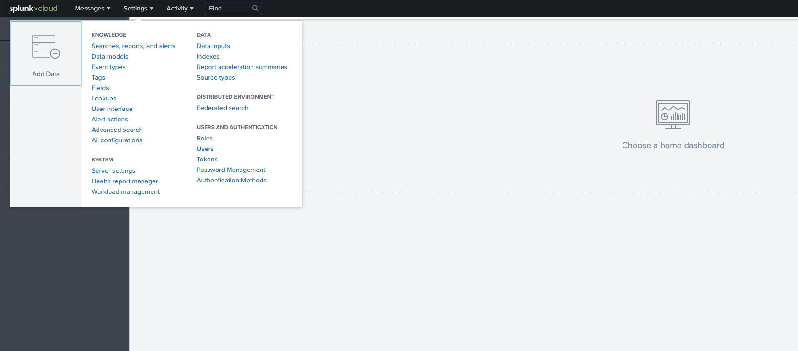
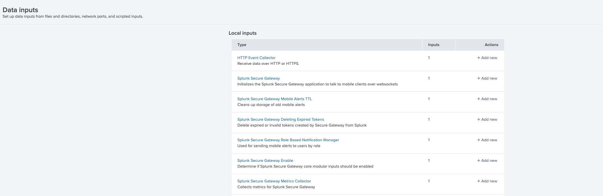
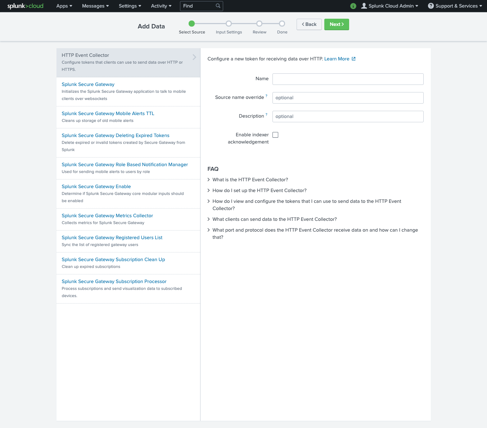
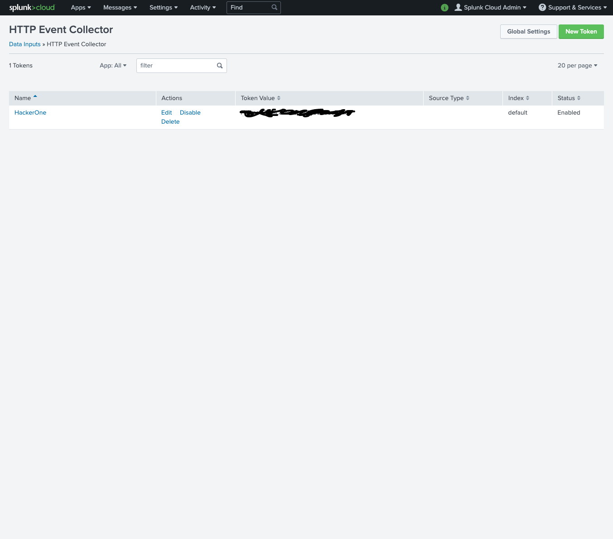
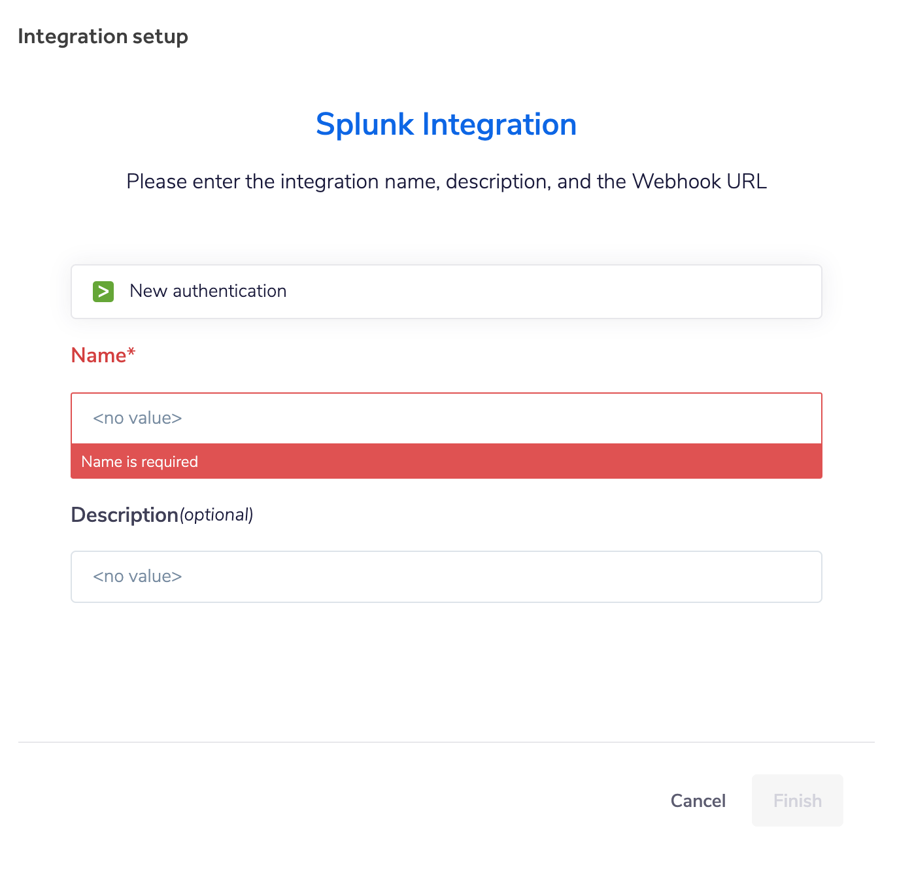

You can configure a Splunk integration to log events from HackerOne in Splunk. The Splunk integration enables data to be logged based on the configured event trigger. This integration is flexible and can be used to log data for any of the following events:
- Report submissions
- Report state changes (triaged, retesting, resolved, etc.)
- Report assigned
- Report comments
- Report disclosures
- Report rewards

> This integration is only available to Enterprise programs.


### Creating the HTTP Event collector
1. In the top menu of Splunk, go to **Settings > Data Inputs**



2. Click on **HTTP Event Collector**



3. Click on **New Token**
4. Enter a name and click **Next** until you completed the setup of the connector



5. Copy the token from the overview of data inputs and save it for the next step of the setup



### Setup on HackerOne

1. Go to **Program Settings > Program > Integrations**.
2. Click **Connect to Splunk**.
3. Click on **Set up new integration**
4. Click on **New authentication**



5. In the popup enter the **Event Collector URL** and the **HEC token** (This is the same token you created earlier in the setup). See [the information below](#constructing-the-even-collector-url) for details on how to construct the URL.


6. Click **Create** to save the authentication
7. Enter a name for the Integration
8. Click **Finish** to complete the integration
9. Now click **Enable** to start using the integration

Once you've successfully added the integration, you'll be able to retrieve data from HackerOne in your Splunk instance.

### Constructing the Event Collector URL

- The standard form for the HEC URI in Splunk Cloud free trials is as follows:
`<protocol>://inputs.<host>:<port>/<endpoint>`

- The standard form for the HEC URI in Splunk Cloud is as follows:
`<protocol>://http-inputs-<host>:<port>/<endpoint>`

- The standard form for the HEC URI in Splunk Cloud on Google Cloud is as follows:
`<protocol>://http-inputs.<host>:<port>/<endpoint>`

----

- `<protocol>` is either http or https
- You must add `http-inputs-` before the `<host>`
- `<host>` is the Splunk Cloud instance that runs HEC
- `<port>` is the HEC port number
- `8088` on Splunk Cloud free trials
- `443` by default on Splunk Cloud instances
- `<endpoint>` is the HEC endpoint you want to use. In many cases, you use the `/services/collector/event` endpoint for JavaScript Object Notation (JSON)-formatted events or the `services/collector/raw` endpoint for raw events

### Example event
Below you can find an example of an event that gets pushed from HackerOne to Splunk.

```
{
  "data": {
    "id": "1337",
    "type": "activity-comment",
    "attributes": {
      "message": "Comment!",
      "created_at": "2016-02-02T04:05:06.000Z",
      "updated_at": "2016-02-02T04:05:06.000Z",
      "internal": false
    },
    "relationships": {
      "actor": {
        "data": {
          "id": "1337",
          "type": "user",
          "attributes": {
            "username": "api-example",
            "name": "API Example",
            "disabled": false,
            "created_at": "2016-02-02T04:05:06.000Z",
            "profile_picture": {
              "62x62": "/assets/avatars/default.png",
              "82x82": "/assets/avatars/default.png",
              "110x110": "/assets/avatars/default.png",
              "260x260": "/assets/avatars/default.png"
            }
          }
        }
      },
      "attachments": {
        "data": [
          {
            "id": "1337",
            "type": "attachment",
            "attributes": {
              "expiring_url": "/system/attachments/files/000/001/337/original/root.rb?1454385906",
              "created_at": "2016-02-02T04:05:06.000Z",
              "file_name": "root.rb",
              "content_type": "text/x-ruby",
              "file_size": 2871
            }
          }
        ]
      }
    }
  }
}
```
