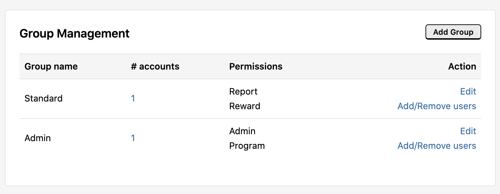
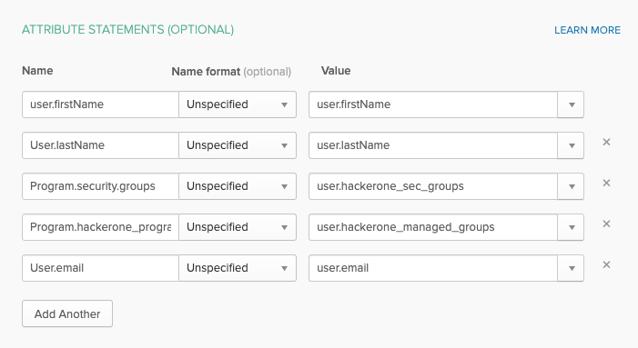

HackerOne offers Just-in-time (JIT) provisioning with [SSO via SAML](single-sign-on-sso-via-saml.html) with System for Cross-domain Identity Management(SCIM). JIT provisioning enables you to automatically create user accounts by using the information from the SAML protocol.

When SSO via SAML has been set up, each time a new user from your organization logs in to HackerOne, their account will automatically be created. There are 2 types of provisioning that are associated in the creation of each account: Attribute Provisioning and Program Membership.

Provisioning Type | Details
----------------- | --------
Attribute Provisioning | By default, all accounts will be provisioned with and keep up-to-date these attributes: <li>First Name <li>Last name
Program Membership | All SAML users have access to the platform by default, but don't necessarily have access to programs. The options for program membership can be set to: None (default), Basic or Advanced. See below to learn more about these options.

### Program Membership Options
You can configure your program membership options to None (default), Basic or Advanced. Each option enables the user different permissions.

> For Basic or Advanced configuration, please contact HackerOne

Option Type | Details
----------- | -------
None | You can invite users to your program and manage their membership and permission level within the user management interface.
Basic | Enables any user attached to your SAML configuration to join the program automatically without an invitation at login. This works for multiple programs if your SAML settings are attached to all programs. <br><br>To configure this provisioning, contact support@hackerone.com after your SAML configuration is enabled and HackerOne will turn it on for you.
Advanced | *Only for Enterprise programs* <br><br>Enables organizations to control membership and permission level from their SSO provider. When configured, the attributes for the users membership and group will be used to assign the user to your program and the appropriate group in HackerOne with the associated permissions. You can confirm the memberships are being added properly by viewing your program [audit log](audit-logs.html).<br><br>To configure this provisioning, HackerOne needs to establish a mapping between the SSO provider (your system) and the HackerOne system. HackerOne does this by utilizing the attribute statements on the SSO provider side, which you will point to groups defined in your HackerOne program. <br><br>The assertion should provide an attribute with the following name: `Program.<handle>.groups` and the value should be a semi-colon delimited list of the program Group names the user should belong to. If no groups are specified the user will not be added to the program. <br><br> Take, for example, this set of configured Groups in HackerOne:<br><br>  <br><br>A correlating SSO configuration (for Okta) would look like this: <br><br>

The assertion can confirm the mapping between the SSO provider and HackerOne is done correctly by inspecting the assertion statement in the SAML Response:

```
<saml2:AttributeStatement xmlns:saml2="urn:oasis:names:tc:SAML:2.0:assertion">
   <saml2:Attribute Name="user.firstName" NameFormat="urn:oasis:names:tc:SAML:2.0:attrname-format:unspecified">
     <saml2:AttributeValue xmlns:xs="<snip>" xsi:type="xs:string">Ben</saml2:AttributeValue>
   </saml2:Attribute>
   <saml2:Attribute Name="User.lastName" NameFormat="urn:oasis:names:tc:SAML:2.0:attrname-format:unspecified">
     <saml2:AttributeValue xmlns:xs="<snip>" xmlns:xsi="<snip>" xsi:type="xs:string">Willis</saml2:AttributeValue>
   </saml2:Attribute>
   <saml2:Attribute Name="Program.security.groups" NameFormat="urn:oasis:names:tc:SAML:2.0:attrname-format:unspecified">
     <saml2:AttributeValue xmlns:xs="<snip>" xmlns:xsi="<snip>" xsi:type="xs:string">Admin;Standard</saml2:AttributeValue>
   </saml2:Attribute>
   <saml2:Attribute Name="Program.hackerone_program_2.groups" NameFormat="<snip>">
     <saml2:AttributeValue xmlns:xs="<snip>" xmlns:xsi="<snip>" xsi:type="xs:string">Standard</saml2:AttributeValue>
   </saml2:Attribute>
 </saml2:AttributeStatement>
 ```
