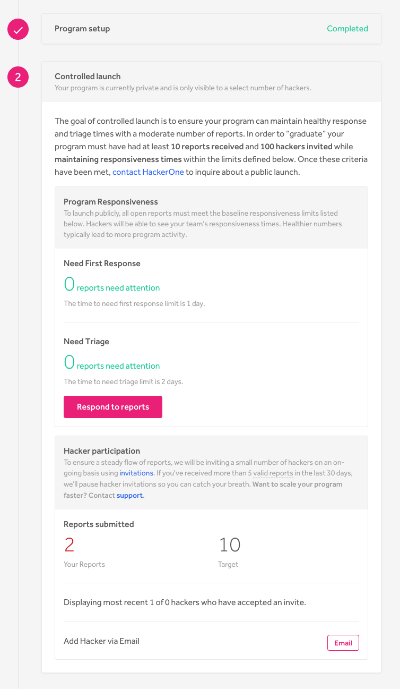
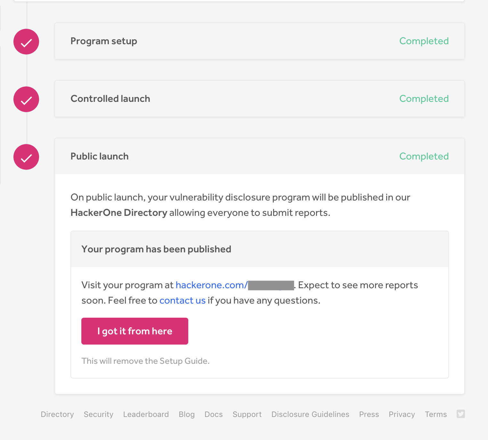

If you elect to start a HackerOne Response program, you'll be taken to the Setup Guide where you can walk through the steps of setting up and successfully launching your program.

There are 3 steps to the guide you must complete:
1. [Program Setup](#program-setup)
2. [Controlled Launch](#controlled-launch)
3. [Public Launch](#public-launch)

### Program Setup
To set up your Response program:

1. Select **Edit** for the corresponding item to edit your policy, profile, and scope. If you've successfully completed an item, a *Completed* tag will appear.  
1. Click **Submit for approval** to have HackerOne review your program once you've completed all of the items for program setup.

### Controlled Launch
If your program is approved by HackerOne, it will be placed in **Controlled launch** where it'll remain private and visible to only a select number of hackers. Within the controlled launch stage, you can invite hackers to your program and manage the reports you receive.

Before publicly launching your program, your program must:
   * Receive at least 10 reports and have invited 100 hackers
   * Meet the baseline responsiveness limits

### Public Launch
Once you've met the criteria in Controlled Launch, the **Public launch** button will appear, and you can publicly self-launch your program whenever you're ready to. When you publicly launch your program, your vulnerability disclosure program will be published on HackerOne's Directory and will be open to other hackers to submit reports.

