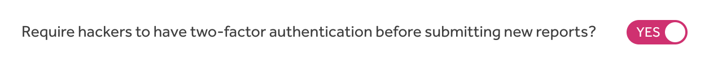
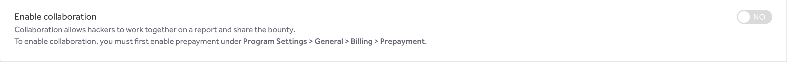

The Submission Requirements page enables you to set specific requirements for hackers to submit reports to your program. You can:
* Require hackers to meet certain [signal requirements](signal-requirements.html)
* Require hackers to have two-factor authentication  
* [Enable Collaboration](#enabling-collaboration)
* Select [severity rating options](#severity-rating-options)

To access the Submission Requirements page, go to: **Program Settings > Program > Hacker Management > Submission**.

### Requiring Two-Factor Authentication
To require hackers to have two-factor authentication enabled before submitting reports to your program:
1. Go to <b>Program Settings > Program > Submission</b>.
2. Go to the section on requiring hackers to have 2FA.
3. Click the toggle so that it's set to <b>Yes</b>.

#### For Public Programs
Hackers that have already submitted past reports before 2FA was required will still be able to access and comment on those reports. They, however, won't be able to submit any new reports to your program without enabling 2FA.

#### For Private Programs
Hackers will be required to have 2FA enabled to participate and submit reports to a private program. Once you turn this feature for a private program all hackers without 2FA will be removed from the program and immediately sent an invitation back to the program. Those hackers and future hackers won't be able to accept the invitation until they have 2FA enabled.

### Enabling Collaboration
[Collaboration](/hackers/payments.html#collaboration) enables hackers to split the bounty with other hackers that helped collaborate on a report. This enables each hacker to be rewarded for their findings on the report.  

> **Note:** You can only enable Collaboration if your program uses the [prepayment](billing.html) billing option.

To enable Collaboration for your program:
1. Go to <b>Program Settings > Program > Submission</b>.
2. Click the toggle so that it's set to <b>Yes</b> for <b>Enable Collaboration</b>.

### Severity Rating Options
You can select how you would like hackers to determine the [severity](severity.html) of the vulnerability they're reporting.

To set your severity ratings:
1. Go to the *Severity Rating Options* section under <b>Program Settings > Program > Submission</b>.
2. Select from these options:

Option | Details
------ | -------
Rating or CVSS Score | Hackers can choose to rate the severity of their vulnerability by using the CVSS calculator or by marking it as *None, Low, Medium, High,* or *Critical* based on their own judgment.   *This is the default option and is recommended for most users.
CVSS Score Only | Hackers can only use the CVSS calculator to rate the severity of the vulnerability.   *This is recommended only for interacting with hackers that understand CVSS*.   
