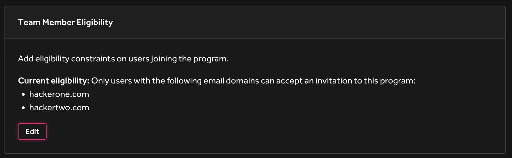

Team member eligibility settings allow you to configure a list of email domains that are eligible to join your program. These settings will allow or block a user when accepting an invitation, but will not affect any users that are already a member of the program. This creates a backstop in case invitations are sent to the wrong user, or to ensure those accepting the invitation use the correct account.

To set this up, visit the Authentication page under your program settings.

><i>Note: When enabling SSO with SAML, eligibility will automatically be enabled with your SSO domains</i>.
