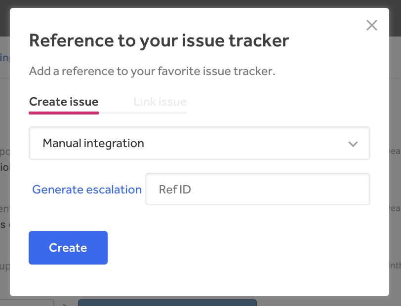

With the Trac integration, HackerOne makes it easy for you to link Trac issues as references on the platform.

In order to configure the Trac integration for your team, [contact HackerOne](https://support.hackerone.com) with the following information:

- The base URI of the Trac instance (e.g. https://trac.company.com/)
- The component you'd like issues to default to
- The type you'd like issues to default to
- Any other custom keywords/fields you'd like prepopulated. Options are described here: http://trac.edgewall.org/wiki/TracTickets#PresetValuesforNewTickets

With all of the provided information, HackerOne will be able to set up your requested integration. You’ll get an email notification letting you know that your integration has been set up within 1-2 business days.

### How the Integration Works
After your Trac integration has been set up:
1. Change the action picker to **Change state > Triaged** in your report.

2. Click **Add reference to issue tracker**.
3. Make sure your Trac integration is selected.

4. Click **Generate escalation**. You’ll be taken to your Trac account where the report is pre-populated.
3. Submit the issue to create the report in Trac.
4. Copy the Trac report issue number and paste it in the **Reference ID** field back in the HackerOne.
5. Click **Create** to create a direct reference link to the issue in Trac.  
