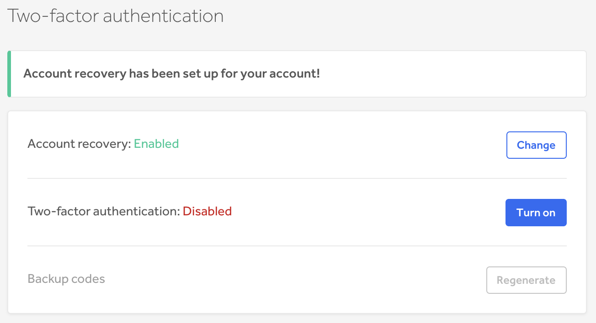
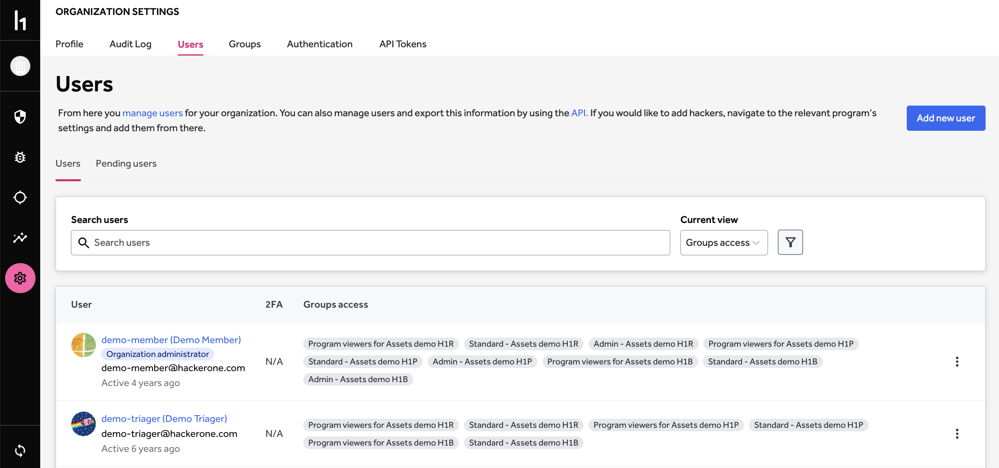

Two-factor authentication (2FA) enables you to add an extra layer of protection from getting your account compromised. You can set up two-factor authentication using any device capable of generating Time-based One-Time Password (TOTP) authentication codes (RFC 6238) to log in to your HackerOne account. You can use Google Authenticator, Duo Mobile, or any other compatible application to generate the codes.

Two-factor authentication is encouraged but not required on HackerOne. We believe that each step throughout the vulnerability submission process introduces another opportunity for the finder to abandon their disclosure efforts. As a platform, HackerOne prioritizes making it as easy as possible to disclose a vulnerability so it can be safely resolved. Reducing barriers for submission helps ensure more vulnerabilities end up in the hands of those that can fix them. Individual programs can choose to require two-factor authentication for all submissions.

### Set Up
Before setting up 2FA, make sure you have a TOT/RFC-6238 compatible application, such as Google Authenticator or Duo Mobile.

To set up two-factor authentication for your account:
1. Go to your profile settings by clicking on your profile picture at the bottom of the left navigation menu and then selecting **User Settings**
2. Click **Account Security**
3. Open your authentication app and click **Add device** or scan the QR code on your HackerOne screen.
    * You can also enter your secret key manually if you're unable to scan the QR code.

4. Click **Next**
5. Save your backup codes. 
    * **Important:** This is the only time you will be able to do this. If you lose them, you will have to generate new ones.

6. Click **Next**
7. Enter your verification code from your 2FA app, one of the backup codes, and your account password as prompted.

8. Click **Save**

Once your two-factor authentication has been verified, when you log in to HackerOne, you’ll be prompted to enter a 6-digit verification code from your authentication application. You must enter the verification code to log in to HackerOne successfully.

On your user management settings, under <b>Settings > Users</b>, you'll be able to see those with two-factor authentication on or off via the 2FA column. A user with **N/A** means that they are authenticating via Single Sign-On (SSO) using a third-party identity provider. For example, HackerOne Security Analysts will have a 2FA status of N/A because they use SSO.

><i>Note: Two-factor Authentication is on a per-user basis. You can’t have SSO and 2FA simultaneously.</i>

If a program adds multi-factor authentication to its requirements, the following will happen automatically:
1. Hackers who do not have it will be removed from the program.
2. Removed hackers will receive an invite explaining they must add multi-factor authentication to rejoin the program.

If a hacker removes multi-factor authentication from their preferences:
1. The hacker will be removed from all programs requiring it.
2. The hacker will receive invitations explaining they must add multi-factor authentication to rejoin the programs.
