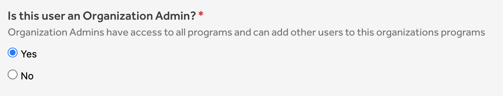
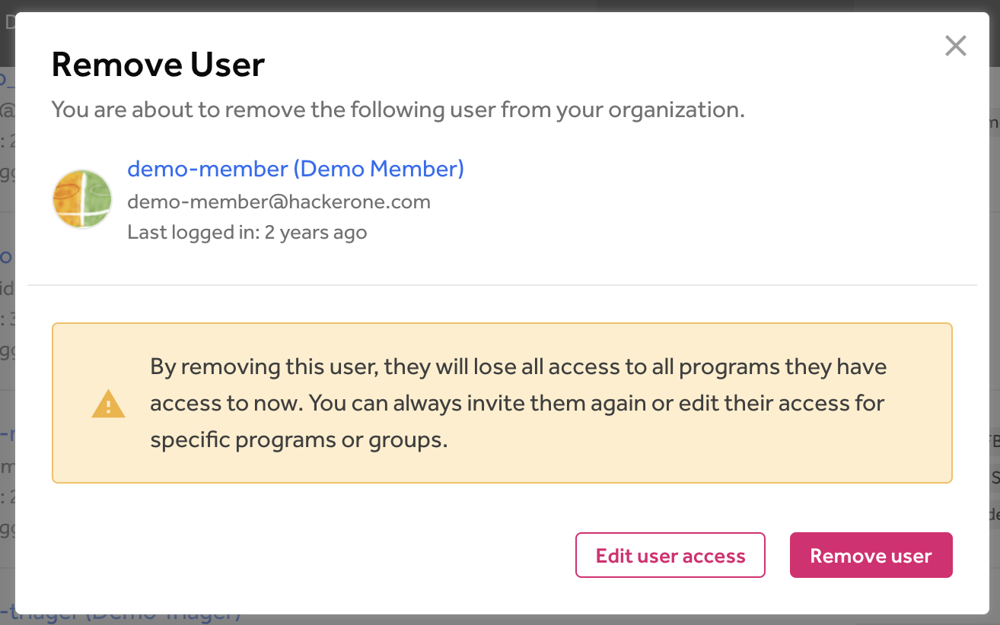

To manage your team members you can go to <b>Organization Settings > User Management</b>. From here you can manage all users across your organization.

### Adding a user to the organization
To add a new user to your organization:
1. Go the <b>Organization Settings > User Management</b>
2. Click on "Invite User"
3. Provide the email address of the user that should be invited
4. Select the programs and groups the user should be added to. Selecting a program without adding a user to a group will give the user read only access to the selected program.
5. Click on "Invite User" at the bottom of the page to finish.

###  Marking a user as Organization Admin
Organization Admins have access to all programs and can add other users to programs of the organization. To mark someone as Organization Admin:
1. Go the <b>Organization Settings > User Management</b>
2. Find the user that you want to make an Organization Admins
3. Click the pencil on the right to go into edit mode
4. Find the Organization Admin section and select "Yes"

5. Click on "Update User" to save your changes

### Updating access for existing users
1. Go the <b>Organization Settings > User Management</b>
2. Find the user that you want to update
3. Click the pencil on the right to go into edit mode
4. Check/uncheck the boxes for the programs where you want to update the access or permissions.
5. Click on "Update User" to save your changes

### Removing a user from the organization
To remove a user from the organization:
1. Go the <b>Organization Settings > User Management</b>
2. Find the user that you want to remove
3. Click the trash icon on the right to delete the user from the organization
4. Click on "Remove User"

The user will now be removed from all programs in your organization. If you wish to remove the user from certain programs instead, click on "Edit user access" instead in step 4.
