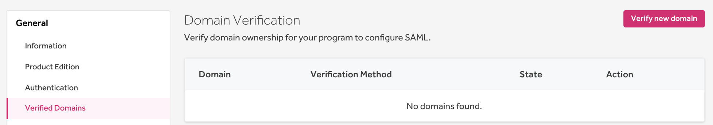
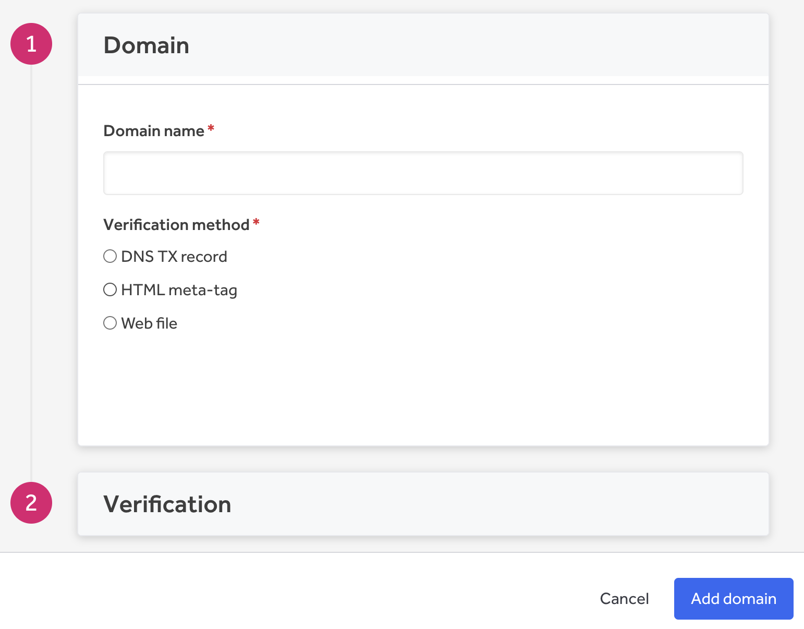
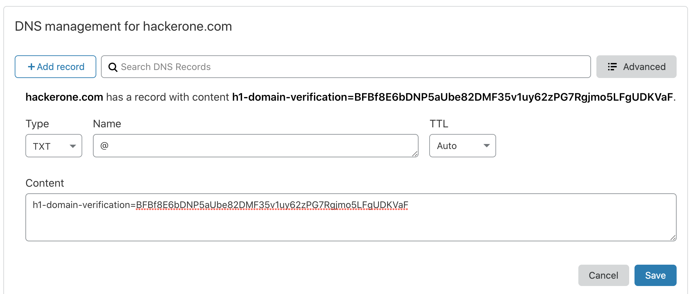
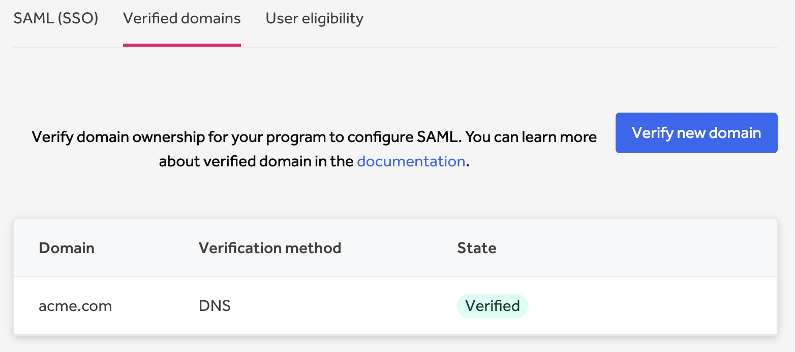

In order to configure [single sign-on via SAML](single-sign-on-sso-via-saml.html), you need to verify ownership of the domain for your program.

To verify your domain:
1. Go to **Organization Settings > Authentication > Verified Domains**.

><i>Note: You must be an organization administrator to add a verified domain.</i>

2. Click **Add verified domain**.
3. Enter the domain name you want to verify in the **Domain name** field.
4. Choose the **Verification Method** of your domain. You can choose from:

Option | Details
------ | -------
DNS TXT record | You'll be prompted to add a TXT record to the DNS configuration of your domain to allow HackerOne to verify you have ownership over the domain.
HTML meta-tag | You'll be prompted to add an HTML meta-tag to the index page of your domain to allow HackerOne to verify you have ownership over the domain.
Web file | You'll be prompted to upload a text file to allow HackerOne to verify if you have ownership over the domain.

><i>Note: Use only the part of the domain name used in the email address of the users that will be logging in. For example: if an email address looks like `wiley@acme.com`, use `acme.com` as domain name.</i>

5. Click **Add domain**.

6. Follow the instructions on the page to allow HackerOne to verify you have ownership over the domain. Instructions will vary depending on the verification method you chose in step 4 above. You'll have to go to your DNS provider to manage settings on the domain.

Here's an example of using the DNS TXT record on Cloudflare to allow HackerOne to verify your domain:

><i>Note: when using Amazon Route53 the `@` character isn't used. You can just leave the name value empty.</i>

7. Click **Verify**

Once your domain is successfully verified, the status of your domain will be changed to *Verified*. You can continue to set up your [SAML settings](single-sign-on-sso-via-saml.html).

><i>Note: it can take a while for the DNS records to propagate. If at first verification fails please try again later. You can use an online DNS checker like [https://dnschecker.org/](https://dnschecker.org/) to check if the DNS records have been propagated.</i>

If your verification has failed, you can choose to **Cancel verification**.
