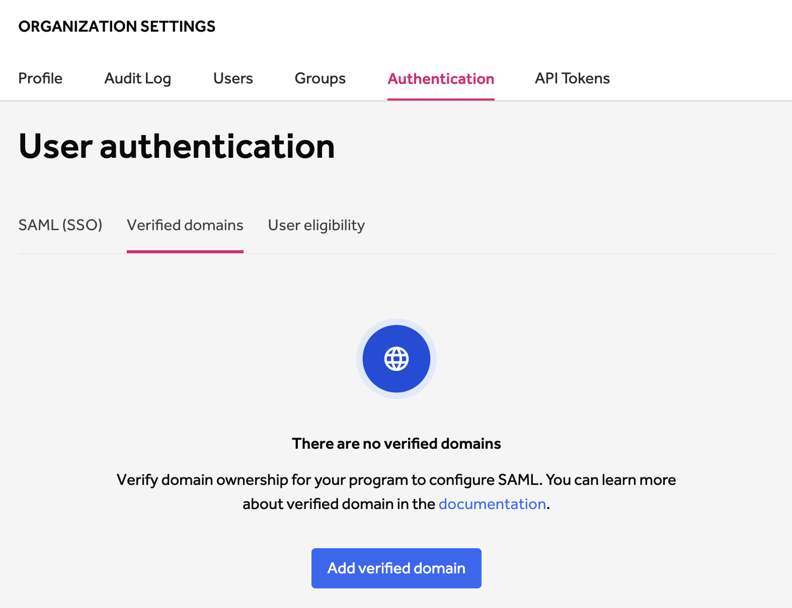

In order to configure [single sign-on via SAML](single-sign-on-sso-via-saml.html), you need to verify ownership of the domain for your program.

To verify your domain:
1. Go to **Program Settings > General > Verified Domains**.

2. Click **Verify new domain**.
3. Choose the **Verification Method** of your domain. You can choose from:

Option | Details
------ | -------
DNS TXT record | You'll be prompted to add a TXT record to the DNS configuration of your domain to allow HackerOne to verify you have ownership over the domain.
HTML meta-tag | You'll be prompted to add an HTML meta-tag to the index page of your domain to allow HackerOne to verify you have ownership over the domain.
Web file | You'll be prompted to upload a text file to allow HackerOne to verify if you have ownership over the domain.

4. Enter the domain name you want to verify in the **Domain name** field.
5. Click **Next step**.
6. Follow the instructions on the page to allow HackerOne to verify you have ownership over the domain. Instructions will vary depending on the verification method you chose in step 3 above. You'll have to go to your DNS provider to manage settings on the domain.

Here's an example of using the DNS TXT record on Cloudflare to allow HackerOne to verify your domain:

7. Click **Verify**

Once your domain is successfully verified, the status of your domain will be changed to *Verified*. You can continue to verify your [SAML settings](single-sign-on-sso-via-saml.html).

If your verification has failed, you can choose to **Cancel verification**
