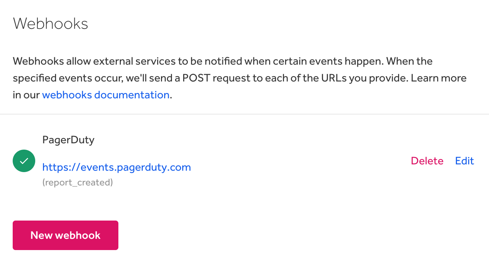
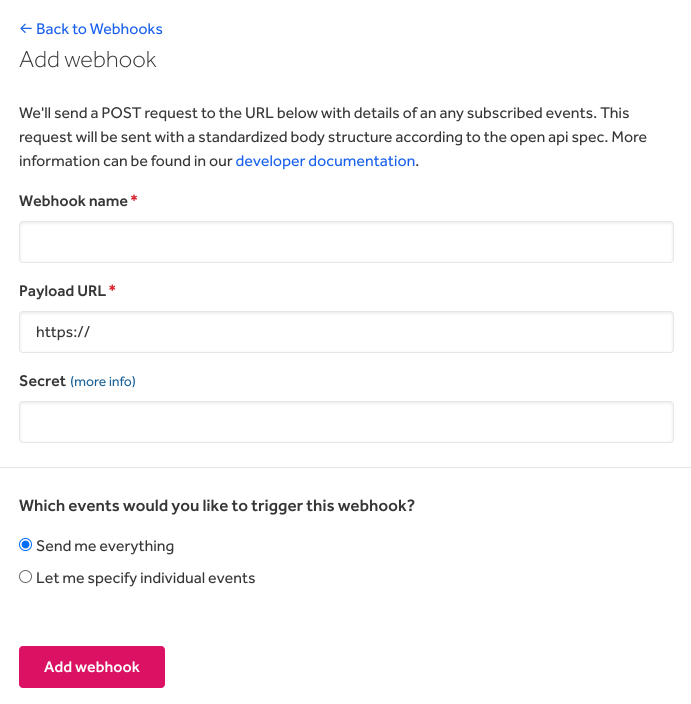
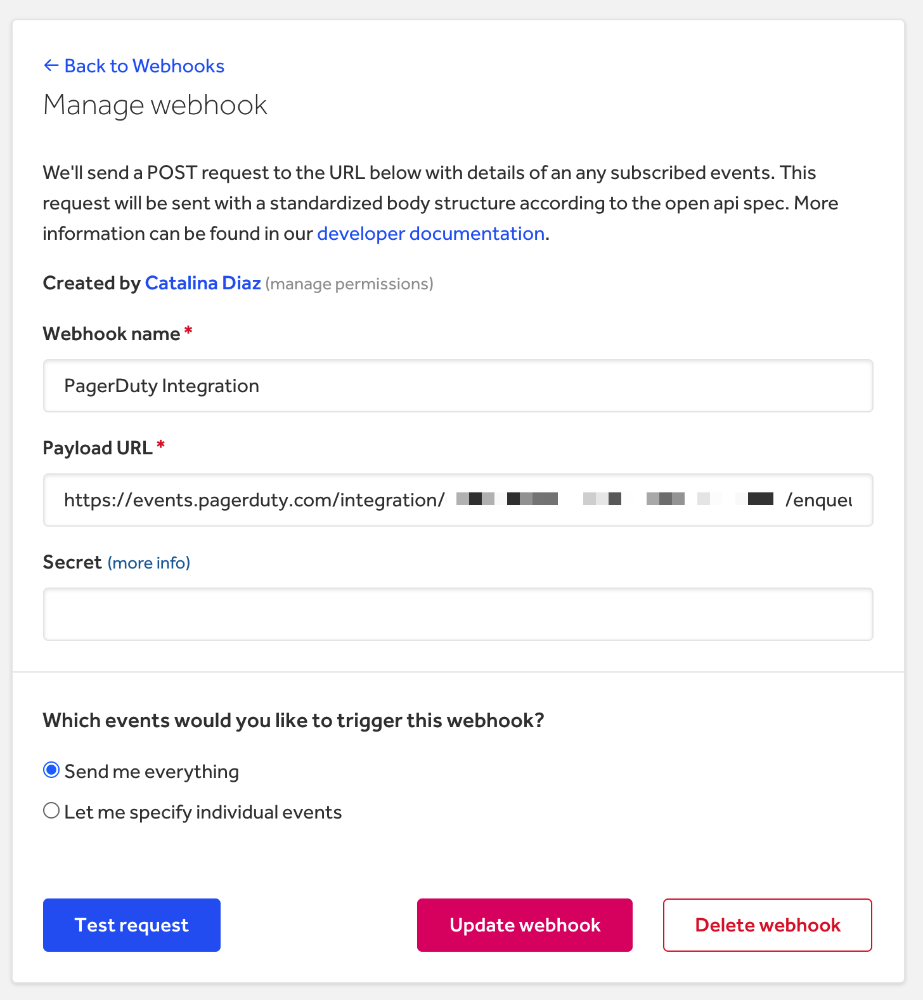
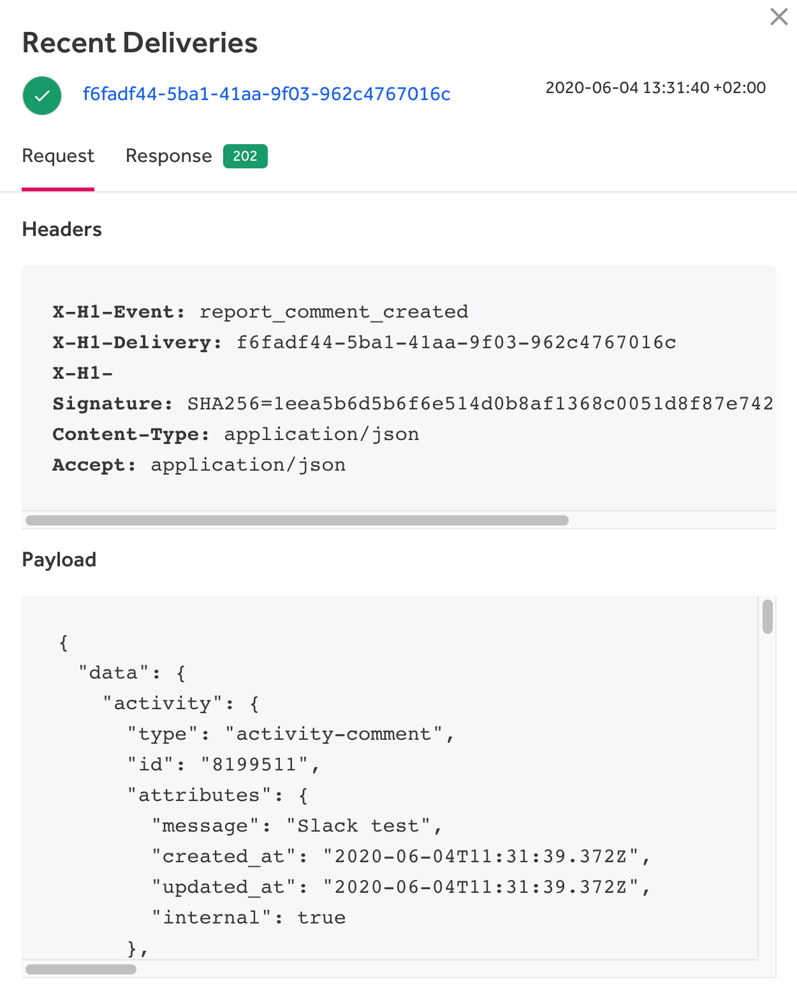
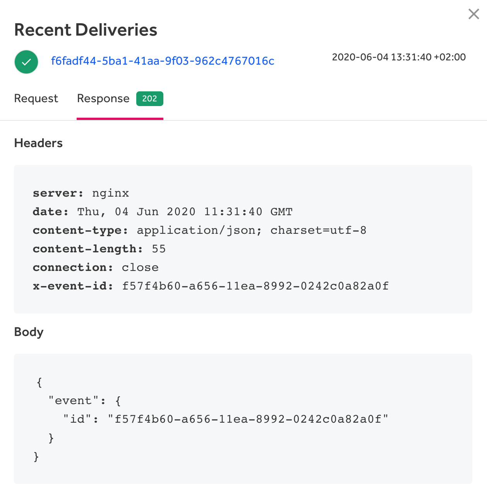

Webhooks enable you to build your own real-time integrations that subscribe to certain report and program events on HackerOne. When an event is triggered, HackerOne will send an HTTP POST payload to the webhook’s configured URL. [View the API documentation for webhooks](https://api.hackerone.com/webhooks/#webhooks).

Some examples of what webhooks can be used for include:
* Updating an external issue tracker
* Triggering a notification system
* Updating a report’s data backup
* Triggering provisioning for a user account when a hacker joins your private program

They can be created on a program level and are bound to the permissions of the user that creates the webhook.

> **Note:** Webhooks are only available for Enterprise programs.

To access webhooks go to **Program Settings > Program > Webhooks**.

### Add a New Webhook
To add a new webhook:
1. Go to **Program Settings > Program > Webhooks**.
2. Click **New webhook**.
3. Enter your **Payload URL**. This URL will be used to receive POST requests.
4. Enter your webhook secret in the **Secret** field. The secret is used to validate that the request came from HackerOne. Learn how to [validate the payload using a secret](https://api.hackerone.com/webhooks/#payloads-validating-payloads-from-hackerone).
5. Select which events you’d like to trigger the webhook. You can choose between:

Option | Details
------ | -------
Send me everything | All events will trigger the webhook.
Let me specify individual events | You can choose which events you'd like to trigger the webhook.

6. Click **Add webhook**.

### Managing Webhooks
To manage your webhooks:
1. Go to **Program Settings > Program > Webhooks**.
2. Click **Edit** for the webhook you want to update.
3. Update the fields you want to change.
4. (Optional) Select **Test request** to send an example request to the configured Payload URL .
5. Click **Update webhook**.

### View Recent Deliveries
You can view recent deliveries that have been made under the **Recent deliveries** section. Click on any of the deliveries to view the POST payload request.

Click on the **Response** tab to view the payload responses.

