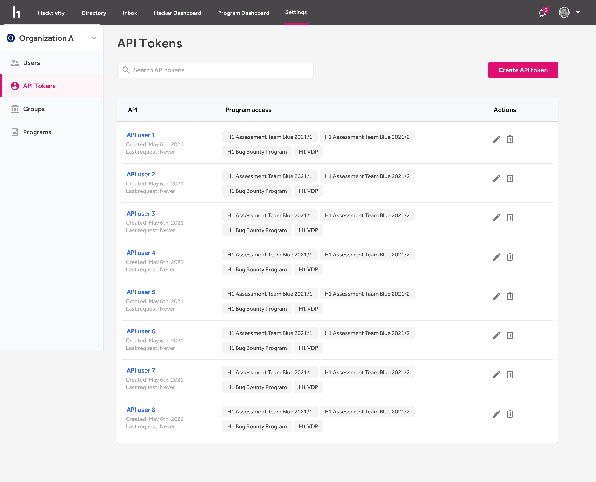
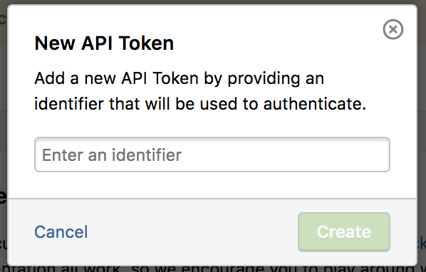
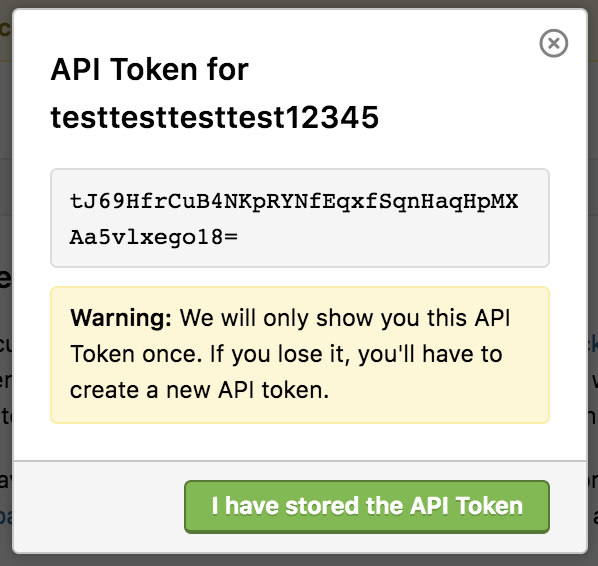

Your program’s administrative users can generate and manage API tokens to experiment with or use the HackerOne API. The API token identifier and value are used as the username and password for HTTP Basic authentication.

To generate an API token:
1. Go to <b>Settings > Program > Automation > API</b>.

2. Click <b>Create API Token</b>.

3. Enter an identifier for the new API token.

4. Store the generated API token.
5. Click <b>I have stored the API Token</b>.

6. Click **Manage groups** next to the API token you just generated.
7. Select which groups you want to give permissions to. When a group isn’t selected, they only have read-only permissions. The default groups you can choose from are:

Option | Details
------ | -------
Standard | This group has Report and Reward permissions.
Admin | This group has Admin and Program permissions.

If your program has more groups, you can choose from those groups as well.

Once you've generated your API token, you'll receive a confirmation email stating that you’ve created a new API token. To learn more about the HackerOne API, check out our [API docs](https://api.hackerone.com/#introduction).
