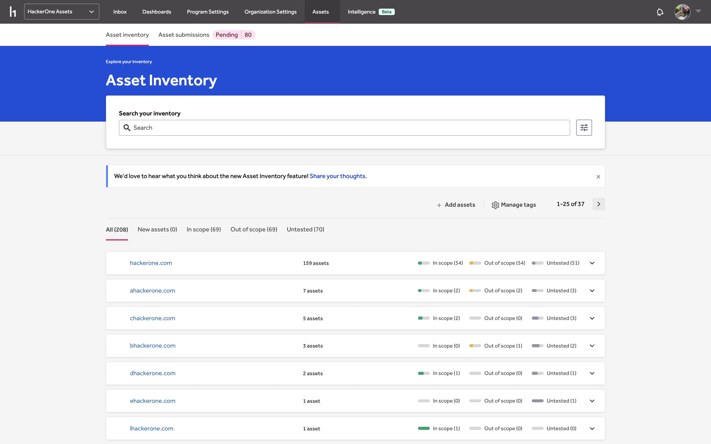
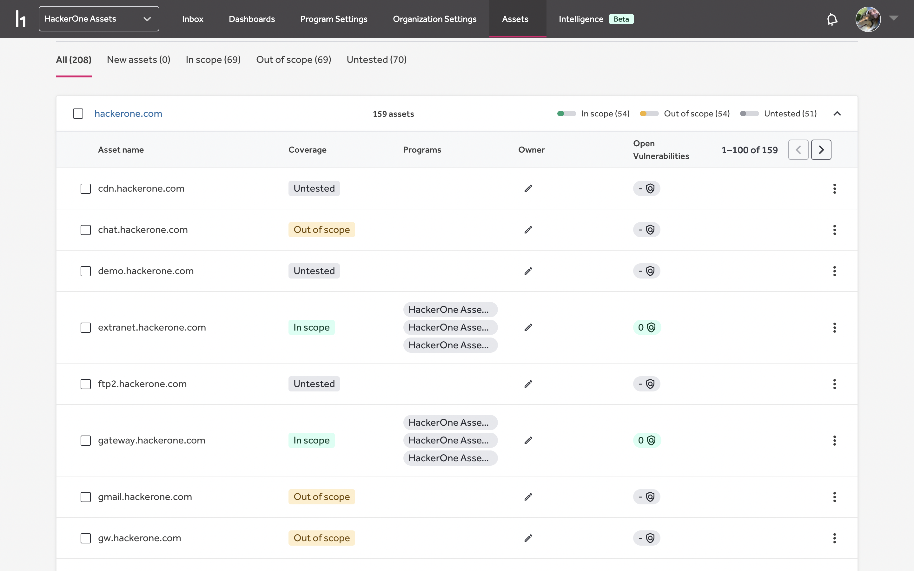
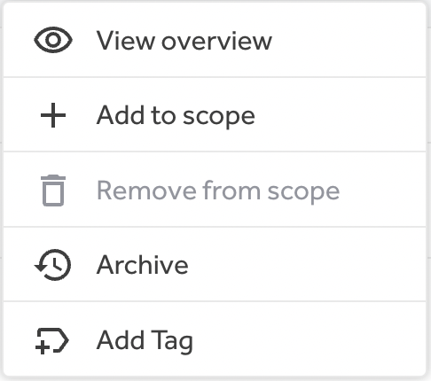
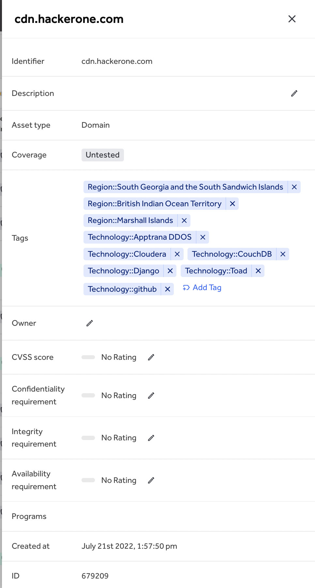
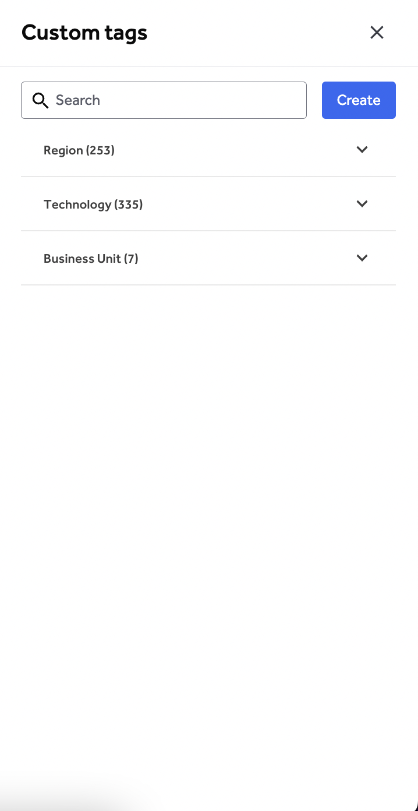
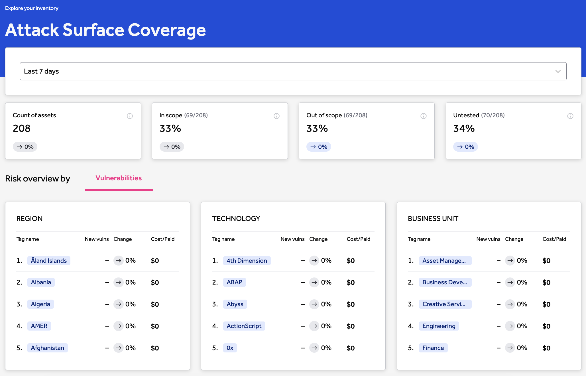
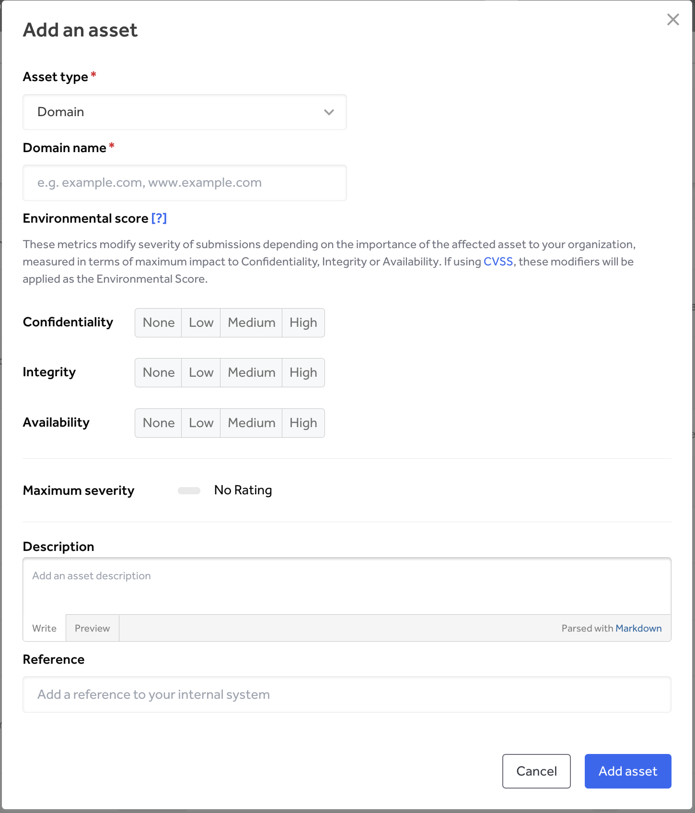

Your organization’s Asset Inventory page allows you to create risk-ranked, custom categories for assets across your organization.

Clicking on a domain group opens a detailed list of all assets under that domain. From there, you can edit them individually or in bulk. Each asset listed shows information on coverage, program, owner, and open vulnerabilities.

Opening the menu for an asset gives you options to view the asset overview, add scope, remove from scope, archive, or add a tag. You can also add tags and add or remove from scope in the bulk actions menu.

The asset overview will provide detailed information which you can edit from within the menu.

### Categories & Tags

To create a new category:
1. Click **Manage tags**

2. Click **Create**
3. Select **New Category**
4. Name the category
5. Click **Create tag category** to finish

To create a new tag:
1. Click **Manage tags**
2. Click **Create**
3. Select **New tag**
4. Select a category for the tag to go under
5. Name the tag
6. Click **Create tag** to finish

*Note: You must create and select a category before you can create tags.*

### Filtering

Click the filter button next to the Search bar to filter assets by category or tag.

### Adding Assets

You can add assets to your organization from the Asset Inventory page by clicking **Add assets** under the search & filter box. A pop-up menu will appear prompting you to enter all the asset’s details.
*Note: Assets are also added via the API, Darktrace, and the Asset submission review flows*

The asset will appear in the list alongside all other assets.
