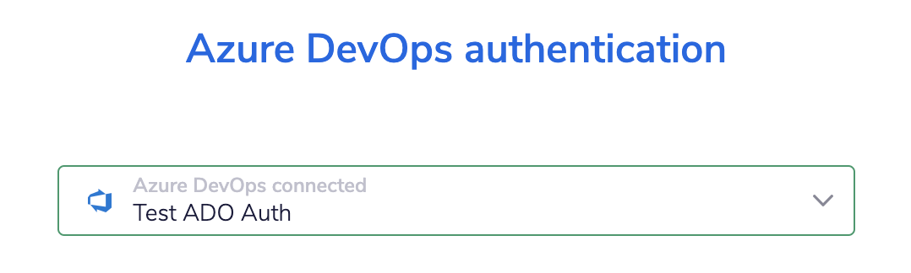
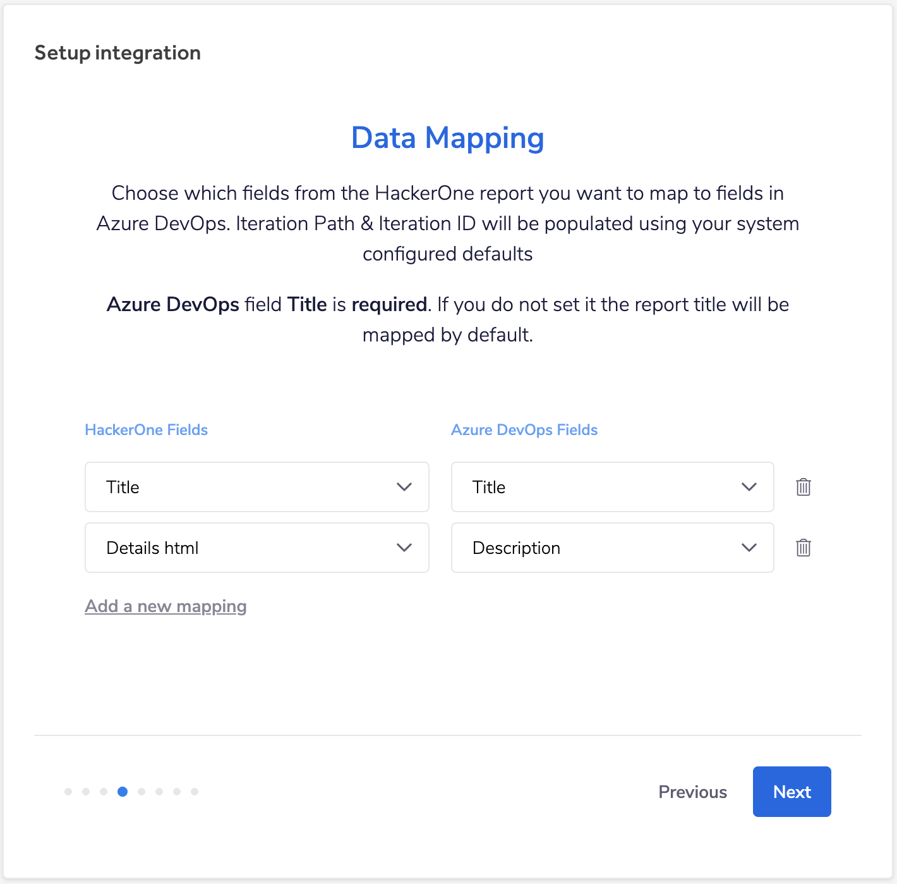
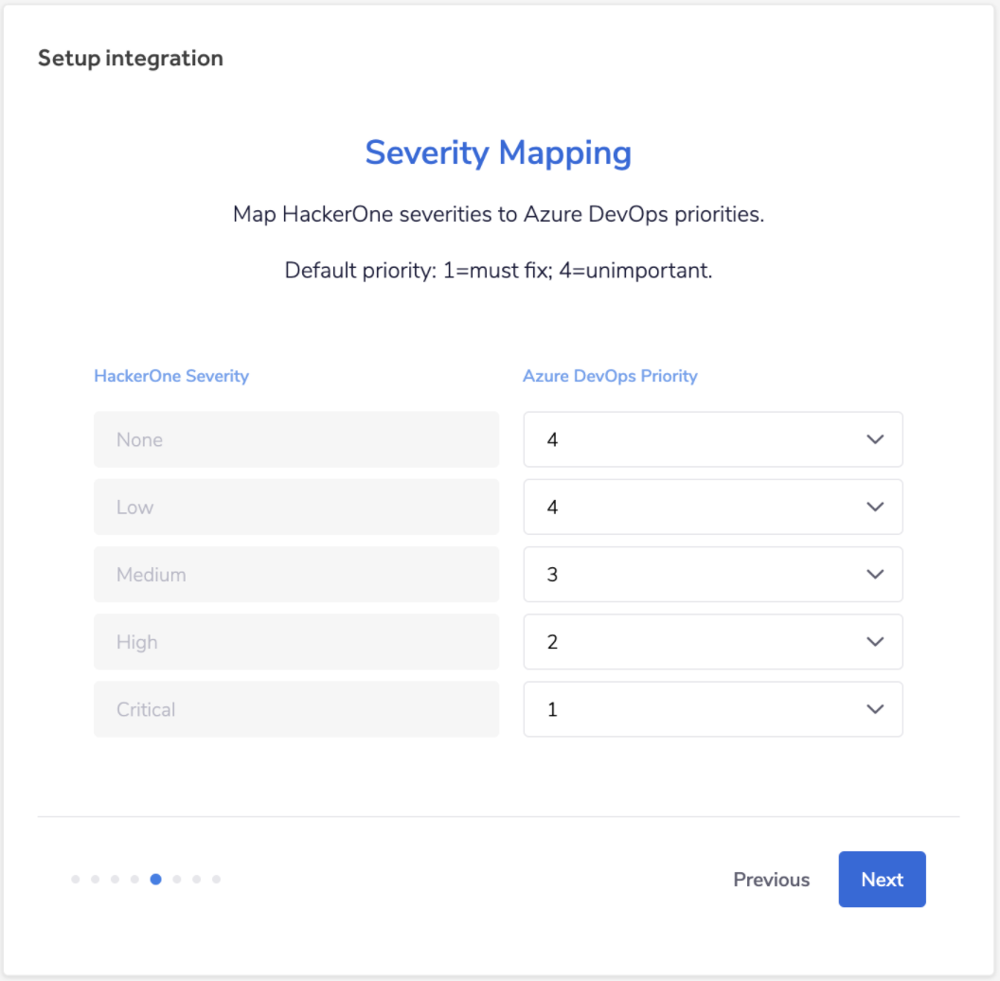
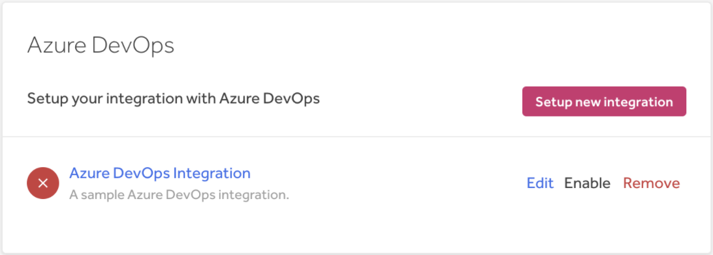
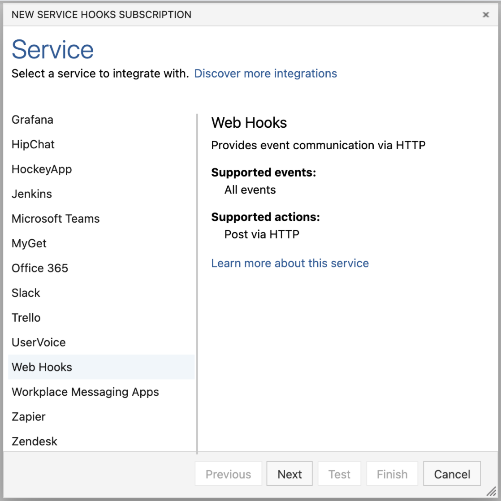
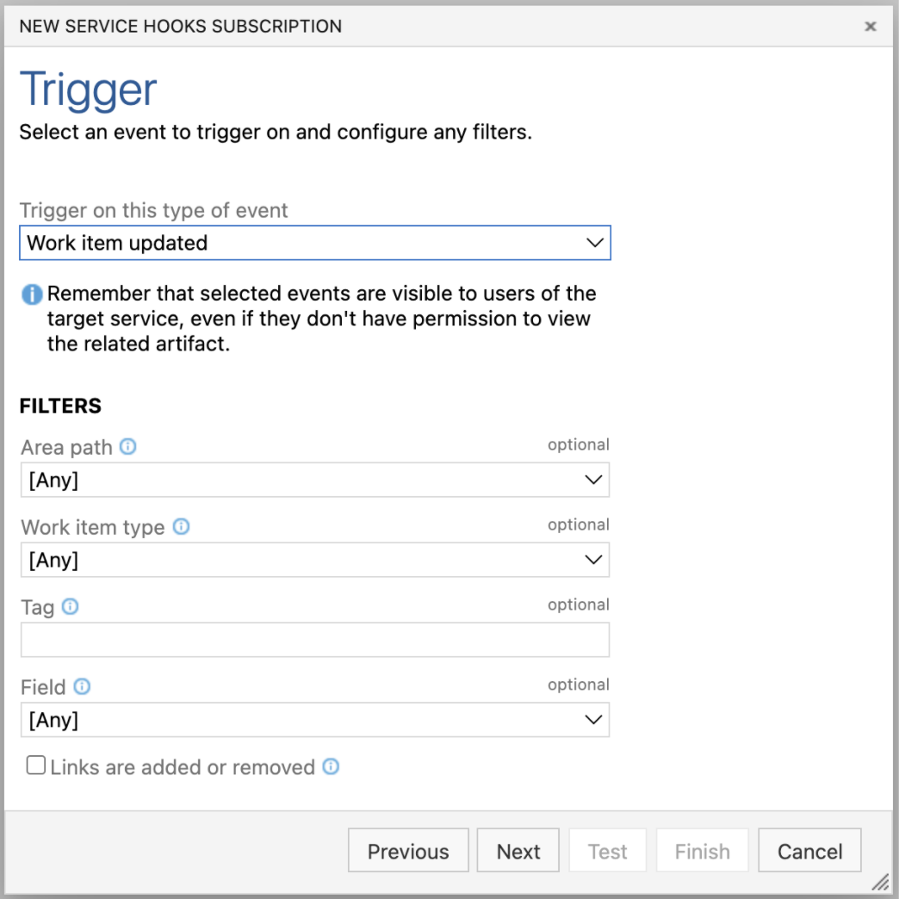
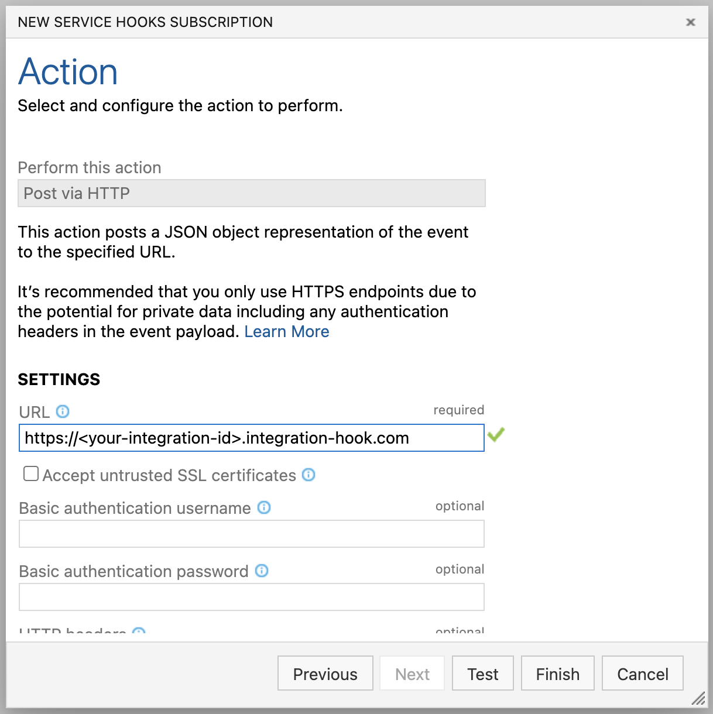
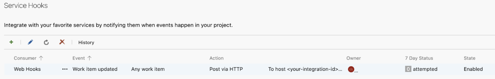

HackerOne offers a bi-directional Azure DevOps integration that enables you to synchronize your HackerOne events to Azure DevOps and vice versa, from Azure DevOps to HackerOne. This integration enables your development and security teams to stay aligned as it contributes to a better workflow of remediating security vulnerabilities by minimizing the manual back and forth between Azure DevOps and HackerOne.

> **Note:** This integration is only available to HackerOne Enterprise customers.

### Setup
To set up the bi-directional integration between HackerOne and your Azure DevOps instance, you’ll need to follow these 2 steps:
1. [Configure the integration on HackerOne](#configure-the-integration-on-hackerone)
2. [Configure outgoing requests on Azure DevOps](#configure-outgoing-requests)

### Configure the Integration on HackerOne
To set up your Azure DevOps integration on HackerOne:
1. Navigate to **Program Settings > Program > Integrations** on HackerOne
2. Click Connect with Azure DevOps.

3. Click **Set up new integration** to start the configuration process

4. *(Optional)* Choose a name and description for your Azure DevOps integration. This will be helpful if you have multiple integrations configured.
5. Click **Next**.
6. Give your authentication a name.
7. Click **Create**.
8. Click **Allow** in the pop-up window asking for permissions. This ensures that HackerOne is enabled to communicate with Azure DevOps.
9. Choose the appropriate Azure DevOps account from the dropdown.

10. Choose the Azure DevOps **Account**, **Project** and **Work Item Type** you want to use for escalating reports.
11. Click **Next**.
12. Choose which fields from the HackerOne report you want to map to the fields in Azure DevOps. For example, you can map the HackerOne vulnerability details to the Azure DevOps description.

13. Click **Next**.
14. Choose which Azure DevOps Priority levels you want to map to the HackerOne severity. You can choose the same numbers for multiple severity ratings.

15. Click **Next**.
16. Choose which events you want to sync from HackerOne to Azure DevOps. You can choose from:

Option | Details
------ | --------
Comments | When someone comments on a report, an update will be posted on the associated Azure DevOps work item.
State Changes | When someone changes the state of a report, an update will be posted on the associated Azure DevOps item.
Work Item Closed State | You can choose from these options: <li>*To Do*<li>*Doing*<li>*Done*
Rewards | When someone awards a suggests a bounty and/or bonus, an update will be posted on the associated Azure DevOps item.
Disclosure | When disclosure is requested or approved, an update will post on the associated Azure DevOps item.
Synchronize Attachments | You can synchronize attachments linked with reports and comments to the associated Azure DevOps work item.

17. Click **Next**.
18. Select the events you want to sync from Azure DevOps to HackerOne. You can choose from:

Option | Details
------ | -------
Status changed | Post an internal comment when a work item changes status.
When status changes to done | You can choose from these options:  <li>Close HackerOne report <li>Do nothing
Priority changed | Post an internal comment when a work item changes status.
Assignee changed | Post an internal comment when a work item changes the assignee.
Comment added | Post an internal comment when someone comments on a work item.

19. Click **Next**.
20. Copy the **AzureDevOpsListener Public URL**. (You’ll need this later to set up the outgoing requests from Azure DevOps to HackerOne.)
21. Click **Finish**.
22. Click **Enable** in the integrations overview to enable the integration.

### Configure Outgoing Requests
After configuring the integration on HackerOne, you’ll need to configure outgoing requests in Azure DevOps. This will enable you to send the configured events from Azure DevOps to HackerOne. Keep in mind that you’ll need to use Service Hooks in the configuration process.

To configure synchronizing events from Azure DevOps to HackerOne:
1. Go to **Project Settings > Service hooks** in Azure DevOps.
2. Click on **+ Create subscription**.
3. Choose **Web Hooks** from the services list.

4. Click **Next**.
5. Choose **Work item updated** from the dropdown for the **Trigger on this type of event** field.

6. *(Optional)* Apply any of the filters you'd like to use.
7. Click **Next**.
8. Fill out the **URL** field with your **AzureDevOpsListener Public URL** from Step 18 in [Configure the Integration on HackerOne](#configure-the-integration-on-hackerone).

9. Click **Finish**.

Your web hook should appear in the Service Hooks list.
docs. microsoft azure Hardware Deverlover https://trac.macports.org/wiki/SummerOfCode  https://trac.macports.org/wiki/SummerOfCode  https://devcenter.heroku.com/articles/heroku-status https://business.facebook.com King James Bond spectre trailer park boys season pass ID card lab report card and money orders over server Gestate API plus CCTV camera sucks 📛 Bug's line bling drake 🔥 line bling drake hotline bling remix Justin just need help getting ready 42A Gym today and 2nd hand 2nd shift on the Couch With Anyone Else Need Done Anything Wrong Person 9th Period point blank period panties pay period point blank page paper planes para Nada and stuff Delbert Area code Red Bull shot in the hospital Emergency Surgery On Her 👸 Royce Gracie said bring nothing just chilling watching TV and talking Abouts.js to the 🏪 and headsort the application Phipoon Ao nutthapon Joajit Started banking details 🏦 💳 🔢 🏪 manager color-coded colorful lights colorist coloring book Colorado ♨ Colorado ♨ Colorado ♨ Colorado ♨ Colorado ♨ Colorado ♨ Colorado ♨ Colorado ♨ Colorado ♨ Colorado ♨ Colorado ♨ Colorado ♨ Colorado Springs Colorado Springs Colorado Springs Colorado Springs Colorado Springs Colorado Springs Colorado Springs Colorado Springs Colorado Springs Colorado Springs Colorado Springs Colorado ♨ Colorado ♨ Colorado Springs Arkansas Razorbacks In The Future Mrs Espinoza Loves Arturo Ramirez Said he will try working condition Zone Zach church clothes sizes available later take care and stay แม่afe travels home and then  https://github.com/github/docs/blob/main/github/getting-started-with-github/githubs-products#github-pro https://github.com/ocampossoto/AI-Doorman https://github.com/https-github-com-Ao25400502 https://github.com/npm/cli/labels/Bug may have been a missing assembly, or a dependency on a more recent Windows SDK release.

8>C:\Program Files (x86)\Microsoft SDKs\UWPNuGetPackages\microsoft.net.native.compiler\2.2.8-rel-28605-00\tools\Microsoft.NetNative.targets(801,5): warning : ILTransform : warning ILT0005: Type 'Windows.UI.Xaml.CornerRadius' from assembly 'Windows' was not included in compilation, but was referenced in the application. There may have been a missing extraction-root>https://github.com/github/docs/tree/github:mainhttps://trac.macports.org/wiki/SummerOfCodehttps://github.com/ocampossoto/AI-Doormanhttps://github.com/npm/cli/labels/Needs%20Triagehttps://github.com/npm/cli/labels/Bughttps://github.com/npm/cli/labels/Release%207.xhttps://www.facebook.com/verify/email/checkpoint/?token=AbqZJuOeV30xhooeBuUjeX8XLh3ecW7qNNlWYL9a3HslYvwH9mwWLP3B6Wc9SzLxlqDvSYPd2SaxrVLujgoDyWYL2bErSqIkJxouitBzfRU371KhKH6_RlzrMSFqDXlAP2_TbmA3HGIsNKXvwwM2s1wFVuRMj74dy49oUdvrRil5LcQwYzvo3T_x6oBAmIe79ISQ9pCz_ZBqJpAcZsvpnVaBTrCogTA-x8uMMFHvajF01QdSP-h90IsX_h8-jImFy3zszZ8759BgB5ujl3Apxkhf54kWHQWwtyN6swCItKG6h3i79V9Tj0NDWEQm9t3ZXKMhttps://github.com/github/docs/blob/main/github/getting-started-with-github/githubs-products#github-prohttps://github.com/github/docs/tree/github:mainextraction-root>https://github.com/npm/cli/labels/Bughttps://github.com/npm/cli/labels/Needs%20Triagehttps://github.com/npm/cli/labels/Release%207.xhttps://github.com/npm/cli/labels/Bugdatabase createhttps://github.com/N0u5t02549aojohttps://github.com/npm/cli/labels/Needs%20Triagehttps://github.com/npm/cli/labels/Bug

