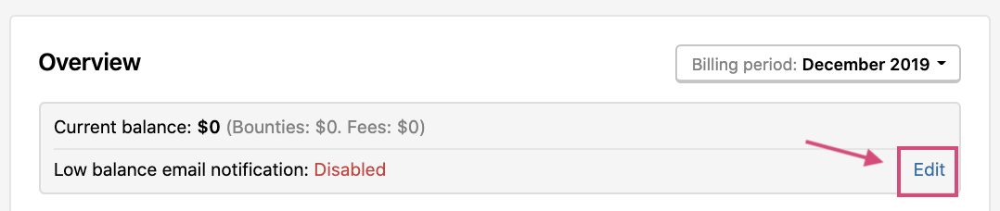
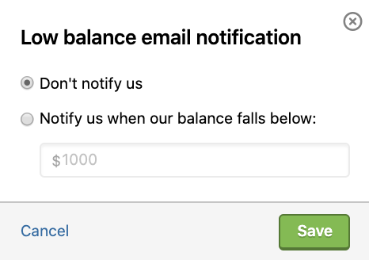

HackerOne makes it easy to pay hackers. You can choose from these 2 options to pay a hacker:

Option | Details
------ | ------
Credit Card | Add a credit card to your HackerOne account that is charged to pay out bounties. To set up go to **Settings > General > Billing > Credit Card**.
Prepayment | Make an advanced deposit which bounties can be paid out from. Whenever your program decides on a bounty, you simply set the amount you'd like to pay on the report, and it's withdrawn from your balance. When funds are running low, HackerOne will request another advanced deposit if you account has auto-replenishment. HackerOne recommends depositing 3 months' worth of bounty budget at a time. Most programs use this method to pay out bounties.  To set up go to **Program Settings > General > Billing > Prepayment**.

><i>Note: You can set up both options. When both options are set up, the prepayment is automatically deducted first. Once the prepayment is depleted, the credit card is charged as the alternate form of payment.</i>

The typical time to remit payment to hackers is 2-7 days.

With HackerOne taking care of your payments, you don't have to worry about:
* Compliance
* Taxation
* Finding yourself in situations such as figuring out how to pay a hacker in an obscure place that doesn't have a mailing address

HackerOne also collects the appropriate tax forms to remove the operational headache for you.

### Invoices

To request an invoice, go to **Program Settings > General > Billing > Prepayment**.

You can view details for each transaction by viewing or exporting reports in **Program Settings > General > Billing > Overview**.

### Low Balance Notifications

When you've opted to use prepayment, you can set up notifications to let you know that your account balance is low.

To set up low balance notifications:
1. Go to **Program Settings > General > Billing > Overview**.
2. Click **Edit** next to the **Low balance email notification** page.

3. Select **Notify us when our balance falls below:**

4. Enter the threshold balance.
5. Click **Save**.

To stop notifications, you can select: **Edit > Don't notify us**.
