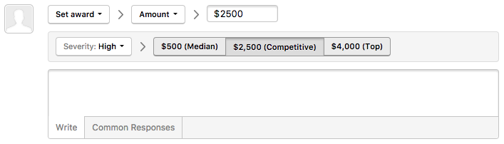
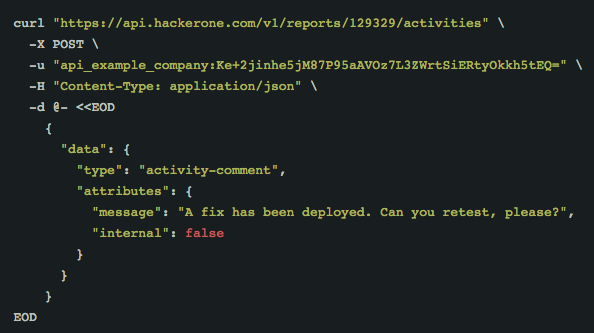
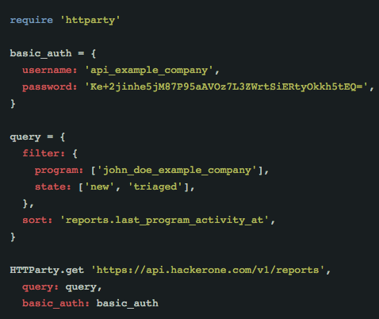

A bounty is money you reward to hackers for reported and resolved bugs. They're used to attract the best hackers and to keep them incentivized to hack your programs. You can use bounties to encourage hackers to focus on particular assets by altering the reward amount for different vulnerability types. You shouldn't feel obligated to award a bounty for every incoming report as it's best to only reward for useful, valid reports.

### Awarding Bounties on Reports

You can award a bounty through any report submitted to HackerOne. Some teams prefer to award a bounty once the issue has been confirmed as valid, while others wait until the issue is resolved.

To award a bounty:
1. Go to your inbox and open the report you'd like to award a bounty for.
2. Expand the action picker at the bottom of the report above the comment box.
3. Select **Set award**.
4. Enter the bounty amount you wish to award. You can select one of the pre-calculated median, competitive, and top bounty awards for severity level of the bug.

Bounty amounts can be increased at any point by setting another award on the report, but keep in mind that bounties can't be removed once awarded.

### Suggesting Bounties

If you're unsure of how much to award the hacker, you can communicate a suggested amount with your internal team. To suggest an amount:
1. Go to your inbox and open the report you'd like to award a bounty for.
2. Expand the action picker at the bottom of the report above the comment box.
3. Select **Set award**.
4. Select **Suggest amount** in the next action picker.

5. Enter your suggested bounty amount.
6. <i>(Optional)</i> Enter your reason of why you suggest that bounty amount.
6. Click **Suggest award**.

### Best Practices

Here are some best practices to follow when awarding bounties:
* Provide bounties for useful, valid reports.
* Award a bounty for a significant found vulnerability that is out of scope.
* Clearly communicate to hackers your reasons for awarding or declining a bounty.

><i>Note: Professional, Enterprise, and Fully Managed programs have access to a HackerOne representative who can provide insight and consult them through the bounty awarding process.</i>

### Bounties for Reports Received Outside of HackerOne

When hackers submit vulnerabilities to your organization outside of HackerOne, you can leverage the HackerOne API to award hackers for their efforts. To start paying hackers, generate an API token on your Program settings page. Keep in mind that this API endpoint is not for awarding bounties for reports on HackerOne itself, but only for reports that were reported outside of HackerOne.

><i>Note: This option is only available for HackerOne Professional, Enterprise, and Community editions.</i>

To start paying hackers:
1. Go to **Settings > Program > Automation > API**.
2. Click **Create API Token** to create an API token.
3. Enter the unique identifier to authenticate the token in the **New API Token** window.
4. Click **Create**.
5. The API token will be generated and presented to you. This is the only time the API token is shown to you.
6. Click **Manage groups** next to the API identifier to grant reward permissions to various groups.
7. Select the groups you want to give reward permissions to. By default, the Standard group has Reward permissions.
8. Make sure your billing methods have been complete so that there's a way to pay out bounties in **Settings > General > Billing**.
9. Configure how to award a bounty. Go to [this page](https://api.hackerone.com/#programs-award-bounty) to see the documentation on how to award a bounty. See the code example in cURL and Ruby that'll help you. <i>Note: the 1337 program ID used in the example below is not real and should be replaced with your own program ID. You can find your program ID in report objects or by asking your HackerOne program manager.</i>

cURL | Ruby
---- | ----
 | 

10. Award the bounty for the hacker.

After the bounty has been awarded, the hacker will receive an email to claim the bounty. HackerOne will collect the person's tax form before processing the payout. The awarded amount, including your applicable fees, will be deducted from your balance immediately. A resolved dummy report will show up in your Bugs overview, which will help you keep track of the bounties you've paid out.

For technical questions or help with your implementation, please reach out to support@hackerone.com or your HackerOne program manager.
