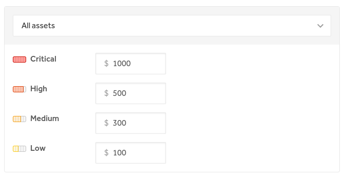
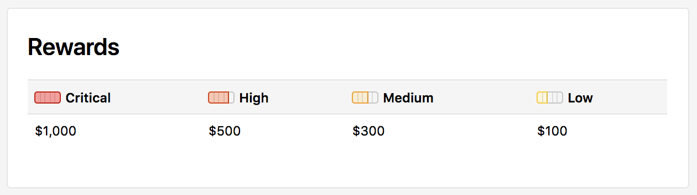

A bounty table shows how much your program is willing to pay for various bugs you receive. They help set expectations for hackers and gives your bug bounty team a guideline to ensure fair and consistent reward amounts. Setting up a bounty table will help provide more granular data and analytics for your program, which will in turn, help your program become more successful. The bounties in the table are categorized based on the severity of the issue identified.

To set up and publish your bounty table on your security page:

1. Go to **Program Settings > Program > Rewards > Bounties**.
2. <i>(Optional)</i> Edit the column names of the bounty table that best fit the reward structure of your program under the **Bounty Table** section.
3. Select the asset you want the bounty structure to apply to. If you want it to apply to all assets, the default is already set to **All assets**.
4. Input your bounty amounts under each column.
5. <i>(Optional)</i> To add another row to your bounty table, click **+ add another bounty table row**.
6. <i>(Optional)</i> Add a description about how severity is determined or you can also add examples of what types of bugs fall into which category in the **Optional description** field.
5. Click <b>Create bounty table</b>.

Your security page will now have a Rewards section that showcases your bounty table.

To remove the bounty table from your security page, select **Remove bounty table** under **Program Settings > Program > Rewards > Bounties**.
