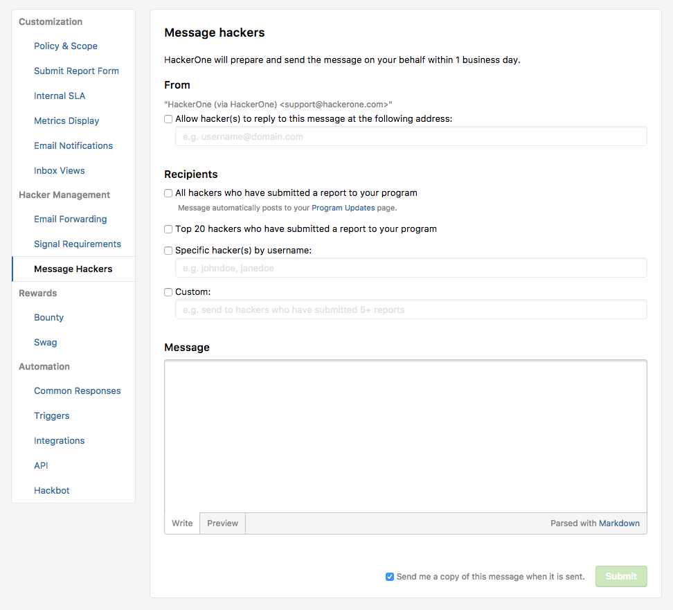

You can communicate with hackers by:
* Commenting on reports
* Broadcast messaging

### Commenting on a Report
You can easily communicate with hackers by commenting within the report. To add a comment on a report:

1. Select **Add comment** from the action picker above the comment box.
2. Select **All participants** in the next drop-down of the action picker to ensure the comment is visible to the hacker who filed the report.
3. Type your message in the comment box.
4. Select **Post comment**.

The hacker will get a notification in their HackerOne profile and will also be notified by email if they have notifications for the report enabled. If you want to make sure they get the message no matter their notification settings, you can type @hacker’s username in the comment to address them directly.

### Commenting on Multiple Reports
You can add comments to multiple reports simultaneously. To add comments to multiple reports:

1. Select the reports you want the comments to be applied to in your inbox by selecting the check box next to the report titles. A list of the titles of the selected reports populate in the center of the screen above the **Comment** field.
2. Select whether you want the comment to go to **All participants** or to your internal **Team only**.
3. Type your comment in the **Comment** box.
4. Click the **Post comment**.

### Broadcast Messaging
If you want to reach a larger group of hackers with a one-way announcement, you can use the Message Hackers feature.

1. Go to your Program's **Settings > Program > Message Hackers**.
2. Select the recipients of the message. You can select to send a message to:
  - All hackers who have submitted a report to your program
  - The top 20 hackers who have submitted a report to your program
  - Specific hackers by username
  - Custom grouping of hackers. You can use the **Custom** recipients field to describe a uniq group that you want to message like   *All hackers on the HackerOne platform who have submitted 5+ reports*
  - All invited hackers    *Note: This option is only available for private programs*
3. Write your message in the **Message** box.
4. Click **Submit**.

Your message will first go to HackerOne support who will verify the content of the message. After verification, your message will be sent to the selected recipients within 1 business day. The message will appear from *Your Team (via HackerOne)* and will be no-reply.

