### Custom Inboxes

*(Enterprise Only Feature)*

Every program has its own inbox that hosts vulnerability reports submitted by hackers. The reports can be accessed by the hacker who submitted the report, in certain cases the HackerOne triage team and groups who have been granted access to this inbox.

In most cases, the access to all these reports are unnecessary and it can become distracting to team members who do not need access to all reports, but still need access to some reports.

Custom inboxes help manage access to these reports. Enterprise Customers have the ability to set up specific inboxes for specific teams and can allocate reports to these inboxes for their teams to access via the program inbox.

Every Enterprise customer has access to 20 custom inboxes in the platform.

### Custom Inboxes Overview

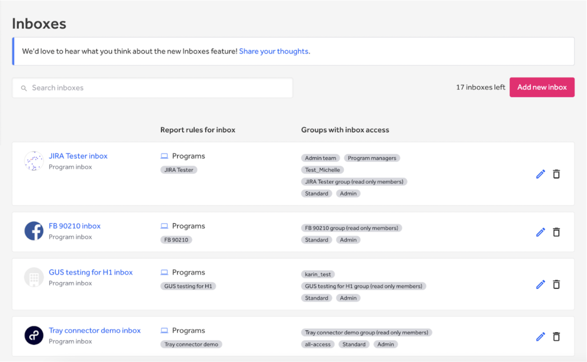

From your Organization settings, click on Inboxes. On this overview page you can see all inboxes that belong to your organization, including program inboxes. From this page you can:
1. Search for a specific inbox
2. Add a new custom inbox
3. Navigate to an inbox
4. Modify a custom inbox
    * Only custom inboxes can be modified
5. Remove a custom inbox
    * Only custom inboxes can be removed

### Add a Custom Inbox
Follow these steps to add a custom inbox to your organization:

1. From this page you will see an overview of all inboxes that belong to your organization, including program inboxes.

2. At the top of the page, select **Add new inbox.**
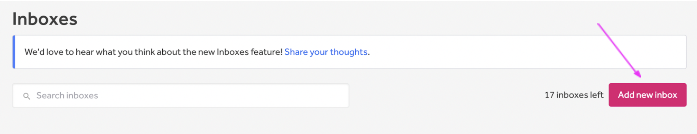

3. Add a **name, handle, and avatar** for your new custom inbox. This will help you identify the inbox you want to select from the main Inbox
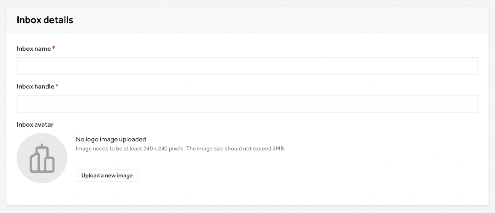

4. **Select the groups** you would like to have access to this inbox.
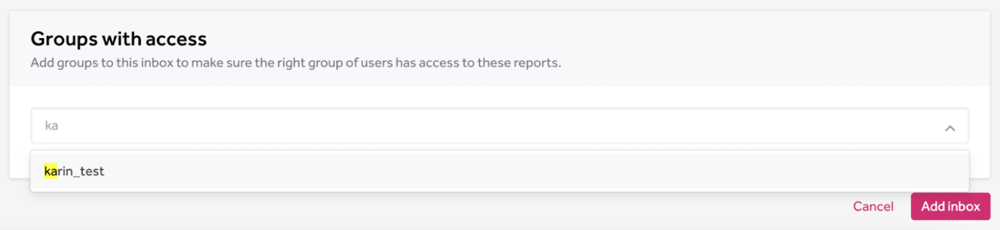

5. To finish, click **Add inbox.**

### Modifying a Custom Inbox
1. You can edit a custom inbox by selecting the edit inbox icon. This will navigate your to the inbox profile page
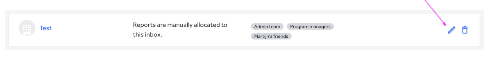

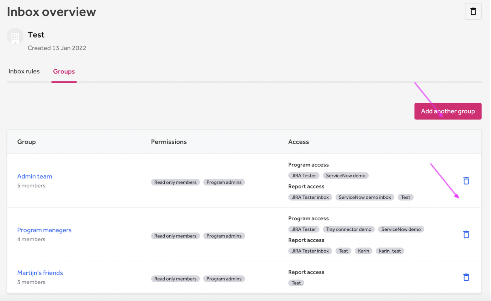

2. On the inbox profile page you will see all the groups that have access to this inbox. From here you can
    * Delete the inbox
  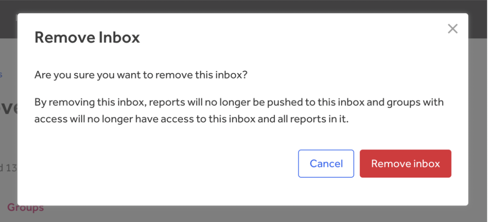

    * Add more groups to have access to this inbox
  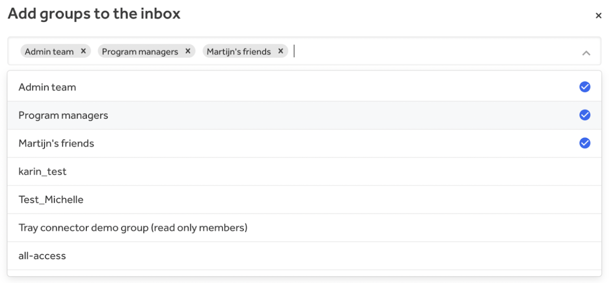

    * Remove groups that currently have access to this inbox
  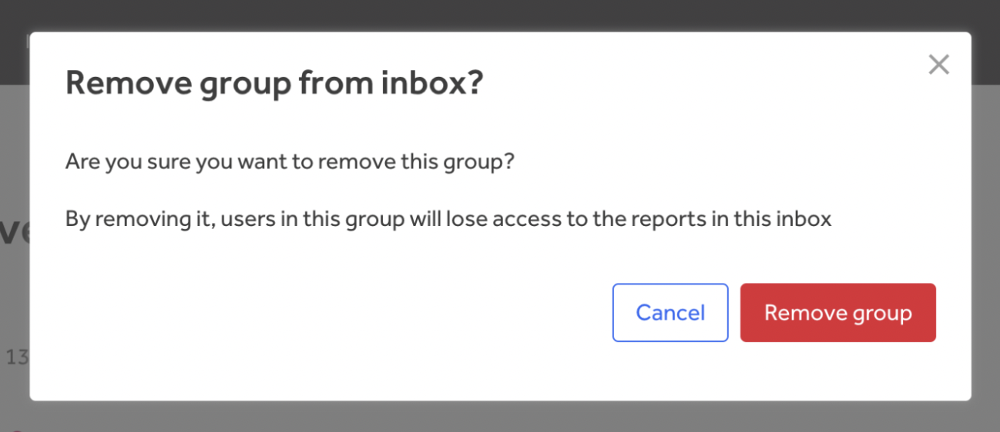

### Remove Inbox
You can remove an inbox in two ways:
1. From the Inboxes overview page
    * Click the trash can - A popup will appear asking if you are sure
  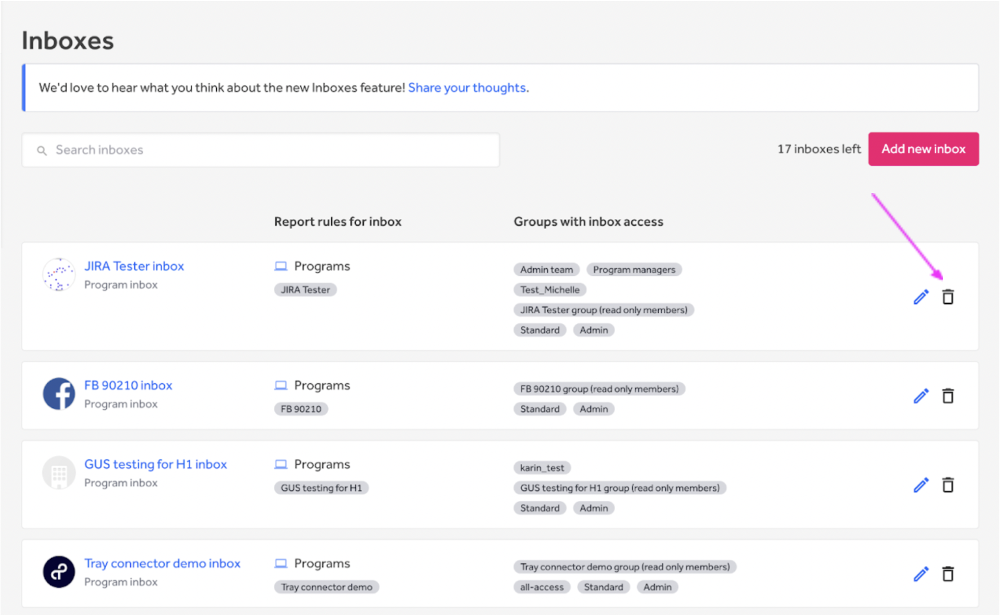

2. From the Inbox profile page (see [Modifying a Custom Inbox](#modifying-a-custom-inbox))

### Used All Allocated Inboxes

Each program has a set number of inboxes available to them. If you have used all of yours, you will see the message below telling you how to fix this or purchase more.
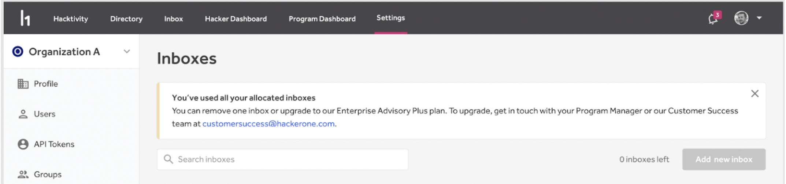
