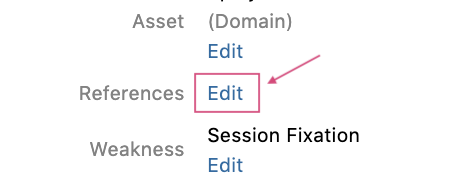
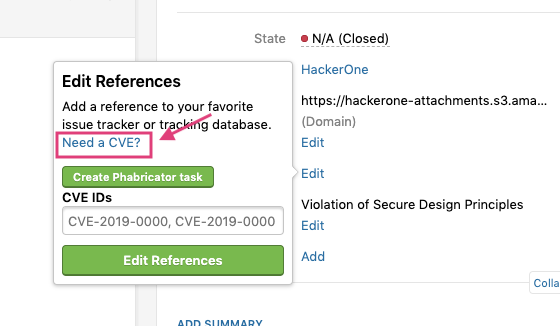
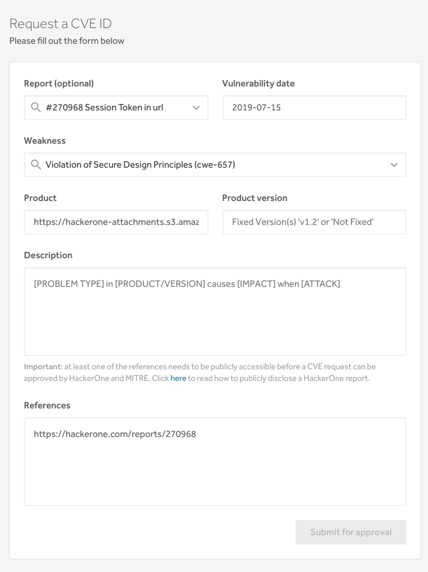
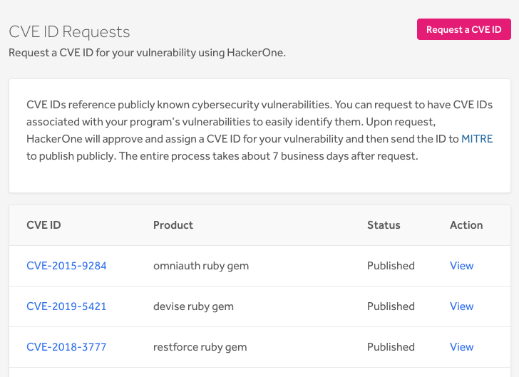

The CVE, short for common vulnerabilities and exposures, is a directory of publicly disclosed cybersecurity vulnerabilities that you can freely search, use, and incorporate into products and services.  Each vulnerability is referenced by a CVE ID to easily identify them. You can request to have CVE IDs associated with your program’s vulnerabilities, through which a CVE Assignment Authority (CNA) will then assign you a valid CVE ID and help you disclose the vulnerability.

As HackerOne is a CNA empowered to assign and work with customers in assisting them to disclose vulnerabilities, you can request to have CVE IDs associated with your program’s vulnerabilities through the HackerOne platform. HackerOne will automatically assign a CVE ID for your vulnerability and publish it to [MITRE](https://cve.mitre.org/) when you've publicly posted your security advisory. 

><i>Note: To opt-in to this feature, talk to your program manager or email support@hackerone.com</i>.

You can request a CVE ID straight from your report. To request a CVE ID from your report:
1. Go to the report in your inbox that you want to add a CVE ID to.
2. Click **Edit** next to ***References***.

3. Click **Need a CVE?** to request a CVE ID.

4. Fill out these fields:

Option | DetailS
------ | -------
Report ID | <i>(Optional)</i> The ID number of the report.
Vulnerability Date | The date the vulnerability was found.
Weaknesses | The type of the potential issue. Learn more about weaknesses [here](/hackers/weakness.html).
Product | The name of the product the vulnerability is found in.
Product Version | The affected version of the product and the fixed version.  
Description | A public description of the vulnerability.
References | Links to where the advisory report, security report, or other information about the vulnerability can be found.

5. Click <b>Submit for approval</b>.

The CVE ID Summary section on the Request CVE ID homepage will list out the status of all of your requests. To access the CVE ID Requests page, go to <b>Settings > Customization > Request CVE ID</b>. Your CVE ID request can have the following statuses:

Option | Detail
------ | -------
Needs action | There are errors within the form that you need to fix or additional information is needed. Click <b>edit</b> to fix your form.
Pending H1 approval | HackerOne is in the process of approving your request.
HackerOne approved | HackerOne has approved your request and the request will be sent to MITRE for processing.
Pending MITRE approval | MITRE is in the process of publishing your ID.
Published | A CVE ID has been successfully assigned and the ID and vulnerability are published.

You can modify and view the descriptions of your vulnerability by selecting <b>Edit</b> or <b>View</b> within the CVE ID Summary section.

