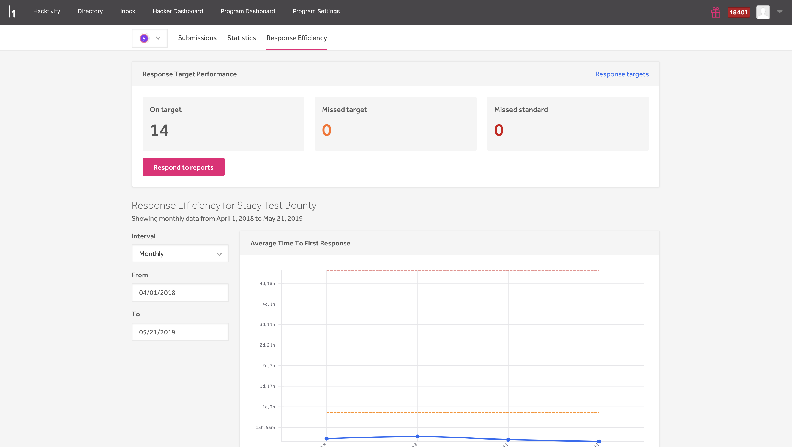

The Program Dashboard provides information on various metrics for your program. This helps you track the progress of your program and it also gives you a detailed summary and understanding of your program status.

HackerOne provides dashboards on these pages:
* [Submissions](/programs/submissions-dashboard.html)
* [Statistics](/programs/statistics-dashboard.html)
* Response Efficiency
* [Hacker Feedback](hacker-feedback-dashboard.html)

For each dashboard, you can customize the data you see by choosing the dates you want to see the metrics for.

### Response Efficiency
The Response Efficiency page gives insight into how efficiently you respond to your reports. It helps you keep track of how many reports have missed your [response target](response-targets.html) or standard.

You can view the metrics of the average time to:
* First response
* Triage
* Bounty
* Resolution

