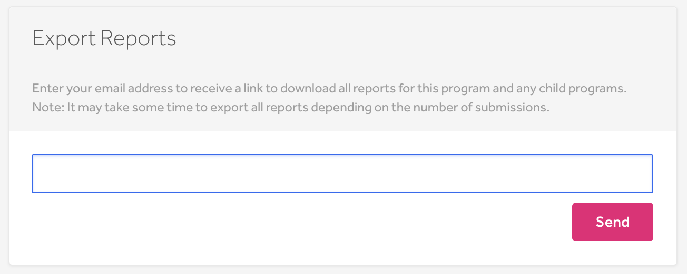
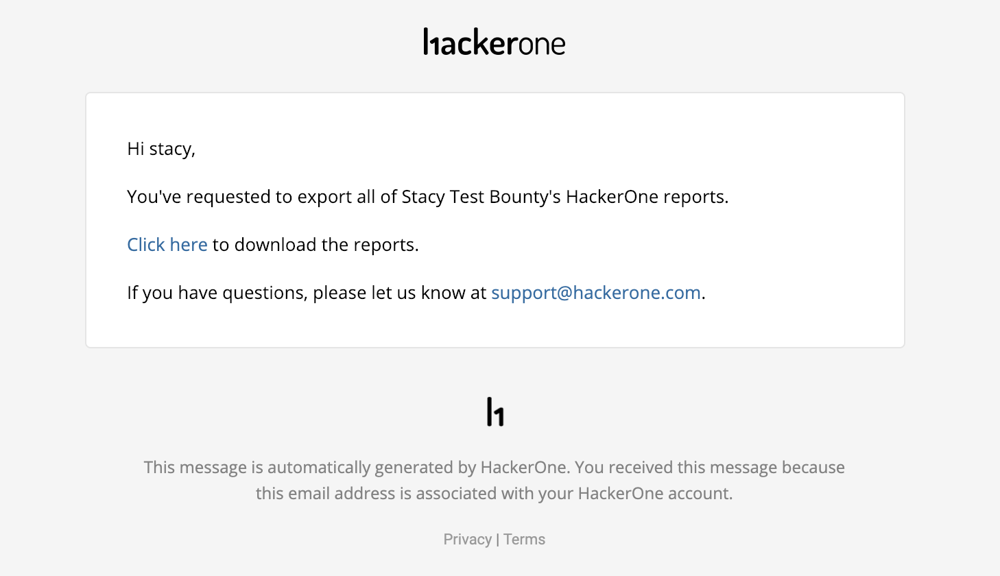
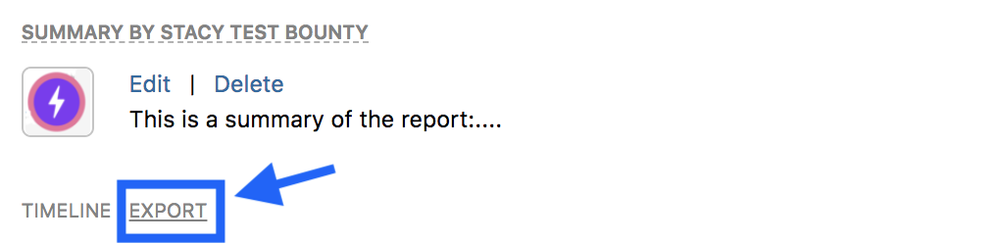

You can export your reports as:
* .csv files
* markdown files
* .zip files

You can also export reports through utilizing the API. See these articles from the HackerOne API documentation to learn more:
* https://api.hackerone.com/#reports-get-report
* https://api.hackerone.com/#reports-get-all-reports

### Export All Reports to a .csv File
You can export all of your vulnerability reports within your program. This enables you to keep and run analytics on your program's vulnerability report data in an organized spreadsheet. You can also export reports for any [child programs](parent-child-programs.html) associated with your program as well. The .csv file doesn't include the comments.

To export all of your reports:
1. Go to your program's **Settings > Automation > Export**.

2. Click **Send** after making sure your email address is correct.
3. Click the link you receive in your email to download your reports as a .csv file.

Depending on the number of reports in your program, it'll take about 5-10 minutes to export all of your reports. Only users given access to the download link will be able to export the reports.

The downloaded file provides the:

* Report ID
* Title
* Severity rating
* Severity score
* State
* Sub-state
* Weakness
* Time the report was reported
* Time of first response
* Time of triage time
* Time the report was closed
* Time the hacker was awarded with the award
* Security member assigned to the report
* Hacker that submitted the report
* Bounty
* Bonus
* Whether the report is public or private
* Reference
* Reference URL
* Structured scope

### Export Select Reports to .csv File  
To export select reports as a .csv file:
1. Select the checkbox of the reports you'd like to export in your inbox. You can select as many reports as you'd like.
2. Click the **Download as CSV** link to download the selected reports.

### Export to Markdown or .zip Files
To export reports as markdown or .zip files:
1. Select the report you want to export from your inbox.
2. Click <b>Export</b> within the report.

3. Select the type of file you want to export the report as. You can choose from:

Option | Details
------ | -------
View raw text | You can copy and paste details of the report in markdown.
Export as .zip | You can download the complete report including the attachments as a zip archive.

4. <i>(Optional)</i> Select whether you want to <b>include internal activities</b>.
