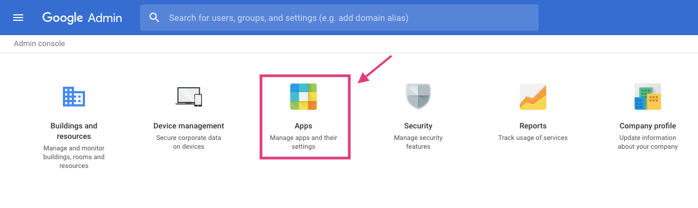
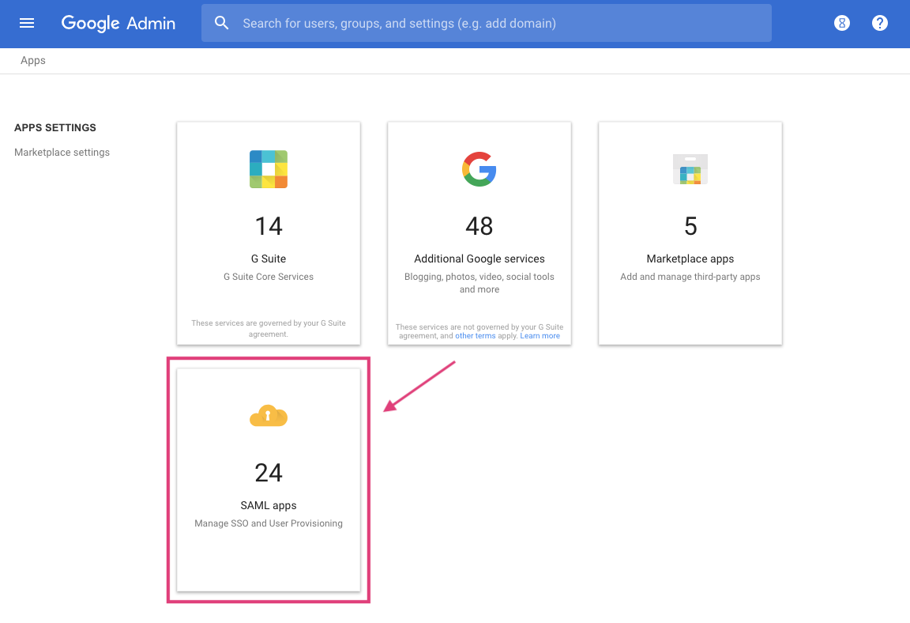
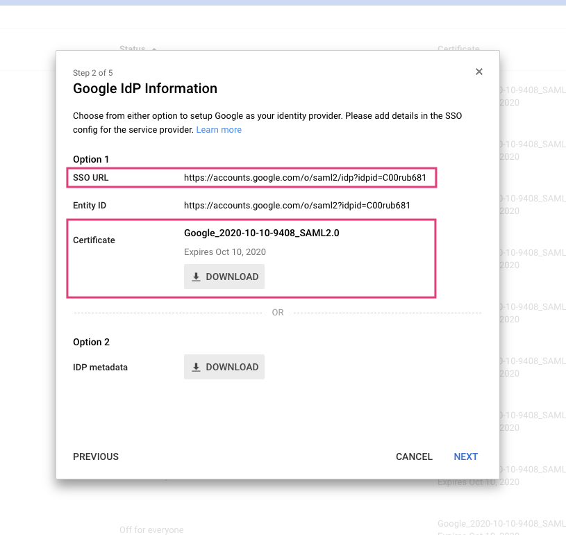
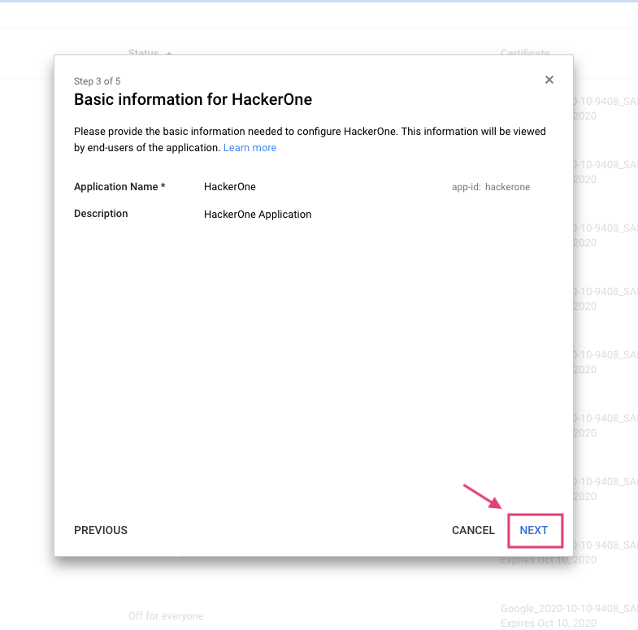
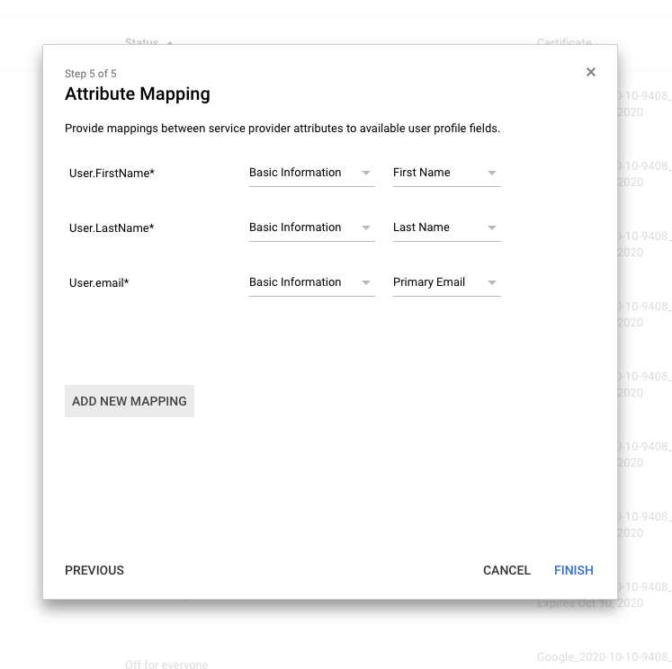
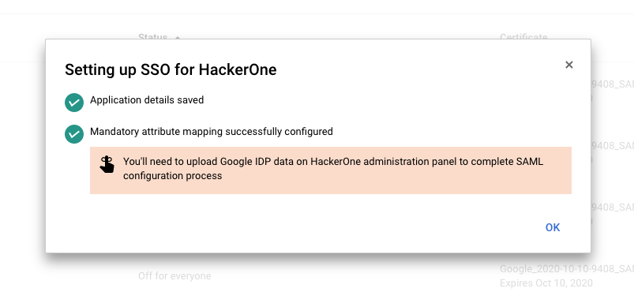
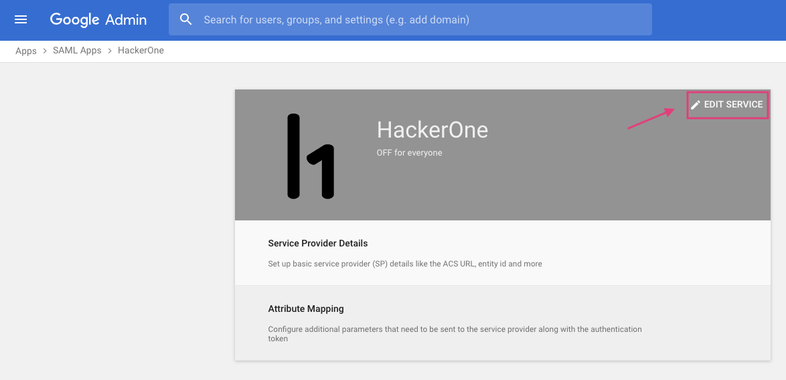
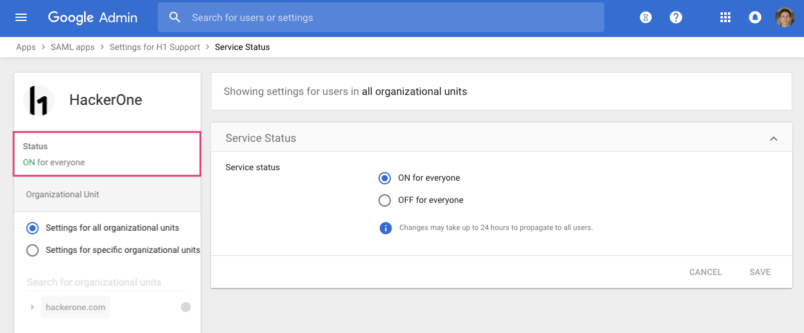

You can use your Google credentials to sign in to HackerOne. To set up SSO via SAML for Google:

1. Log in to the G Suite Admin Console.
2. Click <b>Apps</b>.

3. Click <b>SAML apps</b>.

4. Click on the '+' in the bottom right hand corner to enable SSO for a SAML application.  

5. Find and click on HackerOne in the Apps list.

6. Copy the SSO URL and Certificate.

7. Click <b>Next</b>.
8. Click <b>Next</b> on the Basic Information for HackerOne window

9. Click <b>Next</b> on the Service Provider Details window

10. Adjust the attribute mapping as needed.

11. Click <b>Finish</b>.
12. Click <b>OK</b> to confirm.

13. Click <b>Edit Service</b>.

14. Edit the options to enroll users or organizational units into the HackerOne application. The status will change stating that the application is ON.

15. Follow the SAML setup instructions [here](https://docs.hackerone.com/programs/single-sign-on-sso-via-saml.html). <ul><li>Paste the Single-Sign On URL and the X.509 Certificate that you copied from step 6 into the corresponding fields during SAML setup.</li></ul> 
