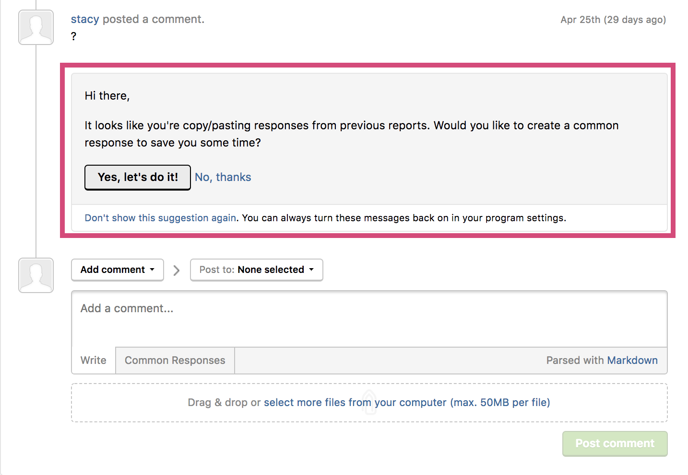

HackBot is HackerOne’s free automated service that provides in-context guidance, suggesting key features and actions on the platform in order to save you time and effort.

For example, HackBot identifies potential duplicates and related reports to help you associate and close reports more quickly. It also can identify out of scope domains which frequently receive invalid reports and suggest a pre-submission trigger which, in turn, warns hackers in the act of submitting a report for that domain.

HackBot offers suggestions that are visible only to your security team as internal comments. It will not take any action on your behalf.

We love adding new functionality to HackBot to make your life easier and more efficient, so [let us know](https://support.hackerone.com/hc/en-us/requests/new) if you have any suggestions on how it can be more useful.
