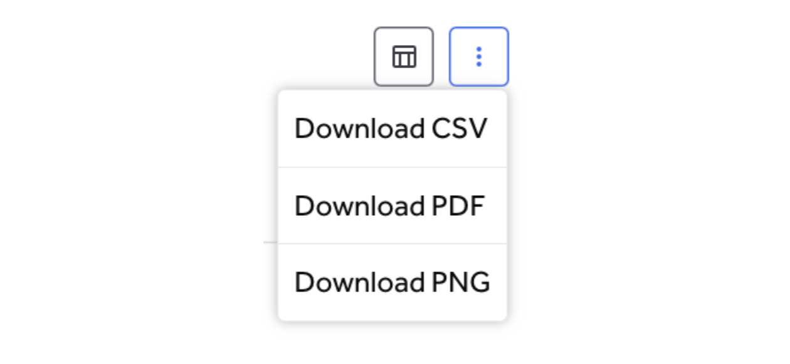

The Hacker Engagement dashboard shows metrics on hacker participation in your programs. Close attention to this data and follow-up actions will ensure that you have a healthy count of participating hackers for running a successful bug bounty and vulnerability disclosure program (VDP). These provide a deeper insight into how many hackers submit valid reports and how many return to your program over time. 

The data displayed is for the time period chosen with the date picker at the right-top. For example, if the yearly option is selected with dates from 09-Dec-2021 to 09-Dec-2022, then the data is shown for the entire year of 2022. Also, dates shown in the charts are for the beginning of the month, quarter or year. 

### Download Options
Each of the charts allows you to download the chart as CSV, PDF, or PNG image file using the kabob menu (three vertical dots). 

#### Hacker Participation
The hacker participation chart shows the quality of hacker participation based on the number of hackers who submitted reports versus valid reports. 

#### Active Hackers
The active hackers chart shows how many hackers are new to your program versus returning for the selected time period. Returning hackers includes any hacker who submitted at least one report of any kind during the previous 90 days. This is an indication of how actively hackers are participating in your program. 

#### Active Hackers vs Valid Reports
The active hackers vs valid reports chart shows the count of active hackers and valid reports during the selected period. The same hacker may have submitted multiple valid reports. A valid report is one with any of the following substates: resolved, triaged, or retesting. 

#### Retention vs Valid Reports
The retention vs valid reports chart shows how many returning hackers submitted valid reports during the selected period. 

#### Top Hackers by Valid Reports
The top hackers by valid reports chart shows the top ten hackers with valid reports during the selected period. Analyzing top participating hackers with valid reports over different time periods can help you understand which hackers are most productive in helping improve the security of your assets. More information about hacker profiles can be found in the hacker leaderboard.

#### Top Hackers by Bounty Amount
The top hackers by bounty amount chart shows the top ten hackers who earned the highest bounty awards in your program over the selected time period.

#### Top Hackers by Severity
The top hackers by severity chart shows the top ten hackers based on the severity of the valid reports over the selected time period. 

#### Invitation Funnel
The invitation funnel chart is only displayed for customers with private programs. The invitation funnel shows the overall flow of the number of hackers who were sent invites to join your private program, how many viewed the invite, accepted it, submitted any reports, and submitted valid reports. 

