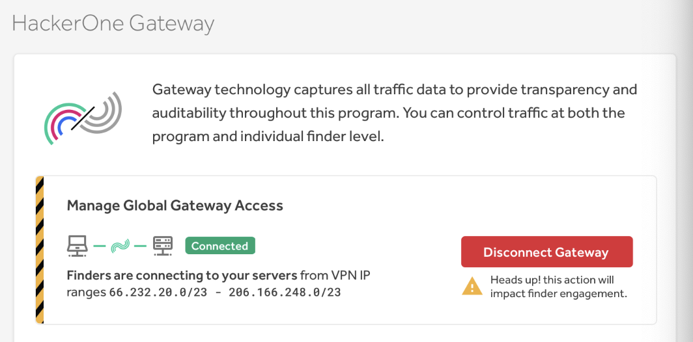
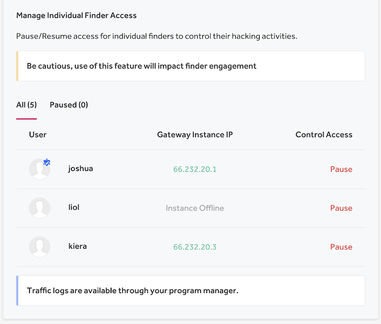

You can require finders to set up a virtual private network (VPN) instance with HackerOne Gateway (VPN) in order to find vulnerabilities in your program. The HackerOne Gateway (VPN) enables you to have granular control over finder activities on your program and assets.

> Gateway (VPN) is available as an add-on. To learn more about adding HackerOne Gateway(VPN) to your program, contact your account manager.

To manage your Gateway settings:
1. Go to **Program Settings > Program > Hacker Management > Gateway**.
2. Check to see if your Gateway is connected under the **Manage Global Gateway Access** section. You’ll see a green **Connected** icon to notify you that traffic is able to successfully flow through the HackerOne VPN instances. If traffic through the VPN is disrupted, you’ll see a grey **Disconnected** icon.
3. *(Optional)* Click **Disconnect Gateway** if you want to close your gateway to finders. Keep in mind that disconnecting your gateway will prevent finders from finding vulnerabilities on your Gateway-protected targets until you reconnect the gateway.
<ul><li><b>Note:</b> If your Gateway is in full tunnel mode or if your assets are under a Content Delivery Network (CDN), you won't be able to disconnect your Gateway as disconnecting your Gateway will prevent hackers from hacking on other programs.</li></ul>

4. *(Optional)* Click **Reconnect Gateway** if you want finders to connect to your servers via Gateway.

### Manage Individual Finder Access
You can also manage which finders are able to access your Gateway. You can view the username of the finder and their Gateway Instance IP.

To manage individual finder access under the **Manage Individual Finder Access** section:
1. Click **Pause** for any finders that you want to prevent from accessing your servers via the Gateway.
2. Click **Resume** to enable Gateway access for the finder.

To receive complete traffic logs, contact your program manager.
