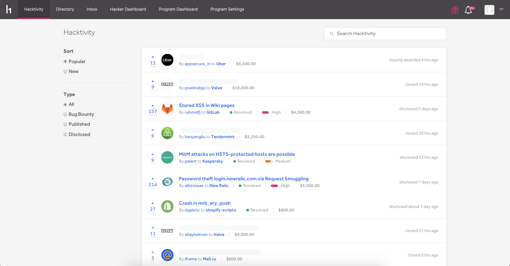
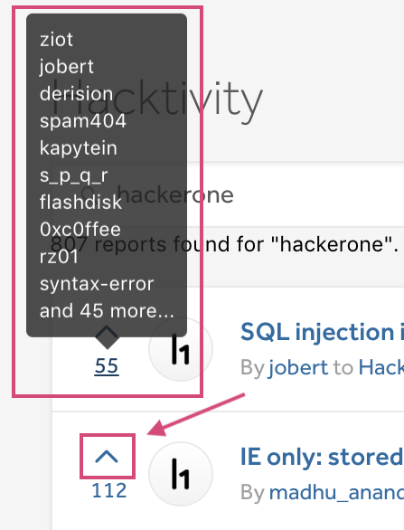

[Hacktivity](https://hackerone.com/hacktivity?sort_type=popular&filter=type%3Aall&page=1&range=forever) is HackerOne's community feed that showcases hacker activity on HackerOne. You can view:
* Reports of disclosed vulnerabilities
* The hacker that submitted the vulnerability
* The associated program
* The awarded bounty amount

You can sort your hacktivity feed by:

Option | Details
---- | --------
Popular | The activity that is currently trending.
New | The latest activity.

You can also filter the activity you want to see by these filters:

Filter Option | Details
------------- | --------
Disclosed | Vulnerability reports that have been disclosed to the public. You can view contents and details of the vulnerabilities of each report.  
Bug Bounty | Vulnerability reports that were only submitted to programs that provide bounties.
Published | Vulnerability reports that are from external sources outside of HackerOne. See: [Publishing External Vulnerabilities](/hackers/publishing-external-vulnerabilities.html)
All | All activities that appear on Hacktivity.

### How Does an Activity Appear on Hacktivity?
Hacktivity only showcases activity for public programs. Hacker activity populates on the Hacktivity feed when disclosed and undisclosed reports are marked as:
* Closed
* Disclosed
* Bounty awarded
* Swag awarded

><i>Note: Undisclosed reports appear with a redacted title.</i>

Hackers can also publish their findings from external sources outside of HackerOne. To learn more, see: [Publishing External Vulnerabilities](/hackers/publishing-external-vulnerabilities.html).

### Search
You can search for reports regarding programs and weaknesses you're interested to read about in the search bar to better learn how specific weaknesses were exploited in various programs.

### Upvoting
You can upvote activities by clicking on the arrow next to the activity. Anyone with an account can upvote, but you can only upvote once on each activity. When you hover over the upvote count, you can see the top 10 hackers (ranked by Signal) that voted on the activity.

There is currently no downvoting capability, but you can retract your upvote by clicking on the arrow again.

### How is Activity Ranked on Hacktivity?
Activities on each page are ranked differently.

On the **Popular** page, activities are ranked by calculating the number of upvotes divided by (a power of the time since they were last updated on Hacktivity). The vote is weighted slightly more if it comes from a hacker with high Signal. Additionally, each activity gets an initial boost if it is resolved and/or receives an above average bounty.

On the **New** page, activities are ordered chronologically with the latest activity being listed on top. A previously appeared vulnerability goes back to the top when there is new activity on the report.

If you want to see downvoting, a commenting feature, or a new feature request, send [HackerOne a feature request](mailto:feedback@hackerone.com).
