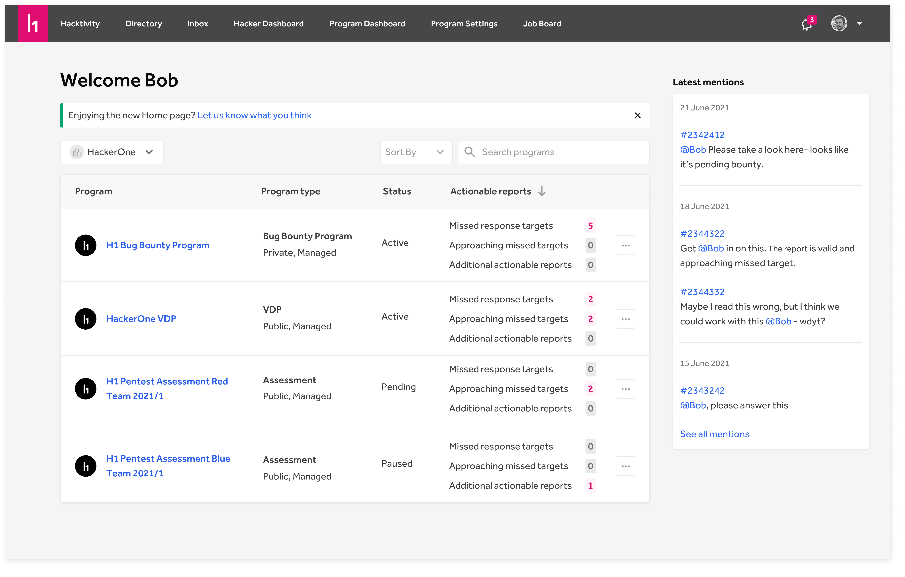

The landing page is the central place for customers to go after they log in. This page shows all programs within your organization and any action items required per program, regardless of the type of program you're running.

### Latest mentions
On the right, there's a column that shows you the latest mentions you received. Whenever someone mentions you in a report, you can see it on the homepage and go to the relevant report with a simple click.

### Actionable reports
For each program on the homepage, we show actionable reports per program. The [actionable reports](/programs/program-overview.html#actionable-reports) are split up into three categories:
1. Missed response targets
2. Approaching missed targets
3. Aditional actionable reports
