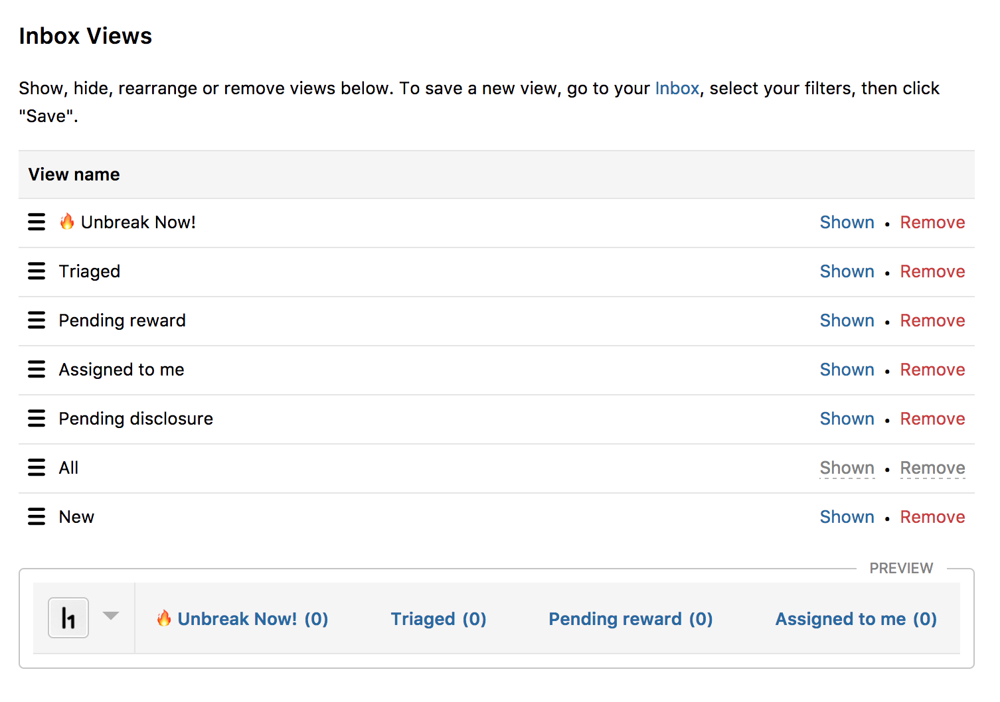

Inbox views are a selection of saved filters that categorize your inbox reports. The administrator of your program can customize the views in your inbox by:
* Adding inbox views
* Updating existing views
* Changing the order of views
* Removing views
* Temporarily showing and hiding views

The ability to customize your inbox views enables different members in your program to operate under a unified workflow that works best for your specific program.
### Adding and Updating Views
To add a new View:
1. Go to your security team's inbox.
2. Click **Show filters**.
3. Select the filters you'd like to see in your new inbox view. A **Custom** view will show in your inbox bar with a **Save** button next to it.
4. Click the **Save** button.
5. The **Save view** window will appear where you can select to create a new view or overwrite an existing one in the **Action** field.
6. Type the View name in the **View name** field.
7. Click **Save view**.

The changes will be made directly in your inbox.

### Changing the Order of Views
To change the order of views:
1. Go to your program's **Settings > Program > Inbox Views**.
2. Click and drag the icon next to the View name to the order you want the View to appear.  

### Removing Views
To permanently remove a View from your inbox:
1. In **Settings > Program > Inbox Views**, select **Remove**. A window will pop up confirming whether you want to remove the view.
2. Click **Ok**.

### Showing and Hiding Views
To show and hide Views:
1. In **Settings > Program > Inbox Views**, select **Shown** next to the View you want to hide. The View will then be hidden. *Note: Shown means that the inbox view currently appears in your Inbox.*
2. When a View is hidden, select **Hidden** to show the View.

><i>Note: There is a Preview section at the bottom of the page that enables you to see a preview of what your Views will look like in the inbox.</i>

### Tutorial Video
<iframe id="ytplayer" type="text/html" width="640" height="360" src="https://www.youtube-nocookie.com/embed/6LayNZUmIAQ?rel=0&autoplay=0&origin={{ site.url }}" frameborder="0"></iframe>
