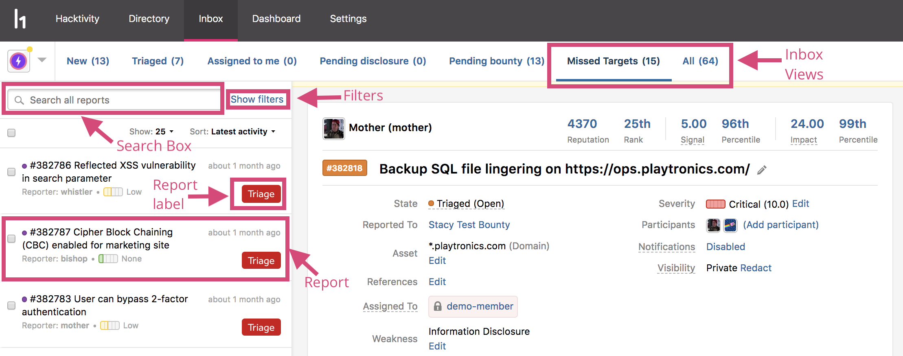

All vulnerability reports submitted to your program are sent directly to the inbox where you can view and manage your reports.

The inbox contains these different features to help you manage your reports:
* [Inbox views](inbox-views.html)
* Filters
* Search
* [Response labels](response-labels.html) (only if your program doesn't meet response targets or standards)

You can customize your filters and inbox views to better fit the workflow for your program.

### Navigating the Inbox
To navigate through your inbox:
1. Click <b>Inbox</b> in your header to access your inbox.
2. Search for your reports by using the:

Option | Details
---- | ------------
Search bar | Type the name or keywords of a report to search for relevant reports.
Filters | Click <b>Show filters</b> to view the different options you can select to filter your reports by.
[Inbox Views](inbox-views.html) | These are saved filters that categorize your inbox reports.

3. Click the report you want to view .
4. [Take action](report-actions.html) on the report.

There are [keyboard shortcuts](keyboard-shortcuts.html) you can use to help you to quickly navigate through your reports in the inbox.
