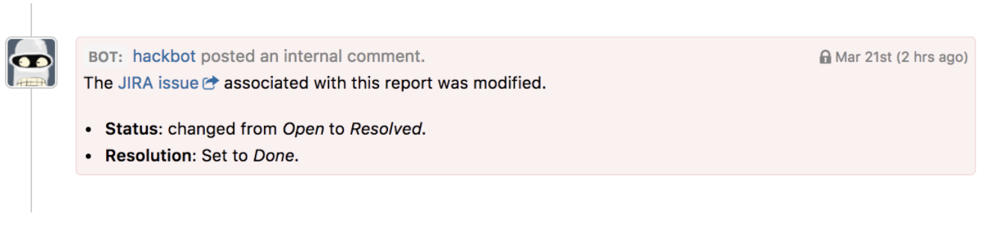

You can integrate HackerOne with Jira Cloud. 

To integrate with Jira Cloud: 
1. Go to **Settings > Program > Integrations**. 
2. Click the **Connect with JIRA** link.
   
3. Choose **JIRA Server**, and you'll be redirected to Atlassian Marketplace where you can download the HackerOne for JIRA application. 
   
4. Click the **Get it now** button in Atlassian Marketplace to install the HackerOne for Jira application. The page will redirect you to your Jira instance and the integration will be downloaded and installed. 
   
5. Click the **Get started** button on the installation confirmation pop-up.
   
6. The installation process will continue on the HackerOne website and will ask you to select the program you want to link to. Select the program you want to link to your Jira instance. 
   
7. The set up will take you to the Jira settings page where you can select which events you want to sync between HackerOne and Jira. 

With Jira integration, you can create Jira issues right from your HackerOne report. 

### Create Jira Issues from your HackerOne Report
To create Jira issues from your HackerOne report:
1. In the comments section of your report, change **Add comment** to **Change state > Triaged**. 
2. Click the **Create JIRA issue** button to create the issue in Jira. 

Every time an action occurs on the Jira issue, Hackbot will automatically create an internal comment on the HackerOne report. 

