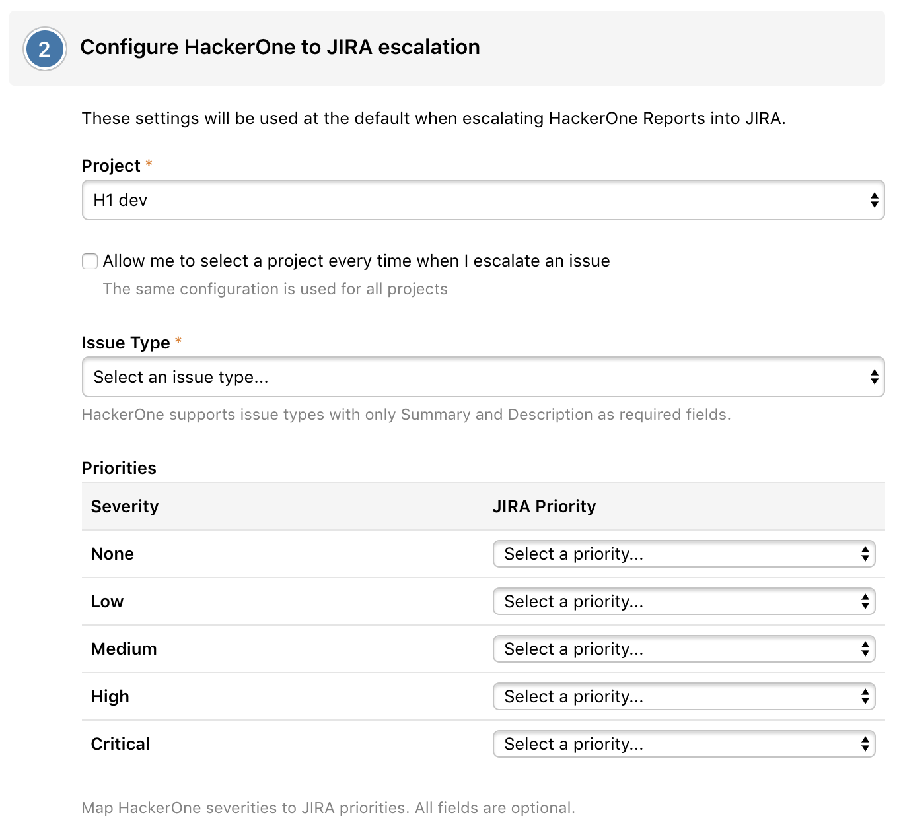
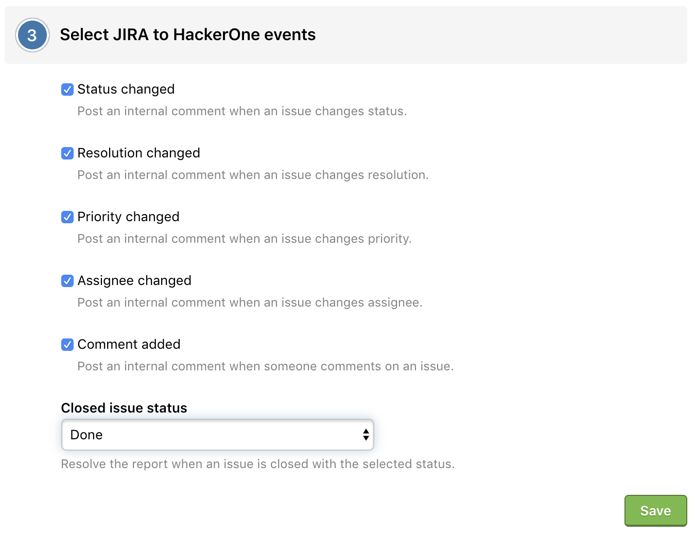
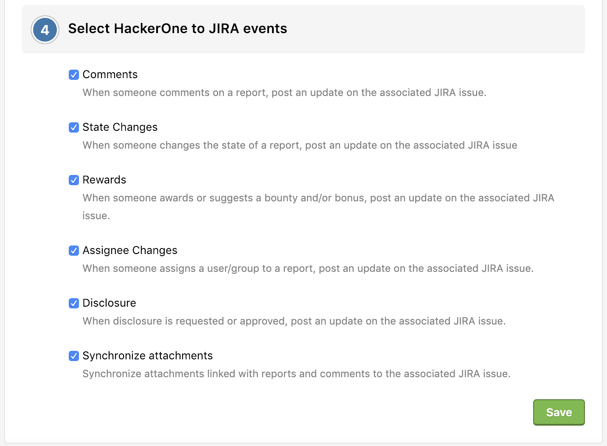

> <b>Note:</b> In order to configure your Jira integration, you must be an admin on Jira in order to properly have webhooks installed. After your integration has properly been set up, you can go back to regular access on Jira.  

You can integrate with Jira Cloud in order to sync information between your HackerOne report and your Jira issue. 

To integrate with Jira Cloud:
1. Go to **Settings > Program > Integrations**.
2. Click the **Connect with Jira** link.
   

3. Choose **Jira Cloud**, and you'll be redirected to Atlassian Marketplace where you can download the HackerOne for Jira application.

   

4. Click the **Get it now** button in Atlassian Marketplace to install the HackerOne for Jira application. The page will redirect you to your Jira instance and the integration will be downloaded and installed.

   

5. Click the **Get started** button on the installation confirmation pop-up.

   

6. The installation process will continue on the HackerOne website and will ask you to select the program you want to link to. Select the program you want to link to your Jira instance.

   

7. The set up will take you to the Jira settings page where you can select which events you want to sync between HackerOne and Jira.

8. Configure which HackerOne projects you'd like to escalate to Jira in the **Configure HackerOne to Jira escalation** window.
     * Select the **Allow me to select a project every time when I escalate an issue** checkbox to have the ability to select from multiple projects when creating Jira issues.
     * Select the Jira Priority you want to map to the corresponding HackerOne severity. This enables the right priority to be set when escalating a HackerOne report to Jira.

   

9. *(Optional)* Select which Jira actions you'd like to post onto HackerOne in the **Select Jira to HackerOne events** window. You can choose from:

Option | Detail
------ | -------
Status changed | Post an internal comment when an issue changes status.
Resolution changed | Post an internal comment when an issues changes resolution.
Priority changed | Post an internal comment when an issue changes priority.
Assignee changed | Post an internal comment when an issue changes assignee.
Comment added | Post an internal comment when someone comments on an issue.
Closed issue status | Resolve the report when an issue is closed with the selected status.

   

10. *(Optional)* Select which actions in HackerOne you'd like to post to Jira in the **Select HackerOne to Jira events** window. You can choose from:

Option | Detail
------ | -------
Comments | When someone comments on a report, post an update on the associated Jira issue.
State Changes | When someone changes the state of a report, post an update on the associated Jira issue.
Rewards | When someone awards or suggests a bounty and/or bonus, post an update on the associated Jira issue.
Assignee Changes | When someone assigns a user/group to a report, post an update on the associated Jira issue.
Disclosure | When disclosure is requested or a report becomes public, post an update on the associated Jira issue.
Synchronize attachments | Synchronize attachments linked with reports and comments to the associated Jira issue.

   

You're all set! Now that you've finished setting up the Jira integration, you can create Jira issues right from your HackerOne report.

### How it works
To create Jira issues from your HackerOne report:
1. Go to the report you want to create a Jira issue for.
2. Click **Edit** in the References field.

  

3. Click **Create Jira Issue**. A Jira ID will automatically generate.

  

