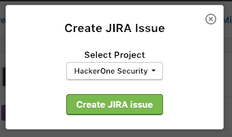
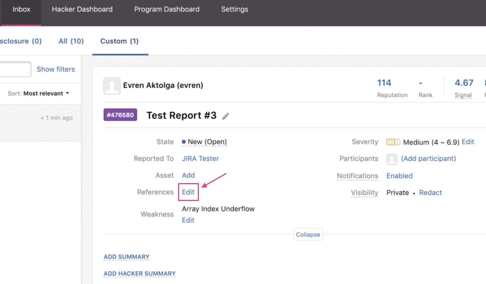
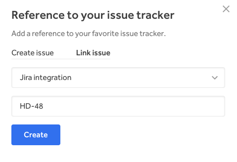
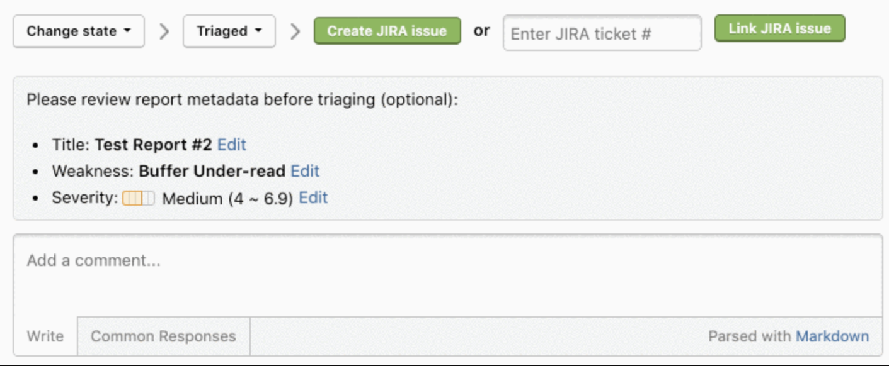

HackerOne enables you to set up a bi-directional Jira integration. This means that Jira users can sync specific workflows from Jira to HackerOne and vice versa, from HackerOne to Jira. This integration helps your development and security teams stay aligned, and contributes to a better workflow to process security vulnerabilities as it minimizes the back and forth between Jira and HackerOne.

These events and directions are currently supported through the bi-directional Jira integration:

HackerOne to Jira | Jira to HackerOne
----------------- | -------------------
Comments | Comments
State changes | State changes <i>Note: The state change in Jira only shows up as an internal comment in the HackerOne report. The HackerOne report state doesn't change. You'll need to log into HackerOne to change the report state.
Rewards | Resolution changes
Assignee changes | Assignee changes
Public disclosure | Priority changes

You can choose to integrate from 2 different types of Jira integrations:

Option | Details
------ | -------
[Jira Cloud](jira-cloud-integration.html) | You can access Jira from anywhere in the world.
[Jira Server](jira-server-integration.html)| Jira is self-hosted and can be behind a firewall or VPN.

><i>Note: Jira Cloud isn't compatible with Jira Server.</i>

Jump to:
* [Creating a Jira Issue](#creating)
* [Linking HackerOne Reports to Existing Jira Tasks](#linking)

### How it Works
A HackerOne report gets triaged and escalated into Jira.

Hackbot automatically captures the status change and posts an internal comment on the associated HackerOne report.

<h3 id="creating">Creating a Jira Issue</h3>
You can create new Jira issues for reports you receive in HackerOne.

To create a new Jira issue from your HackerOne report:
1. Go to the HackerOne report in your inbox that you want to create a new Jira issue for.
2. Click **Edit** next to <i>References</i>.
3. Click **Create JIRA issue**.
4. Select the project that you want the issue to link to in the dropdown. *Note: This option occurs only if you have multiple projects to select from. If you only have 1 project, the issue will automatically escalate to that project.*

<h3 id="linking">Linking HackerOne Reports to Existing Jira Tasks</h3>
You can link your HackerOne reports to existing Jira tasks.

To link your reports:
1. Go to the HackerOne report in your inbox that you want to link to Jira.
2. Click **Edit** next to <i>References</i>.

3. Enter the Jira ticket reference ID in the **Link JIRA ticket** field.
4. Click **Link JIRA issue**.

The HackerOne report will now be linked to the Jira task, and all activities that are performed on the report will be synced to the corresponding task.

There's also another way you can  link your HackerOne reports to Jira. You can:
1. Go to the bottom of your HackerOne report.
2. Select **Change state > Triaged** in the action picker.

3. Enter the JIRA ticket number in the **Enter JIRA ticket #** field.
4. Click **Link JIRA issue**.
