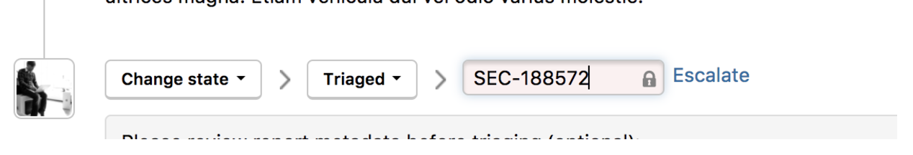

HackerOne enables you to set up a bi-directional Jira integration. This means that Jira users can sync specific workflows from Jira to HackerOne and vice versa, from HackerOne to Jira. This integration helps your development and security teams stay aligned, and contributes to a better workflow to process security vulnerabilities as it minimizes the back and forth between Jira and HackerOne.

These events and directions are currently supported through the bi-directional Jira integration:

HackerOne to Jira | Jira to HackerOne
----------------- | -------------------
Comments | Comments
State changes | State changes <i>Note: The state change in Jira only shows up as an internal comment in the HackerOne report. The HackerOne report state doesn't change. You'll need to log into HackerOne to change the report state.
Rewards | Resolution changes
Asignee changes | Asignee changes
Public disclosure | Priority changes

You can choose to integrate from 2 different types of Jira integrations:

Option | Details
------ | -------
[Jira Cloud](jira-cloud-integration.html) | You can access Jira from anywhere in the world.
[Jira Server](jira-server-integration.html)| Jira is self-hosted and can be behind a firewall or VPN.

><i>Note: Jira Cloud isn't compatible with Jira Server.</i>

### How it Works
A HackerOne report gets triaged and escalated into Jira.

Hackbot automatically captures the status change and posts an internal comment on the associated HackerOne report.

