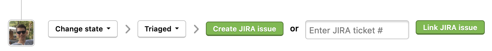

HackerOne enables you to set up a bi-directional Jira integration. This means that Jira users can sync specific workflows from Jira to HackerOne and vice versa, from HackerOne to Jira. There's no need to go back and forth between Jira and HackerOne. With this integration, valid bug reports become task assignments in JIRA with a single click, and fixed bugs automatically come back as being marked as resolved. This integration helps your development and security teams stay aligned, and contributes to a better workflow to process security vulnerabilities.

improves the collaboration between various teams by making it easier to review information across teams and tools. 

These events and directions are currently supported through the bi-directional Jira integration: 

HackerOne to Jira | Jira to HackerOne
----------------- | -------------------
Comments | Coments
State changes | State changes
Rewards | Resolution changes
Asignee changes | Asignee changes
Public disclosure | Priority changes

You can choose to integrate from 2 different types of Jira integration:
* Jira Server
* Jira Cloud

### How it Works
A HackerOne report gets triaged and escalated into Jira. 

Hackbot automatically captures the status change and posts an internal comment on the associated HackerOne report. 

