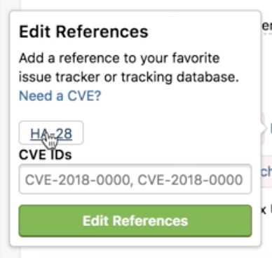

HackerOne offers a bi-directional Jira integration that syncs information between your HackerOne report and the Jira issue. You can choose to integrate with Jira Cloud or Jira Server. This means that Jira users can sync specific workflows from Jira to HackerOne and vice versa, from HackerOne to Jira. This integration helps your development and security teams stay aligned, and contributes to a better workflow to process security vulnerabilities as it minimizes the back and forth between Jira and HackerOne.

Jump to: |
-------- |
[Creating a Jira Issue](#creating) |
[Linking HackerOne Reports to Existing Jira Tasks](#linking) |
[Installing the Jira integration](#installing) |

### How it Works
A HackerOne report gets triaged and escalated into Jira.

Hackbot automatically captures the status change and posts an internal comment on the associated HackerOne report.

These events and directions are currently supported through the bi-directional Jira integration:

HackerOne to Jira | Jira to HackerOne
----------------- | -------------------
Comments | Comments
State changes | State changes  You can select which Jira state will result in automatic closure of the HackerOne report.
Rewards | Resolution changes
Assignee changes | Assignee changes
Public disclosure | Priority changes
Report attachments |

<h3 id="creating">Creating a Jira Issue</h3>
You can create new Jira issues for reports you receive on HackerOne.

To create a new Jira issue from your HackerOne report:
1. Go to the HackerOne report in your inbox that you want to create a new Jira issue for.
2. Click **Edit** next to <i>References</i>.
3. Click **Create JIRA issue**.
4. Select the project that you want the issue to link to in the dropdown. *Note: This option occurs only if you have multiple projects to select from. If you only have 1 project, the issue will automatically escalate to that project.*

5. Click on the Jira ID to access the report in Jira.

  

6. Add comments or change the state of the report in Jira.

  

When you perform an action on the Jira report such as adding a comment or changing the status of the report, Hackbot will generate an internal comment on the HackerOne report to reflect the changes.

  

<h3 id="linking">Linking HackerOne Reports to Existing Jira Tasks</h3>
You can link your HackerOne reports to existing Jira tasks.

To link your reports:
1. Go to the HackerOne report in your inbox that you want to link to Jira.
2. Click **Edit** next to <i>References</i>.

3. Enter the Jira ticket reference ID in the **Link JIRA ticket** field.
4. Click **Link JIRA issue**.

The HackerOne report will now be linked to the Jira task, and all activities that are performed on the report will be synced to the corresponding task.

There's also another way you can  link your HackerOne reports to Jira. You can:
1. Go to the bottom of your HackerOne report.
2. Select **Change state > Triaged** in the action picker.

3. Enter the JIRA ticket number in the **Enter JIRA ticket #** field.
4. Click **Link JIRA issue**.

<h3 id="installing">Installing the Jira integration</h3>

You can choose to integrate from 2 different types of Jira integrations:

Option | Details
------ | -------
[Jira Cloud](jira-cloud-integration.html) | You can access Jira from anywhere in the world.
[Jira Server](jira-server-integration.html)| Jira is self-hosted and can be behind a firewall or VPN.