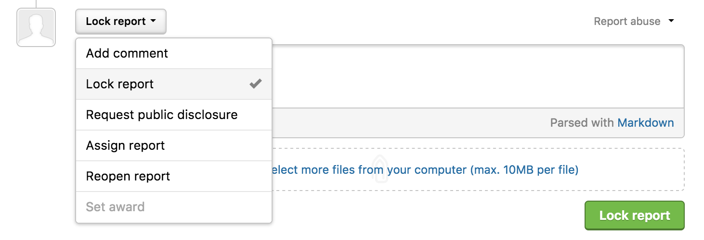
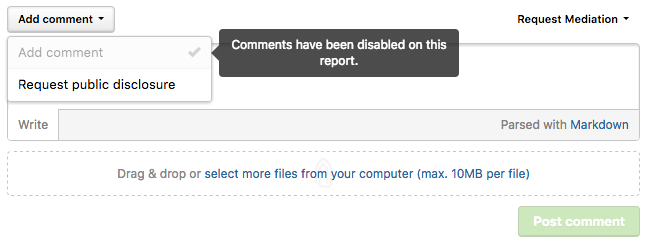
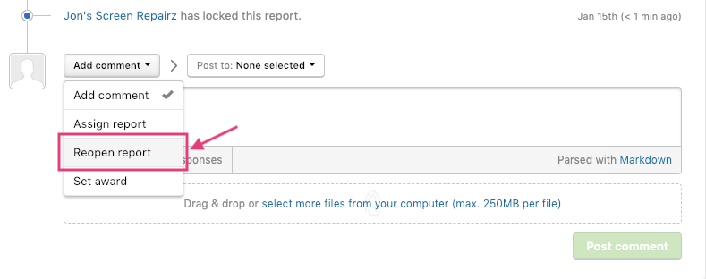

You can lock closed reports in order to prevent further discussion or action on a report. Locking a report is similar to archiving threads in a forum. Reasons to lock a closed report are:
* **Your program has finalized a decision on the report.** No further discussion is necessary on the report and locking it will prevent any more comments from arising.
* **The report is publicly disclosed.** If a report has been publicly disclosed, continued discussion on the report may lead to accidental disclosure of private information. For instance, if the reporter finds the fix to be inadequate afterwards and discusses it on the report, the details of the unpatched vulnerability will be exposed to the entire Internet. The recommended path of action would be to file a new report with the new findings. Locking a report to disable further commenting on the disclosed report would have effectively prevented the accidental disclosure.

### Locking a Closed Report
You can only lock closed reports. Program members with report management permissions are able to lock reports. To lock a closed report:

1) Make sure that the report is closed. If the report isn't closed, close the report.
2) Go to the action picker at the bottom of the report and select **Lock report**.
3) *(Optional)* Provide a comment stating the reason for why you are closing the report.
4) Click **Lock report**.

After a report has been locked, the hacker can no longer comment on the report or add a hacker summary, but can still request or agree to public disclosure or request mediation. Your program team members can still comment both publicly and privately on the report.

### Unlocking Reports
To unlock a report, you can reopen the report by selecting **Reopen report** in the action picker.

