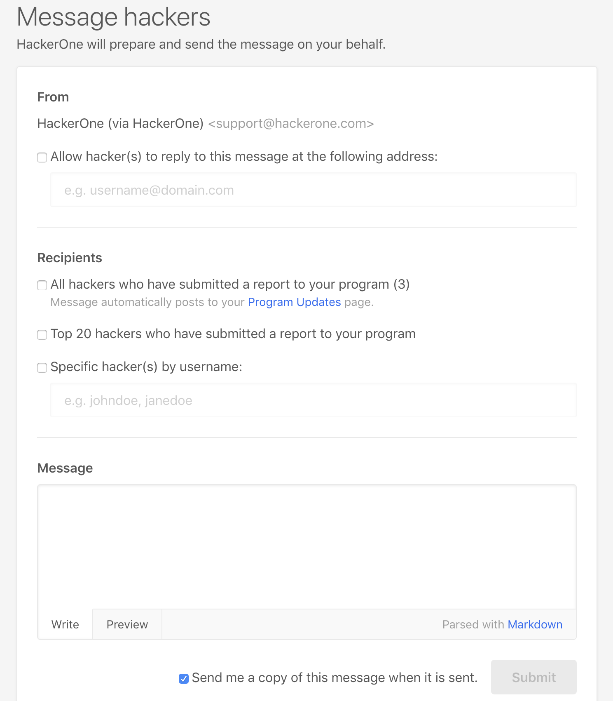

It's important to have good communication with hackers as it enables them to know what's going on with your program. In order to communicate any changes or announcements with your hackers, you can use the Message Hackers feature.

To use the Message Hackers feature:
1. Go to your program's **Settings > Hacker Management > Message Hackers**.
2. Select the recipients of your message. You can select from these options:

Option | Details
------ | -------
All hackers who have submitted a report to your program | The message automatically posts to the **Updates** section of your security page, in which only hackers that have participated in your program can see them.
Top 20 hackers who have submitted a report to your program | The message is only sent to the top 20 hackers of your program.
Specific hacker(s) by username | You can message only certain hackers by entering their usernames.
All invited hackers | This option is only available for private programs

3. Write your message in the **Message** box.
4. Click **Submit**.

Your message will first go to HackerOne support who will verify the content of the message. After verification, your message will be sent to the selected recipients within 1 business day. The message will appear from *Your Team (via HackerOne)* and will be no-reply.

Each recipient will receive a unique email that's specific to them. Hackers won't be able to see if anyone else received the same email.

